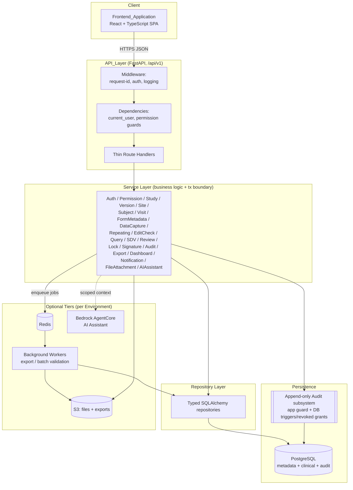
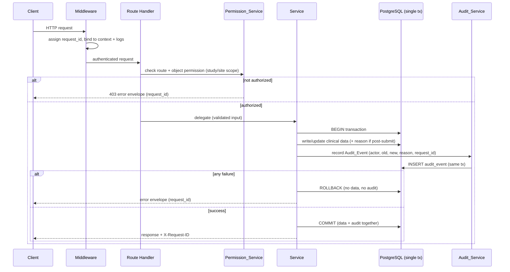
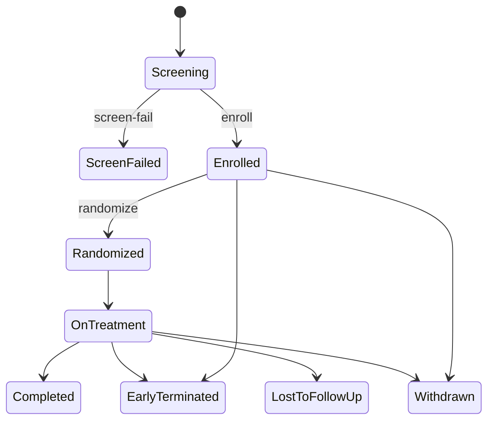
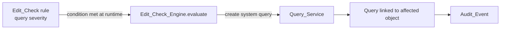
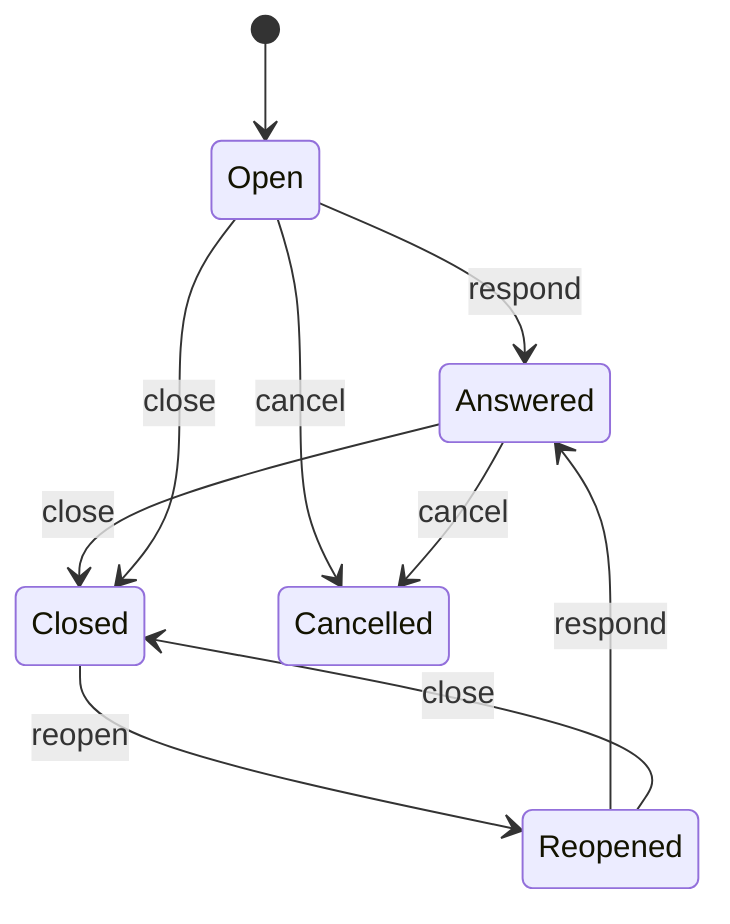
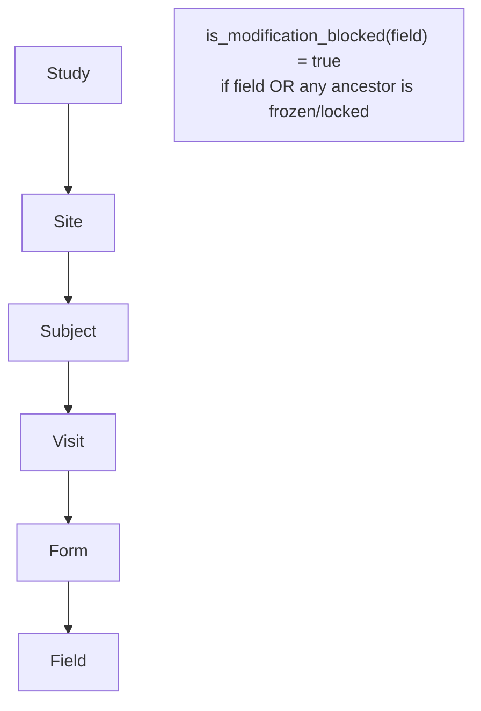
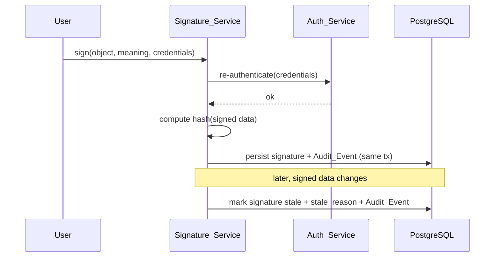
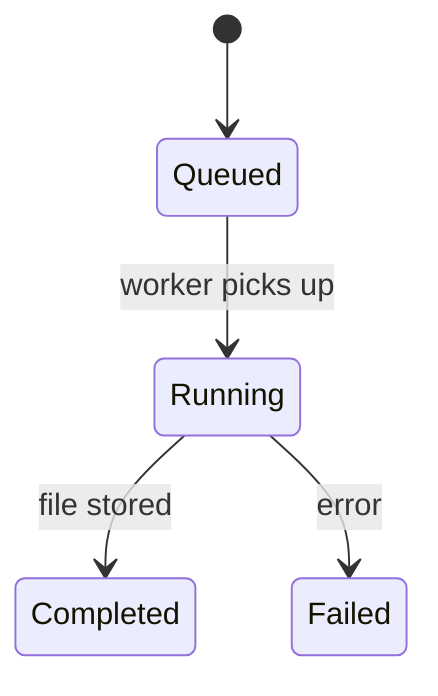
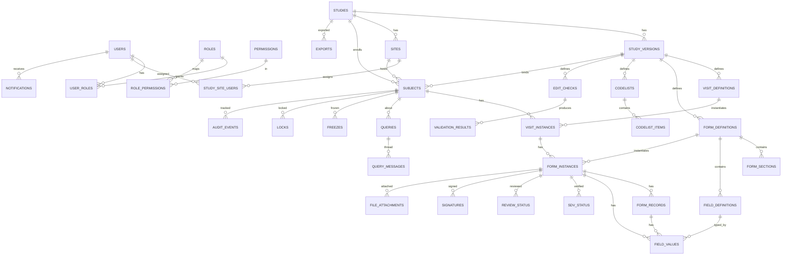

# Design Document

## Overview

The Clinical Electronic Data Capture (EDC_System) is a web-based platform that manages the complete clinical trial data lifecycle in a regulated (21 CFR Part 11, GxP, ALCOA+, HIPAA-aware) environment. It is composed of a React/TypeScript single-page Frontend_Application, a versioned FastAPI API_Layer, a layered set of backend services and repositories, and a PostgreSQL persistence tier, with optional Redis-backed asynchronous workers, S3 object storage, and an optional AWS Bedrock AgentCore AI tier.

This design satisfies the 31 requirements in `requirements.md` and is organized around five design goals:

1. **Audit-safe by construction.** Every clinical or key-configuration mutation writes an immutable Audit_Event inside the same database transaction as the data change. The audit subsystem rejects updates and deletes at both the application and database layers. There is no code path that mutates clinical data without producing an Audit_Event.
2. **Authoritative server-side authorization.** The Permission_Service is the single source of truth for access. Every protected route resolves an Authorization_Scope (union of role permission codes applied at study/site scope) and enforces both route-level and object-level checks. Frontend permission logic is convenience only.
3. **Safe declarative edit checks.** The Edit_Check_Engine evaluates a constrained JSON DSL with a fixed operator set. It never executes user-provided Python or JavaScript. Rules are validated against a schema before persistence, are testable before publish, and are versioned with their owning Study_Version.
4. **Soft-delete retention.** Subject, form, query, and audit data are never physically removed. Logical deletion records the deletion actor, timestamp, and reason while retaining the row, preserving traceability and retention obligations.
5. **Phased delivery.** The module boundaries map cleanly to Phase 1 (MVP), Phase 2 (validation/SDV/review/lock), and Phase 3 (signatures, amendments, advanced exports), so the MVP ships independently with authorization and audit guarantees independently verified.

### Technology Baseline

| Layer | Technology | Notes |
|---|---|---|
| Backend framework | FastAPI (Python 3.11+) | Async REST/JSON, OpenAPI docs, served by Uvicorn/Gunicorn |
| Schema validation | Pydantic v2 | Request/response models, settings |
| ORM / migrations | SQLAlchemy 2.x + Alembic | Typed ORM, versioned schema migrations |
| Database | PostgreSQL | JSONB hybrid storage, UUID PKs, partial/unique indexes |
| Async jobs | Redis + Arq/Celery/RQ (optional) | Export generation, batch validation, large reads |
| Object storage | AWS S3 (optional) | File attachments and export files, signed URLs |
| Auth (optional) | AWS Cognito / OIDC | JWT validation; local JWT fallback otherwise |
| AI (optional) | AWS Bedrock AgentCore | Chat, edit-check drafting, query summarization |
| Deployment | AWS ECS/Fargate + RDS + CloudWatch (optional) | Environment isolation, structured logs, metrics |
| Lint / format | ruff | Linting and formatting in `pyproject.toml` |
| Tests | pytest + Hypothesis | Example/integration tests + property-based tests |
| Frontend | React + TypeScript + Vite | SPA |
| UI | shadcn/ui + Tailwind CSS | Clinical, high-density components |
| Server state | TanStack Query | Caching, mutations, optimistic updates |
| Routing | TanStack Router | Permission-aware route guards |
| Forms | React Hook Form + Zod | Client validation (server authoritative) |
| Tables | TanStack Table | High-density listings |
| Client state | Zustand | Lightweight UI state |

## Architecture

### System Architecture

The system is a layered architecture. The SPA talks only to the versioned API. The API_Layer authenticates, authorizes, and validates, then delegates to services. Services own business logic and transaction boundaries; repositories own all database access. The append-only audit subsystem participates in the same transaction as each clinical write. Optional tiers (Redis/workers, S3, Bedrock) are configured per Environment.



### Request Lifecycle and the Data+Audit Single Transaction

Every clinical mutation follows the same lifecycle. The defining guarantee (Requirements 10.8, 18.1, 21.4, 23.3) is that the data write and its Audit_Event commit atomically: either both persist or neither does. The request identifier assigned at ingress (Requirement 21.5) is propagated into the Audit_Event and every structured log line (Requirement 30.4).



### Module-to-Phase Mapping (Requirement 26)

| Phase | Requirements | Modules / Services |
|---|---|---|
| **Phase 1 (MVP)** | 1, 2, 3, 4, 6, 7, 8, 9, 10, 13 (manual), 18, 19 (CSV), 21, 22, 23, 24, 25, 30 | Auth_Service, Permission_Service, User/Role/Invitation, Study_Service, Site_Service, Subject_Service, Visit_Service, Form_Metadata_Service, Data_Capture_Service, Query_Service (manual), Audit_Service, Export_Service (CSV), Dashboard_Service (core), API/DB/Frontend foundations |
| **Phase 2** | 5 (draft mgmt), 11, 12, 14, 15, 16, 20, 27, 28 | Edit_Check_Engine, Repeating_Record_Service, SDV_Service, Review_Service, Lock_Service, Dashboard_Service (full), File_Attachment_Service, Notification_Service |
| **Phase 3** | 5 (amendments), 17, 19 (advanced formats), 31 | Signature_Service, Study_Version_Service (amendments), Export_Service (Excel/JSON/XPT/ODM), AI_Assistant_Service |
| **Cross-cutting (verified in Phase 1)** | 2 (scope), 18 (immutability) | Independent verification of authorization scope enforcement and audit immutability (Requirement 26.4) |

### Backend Package Structure

```text
backend/
  app/
    main.py                       # app factory, router mount under /api/v1, middleware, health
    core/
      config.py                   # Pydantic settings, per-Environment config
      database.py                 # engine, session, unit-of-work / tx scope
      security.py                 # JWT issue/verify, Cognito/OIDC validation, password + re-auth
      permissions.py              # permission codes, role-capability map, scope resolution
      audit.py                    # audit write helper bound to the active tx + request context
      exceptions.py               # domain exceptions -> HTTP error envelope mapping
      request_context.py          # request_id + actor contextvars, log correlation
    api/
      deps.py                     # current_user, db session, permission guard dependencies
      routes/
        auth.py users.py studies.py study_versions.py sites.py subjects.py
        visits.py forms.py form_data.py records.py queries.py edit_checks.py
        sdv.py reviews.py locks.py signatures.py exports.py audit.py
        dashboards.py notifications.py files.py ai_assistant.py health.py
    models/                       # SQLAlchemy ORM models (one module per aggregate)
    schemas/                      # Pydantic v2 request/response schemas
    services/                     # business logic (one module per service)
    repositories/                 # data access (one module per aggregate)
    workers/                      # async jobs: export_worker.py, validation_worker.py
    tests/                        # unit, integration, permission, audit, property tests
  alembic/                        # migrations
  pyproject.toml                  # deps + [tool.ruff] lint/format config
  Dockerfile
  .env.example                    # per-Environment configuration template
```

## Components and Interfaces

This section defines one subsection per backend service. Each service exposes a Python interface consumed by thin routes; all database access flows through repositories; all mutations route through the Permission_Service and (for clinical/config changes) the Audit_Service in the same transaction.

### Auth_Service (Requirements 1, 3.5)

Handles login, refresh, logout, current-user, password reset, optional Cognito/OIDC validation, MFA, and inactivity enforcement.

- `login(email, password, mfa_code?) -> TokenPair` — verifies credentials; if MFA enabled for the User, requires a valid code (1.9); rejects inactive Users (3.5); issues signed access + refresh tokens (1.1); rejects invalid credentials without issuing tokens (1.2).
- `refresh(refresh_token) -> AccessToken` — issues a new access token for a valid, unrevoked refresh token (1.3).
- `logout(refresh_token) -> None` — revokes the refresh token (1.4).
- `me(user) -> CurrentUser` — returns identity plus resolved Authorization_Scope (1.5).
- `request_password_reset(email) -> None` and `reset_password(token, new_password) -> None` — issues a single-use reset token and updates the password only when a valid token is presented (1.6).
- `validate_external_token(jwt) -> User` — when Cognito/OIDC is configured, validates the issuer/signature/expiry and maps the token `sub` to an internal User (1.7).
- Inactivity: access tokens carry a last-activity claim / server-side session; tokens idle beyond the configured window are rejected until re-authentication (1.8).

Token validation strategy: a single `get_current_user` dependency resolves either a locally issued JWT or a Cognito-issued JWT based on configuration, normalizing both to an internal User and session.

### Permission_Service (Requirements 2, 3.3, 3.6, 23.4)

Single authority for access control. Resolves and enforces permissions at route and object level.

- `resolve_scope(user) -> AuthorizationScope` — computes the union of permission codes across the User's assigned Roles, each tagged with the study/site scope of its assignment (2.1).
- `require(user, permission, study_id?, site_id?) -> None` — raises an authorization error if the scope lacks the permission for the target study/site (2.2, 2.3, 3.3).
- `filter_studies(user, studies)` / `filter_sites(user, sites)` — returns only in-scope studies/sites (2.4).
- `assert_object_access(user, obj)` — denies access to objects whose study/site is out of scope (2.5).

Enforcement is independent of any frontend check (2.6) and every protected mutation passes through `require` before the service mutates data (23.4).

**Role–capability mapping** (scopes: system `S`, study `T`, site `I`):

| Role | Scope | Representative permission codes |
|---|---|---|
| System Administrator | S | `user.*`, `role.*`, `study.create`, `study.configure`, `site.manage`, `audit.read`, `data.export` |
| Study Administrator | T | `study.configure`, `version.publish`, `site.manage`, `form.configure`, `editcheck.configure`, `user.assign` |
| Data Manager | T | `query.create/close/reopen/cancel`, `editcheck.configure`, `lock.manage`, `data.export`, `audit.read`, `review.manage` |
| Clinical Research Associate (CRA) | T/I | `subject.read`, `form.read`, `sdv.manage`, `query.create/close`, `audit.read` |
| Investigator (PI) | I | `subject.read`, `form.read`, `form.enter`, `form.submit`, `query.respond`, `signature.sign` |
| Site Coordinator / Site User | I | `subject.create/read/update`, `form.enter`, `form.submit`, `query.respond`, `file.upload` |
| Medical Reviewer | T | `form.read`, `review.manage`, `query.create`, `audit.read` |
| Sponsor Viewer | T/I | read-only codes only: `subject.read`, `form.read`, `audit.read`, dashboard read (3.6) |

### Study_Service (Requirement 4)

- `create_study(data) -> Study` — persists study code, protocol number, title, sponsor, phase, therapeutic area, indication, status (4.1); enforces unique study code across the system (4.2); writes an Audit_Event (4.5).
- `transition_status(study, target)` — enforces the status machine `Draft → UAT → Active → Enrollment Closed → Locked → Archived` (4.3) and rejects illegal transitions.
- `get_dashboard(user, study)` — delegates to Dashboard_Service for scoped study metrics (4.4).
- All metadata changes write Audit_Events (4.5).

### Study_Version_Service (Requirement 5)

Owns version lifecycle and the immutability of published metadata.

- `publish(version, actor) -> StudyVersion` — transitions `draft → published`, records publication actor and timestamp (5.1).
- `guard_mutable(version)` — rejects modifications to a published version and all child visits/forms/fields/code lists/edit checks (5.2). Called by Form_Metadata_Service, Visit_Service, and Edit_Check_Engine before any metadata write.
- `create_amendment(study, reason) -> StudyVersion` — creates a new draft version with an amendment reason (5.3, Phase 3).
- Prior published versions are retained for traceability (5.4); each form definition is associated with exactly one Study_Version (5.5).

### Site_Service (Requirement 6)

- `create_site(study, data) -> Site` — persists site number, name, PI, country, region, address, status (6.1); enforces site number unique within the study (6.2).
- `deactivate_site(site)` — sets status inactive and retains the record (6.4).
- `assign_user(study, site, user, roles)` — records the site-level assignment (6.5).
- `get_dashboard(user, site)` — delegates scoped site progress metrics (6.3).

### Subject_Service (Requirement 7)

- `create_subject(study, site, data) -> Subject` — persists metadata, binds the Subject to the applicable published Study_Version (7.1); generates the subject identifier by the configured rule and enforces subject number unique within the study (7.2); initializes Visit_Instances and Form_Instances from the bound version (7.4, delegating to Visit_Service).
- `transition_status(subject, target)` — enforces the subject status machine (7.3); writes an Audit_Event (7.6).
- `get_casebook(user, subject)` — returns visit/form structure with clinical status (7.5).



### Visit_Service (Requirement 8)

- `define_visit(version, data) -> VisitDefinition` — persists name, visit number, type, target day, window bounds, display order, required flag (8.1); only while the owning version is draft.
- `initialize_instances(subject)` — creates Visit_Instances from the bound version's definitions (8.2).
- `record_visit_date(instance, date)` — computes window status (`before_window`, `in_window`, `after_window`) from the date relative to `target_day ± window bounds` (8.3).
- `create_unscheduled(subject, data)` — where permitted, creates an unscheduled Visit_Instance (8.4).
- `mark_missed(instance)` — sets status to missed (8.5).

### Form_Metadata_Service (Requirement 9)

Manages eCRF metadata within a Study_Version. Form versioning is achieved through the `study_version_id` relationship on `form_definitions` — there is **no separate `form_versions` table**; a form's version is the version of its owning Study_Version.

- `create/edit/order_forms(version, ...)` and `create/order_sections_and_fields(...)` — allowed only while the owning version is draft (9.1, 9.2); `guard_mutable` blocks edits on published versions.
- Supported control types (9.3): text, textarea, integer, decimal, date, datetime, time, radio, checkbox, dropdown, multi-select, boolean, file upload, calculated, repeating table, coded term.
- Supported field attributes (9.4): label, variable name, data type, required, code list reference, default value, help text, unit, min, max, max length, decimal precision, regex validation, visibility rule, read-only, calculated.
- Code lists and code list items referenced by fields (9.5).
- **Standard form templates**: AE, CM, DM/Demographics, MH, VS, LB, EX, DS, EG, and a Visit Date form, seedable into a draft version.
- **Calculated fields**: declarative expressions (e.g., BMI from height/weight) evaluated server-side via the same safe expression evaluator used by the Edit_Check_Engine.
- All metadata changes write Audit_Events (9.6).

### Data_Capture_Service (Requirement 10)

Loads, saves, submits, reopens, and edits clinical field values for Form_Instances using **hybrid storage**: the full payload on `form_instances.data_jsonb` for fast retrieval, plus one normalized `field_values` row per field for audit, query, SDV, review, and export.

- `load(form_instance) -> FormInstanceView`.
- `save_draft(form_instance, values)` — persists Field_Values and sets status to In Progress (10.1).
- `submit(form_instance)` — validates required fields, data types, ranges, code list membership, and conditional rules; on success sets status Submitted; on failure returns field-level errors and preserves prior values (10.3, 10.4).
- `change_value(form_instance, field, value, reason?)` — if the instance was already submitted, requires a Reason_For_Change before persisting (10.5); rejects modification if the instance (or any ancestor) is Frozen or Locked (10.7, via Lock_Service).
- `mark_not_applicable(form_instance, field)` — persists the not-applicable state (10.6).
- Form_Instance statuses (10.2): Not Started, In Progress, Submitted, Reviewed, Frozen, Locked, Signed.
- Every create/change of a Field_Value writes an Audit_Event in the same transaction (10.8), keeping `data_jsonb` and `field_values` consistent.

### Repeating_Record_Service (Requirement 11)

- `add_record(form_instance) -> FormRecord` — creates a row with a monotonically assigned sequence number (11.1).
- `edit_record(record, values)` — persists changes and writes an Audit_Event (11.2).
- `soft_delete(record, reason)` — records deletion actor, timestamp, reason; retains the row (11.3).
- `restore(record)` — clears deletion state and writes an Audit_Event (11.4).

### Edit_Check_Engine (Requirement 12)

Evaluates a constrained declarative JSON DSL. It **never executes user-provided code** (12.7).

- DSL: boolean trees of `and`/`or`/`not` over conditions `{field, operator, value | value_field}`. Operators: `is_null`, `not_null`, `==`, `!=`, `>`, `>=`, `<`, `<=`, `in`, `not_in`, `matches` (anchored regex), `before`, `after`, `within_days`.
- `validate_rule(json)` — validates against the operator/condition schema before persisting (12.1).
- Rule types (12.2): required field, range, date comparison, cross-field, cross-form, code list validation, format validation, duplicate record, missing visit/form, conditional required, lab abnormality.
- Severities (12.3): info, warning, error, query.
- `test(rule, sample_data) -> Outcome` — evaluates against sample data without persisting clinical data (12.4); enforces test-before-publish.
- `evaluate(form_instance)` — at runtime, when a `query`-severity condition is met, requests Query_Service to create a system Query linked to the affected object (12.5).
- **Lab normal-range pseudo-fields**: `<field>.normal_low` / `<field>.normal_high` are resolved from codelist/lab reference ranges so abnormality checks reference them as ordinary fields.
- Edit checks are versioned with their owning Study_Version (12.6).
- **Seeded examples**: AE start ≤ end; informed-consent date ≤ first procedure; AE Serious=Yes ⇒ seriousness criteria required; AE Outcome=Fatal ⇒ death date required; visit date within window else warning.



### Query_Service (Requirement 13)

- `create_query(target, text, type)` — links the Query to exactly one affected object among Subject, Visit_Instance, Form_Instance, Form_Record, or field (13.1). Manual (Phase 1) and system-generated (Phase 2).
- Lifecycle (13.2): Open, Answered, Closed, Reopened, Cancelled.
- `respond(query, message)` — site user response transitions Open → Answered and appends to the thread (13.3).
- `close(query)` / `reopen(query)` / `cancel(query)` — transitions with closing actor/timestamp (13.4, 13.5).
- Complete threaded message history is preserved (13.6); every action writes an Audit_Event (13.7).



### SDV_Service (Requirement 14)

- `set_sdv(scope, target, actor)` — persists verified status with actor and timestamp at field/form/visit/subject scope (14.1).
- `clear_sdv(target)` — sets status to not verified (14.2).
- `progress(scope) -> {verified, not_verified}` — returns counts for the requested scope (14.3).
- Every change writes an Audit_Event (14.4).

### Review_Service (Requirement 15)

- `mark_reviewed(form_instance, actor)` — persists reviewed status with actor/timestamp (15.1).
- `clear_review(form_instance)` — sets not reviewed (15.2).
- `progress(scope) -> {reviewed, not_reviewed}` (15.3).
- Every change writes an Audit_Event (15.4).

### Lock_Service (Requirement 16)

Applies and removes freeze and lock across the object hierarchy `field → form → visit → subject → site → study`.

- `freeze(object)` / `lock(object)` — sets freeze/lock state on the target (16.1, 16.2).
- `is_modification_blocked(field)` — returns true if the field or **any ancestor** in the chain is frozen or locked (16.3). Data_Capture_Service and File_Attachment_Service call this before mutating.
- `unlock(object, reason)` — requires a reason and clears the lock (16.4).
- Every freeze/lock/unlock writes an Audit_Event (16.5).



### Signature_Service (Requirement 17)

- `sign(object, meaning, credentials)` — requires re-authentication before recording (17.1); persists signer identity, timestamp, meaning, signed-object reference, and a hash of the signed data (17.2).
- `invalidate_if_changed(object)` — when signed data changes, marks the signature stale and records the stale reason (17.3). Called by Data_Capture_Service after post-signature changes.
- Every signature action writes an Audit_Event (17.4).



### Audit_Service (Requirement 18)

Append-only, two-layer immutability.

- `record(event)` — writes an Audit_Event capturing actor, timestamp, entity type/id, study, site, action, and where applicable field, old value, new value, Reason_For_Change, and request_id (18.1, 18.3). Always invoked inside the caller's transaction.
- **Layer 1 (application):** no service exposes update/delete on audit events.
- **Layer 2 (database):** UPDATE/DELETE privileges on `audit_events` are revoked from the application role and/or a trigger raises on UPDATE/DELETE (18.2).
- `search(filters)` — filterable by user, date, entity, subject, field (18.5).
- `export(selection)` — produces an export of selected events (18.6). File upload/download/deletion actions are audited (18.4).

### Export_Service + Export Worker (Requirement 19)

- `create_export(study, params) -> ExportJob` — creates a job, enqueues it, tracks status Queued → Running → Completed/Failed (19.1).
- Worker generates the file in CSV, Excel, JSON, SAS XPT, or ODM XML (19.5) and stores it (S3 or local).
- Filters (19.3): study, site, subject, visit, form, domain, date range, changed-since-last-export, locked-data-only, clean-data-only.
- `subject_list_export(scope)` (19.2).
- `download(export)` — provides the file via signed URL or authenticated streaming and writes an Audit_Event for the download (19.4).



### Dashboard_Service (Requirement 20)

- `study_dashboard(user, study)` — subject counts by status, form completion, open query counts (20.1).
- `site_dashboard(user, site)` — site-level progress (20.2).
- `query_metrics(user, scope)` — open/answered/overdue counts and aging (20.3).
- All metrics computed strictly within the requesting User's Authorization_Scope (20.4); read-only.

### Notification_Service (Requirement 28)

- `on_query_assigned(query)` — notifies recipients in the assigned Role (28.1).
- `on_form_submitted(form_instance)` — notifies responsible reviewers (28.2).
- `on_export_completed(job)` — notifies the requesting User (28.3).
- Statuses: Unread, Read, Archived (28.4).
- `list_unread(user)` — returns notifications addressed to that User (28.5).

### File_Attachment_Service (Requirement 27)

- `upload(parent, file)` — where enabled, stores the file in object storage and persists metadata linked to its clinical object (27.1); rejected if the parent is Frozen or Locked (27.5, via Lock_Service).
- `download(attachment, user)` — granted only if the User has read access to the parent object (27.2, via Permission_Service).
- `soft_delete(attachment, reason)` — logical deletion (27.3).
- Upload/download/deletion all write Audit_Events (27.4, 18.4).

### AI_Assistant_Service (Requirement 31, optional)

- Endpoints for chat, edit-check drafting, and query summarization backed by AWS Bedrock AgentCore (31.1).
- Responses streamed via Server-Sent Events or WebSocket (31.2).
- `build_context(user, request)` — verifies the requesting User's Authorization_Scope and restricts context strictly to in-scope data before sending it to the model (31.3).
- `apply_suggestion(suggestion)` — if a suggestion would change study data, requires explicit human confirmation before applying (31.4); AI-assisted regulated-data changes write Audit_Events (31.5).

### API Surface (Requirement 21)

All endpoints are mounted under `/api/v1`, return Pydantic v2 JSON, paginate lists as `{items, page, page_size, total}`, and emit the standard error envelope. Representative mapping:

| Area | Endpoints (under `/api/v1`) |
|---|---|
| Auth | `POST /auth/login`, `/auth/logout`, `/auth/refresh`, `/auth/forgot-password`, `/auth/reset-password`, `/auth/invite/accept`; `GET /auth/me` |
| Users/Roles | `GET/POST /users`, `GET/PATCH /users/{id}`, `POST /users/{id}/deactivate`, `GET/POST /roles`, `GET /permissions`, `POST /studies/{id}/users/{uid}/assign` |
| Studies | `GET/POST /studies`, `GET/PATCH/DELETE /studies/{id}`, `POST /studies/{id}/publish|archive`, `GET /studies/{id}/dashboard` |
| Versions | `GET/POST /studies/{id}/versions`, `POST /versions/{id}/publish`, `POST /studies/{id}/amend` |
| Sites | `GET/POST /studies/{id}/sites`, `GET/PATCH/DELETE /sites/{id}`, `GET /sites/{id}/dashboard` |
| Subjects | `GET/POST /studies/{id}/subjects`, `GET/PATCH /subjects/{id}`, `POST /subjects/{id}/screen-fail|randomize|terminate`, `GET /subjects/{id}/casebook` |
| Visits | `GET /subjects/{id}/visits`, `POST /subjects/{id}/visits/unscheduled`, `GET/PATCH /visits/{id}`, `POST /visits/{id}/mark-missed` |
| Forms (metadata) | `GET/POST /studies/{id}/forms`, `GET/PATCH/DELETE /forms/{id}`, `POST /forms/{id}/sections|fields`, `PATCH/DELETE /fields/{id}` |
| Form data | `GET /form-instances/{id}`, `PATCH /form-instances/{id}/data`, `POST /form-instances/{id}/save|submit|reopen`, `GET /form-instances/{id}/audit` |
| Records | `POST /form-instances/{id}/records`, `PATCH/DELETE /records/{id}`, `POST /records/{id}/restore` |
| Queries | `GET/POST /queries`, `GET /queries/{id}`, `POST /queries/{id}/respond|close|reopen|cancel`, `GET /queries/{id}/history` |
| Edit checks | `GET/POST /studies/{id}/edit-checks`, `GET/PATCH /edit-checks/{id}`, `POST /edit-checks/{id}/test`, `POST /studies/{id}/edit-checks/run` |
| SDV | `POST /fields/{id}/sdv|unsdv`, `POST /form-instances/{id}/sdv|unsdv`, `GET /studies/{id}/sdv-progress` |
| Review | `POST /form-instances/{id}/review|unreview`, `GET /studies/{id}/review-progress` |
| Freeze/Lock | `POST /form-instances/{id}/freeze|unfreeze|lock|unlock`, `POST /subjects/{id}/freeze|lock`, `POST /studies/{id}/lock` |
| Signatures | `POST /form-instances/{id}/sign`, `POST /subjects/{id}/sign`, `GET /subjects/{id}/signatures` |
| Exports | `GET/POST /studies/{id}/exports`, `GET /exports/{id}`, `GET /exports/{id}/download` |
| Audit | `GET /audit-events`, `GET /subjects/{id}/audit`, `GET /form-instances/{id}/audit`, `GET /fields/{id}/audit` |
| Dashboards | `GET /studies/{id}/dashboard`, `GET /sites/{id}/dashboard`, `GET /studies/{id}/query-metrics` |
| Notifications | `GET /notifications`, `POST /notifications/{id}/read|archive` |
| Files | `POST /objects/{type}/{id}/files`, `GET /files/{id}/download`, `DELETE /files/{id}` |
| AI | `POST /ai/chat`, `POST /ai/edit-check-draft`, `POST /ai/query-summary` (SSE/WS) |
| Health | `GET /health/live`, `GET /health/ready`, `GET /metrics` |

### Frontend Architecture (Requirement 24)

Feature-based structure with shared clinical components and permission-aware routing.

```text
frontend/src/
  app/            router.tsx, providers.tsx
  components/
    ui/           shadcn/ui primitives
    layout/       app shell, nav, study/site switchers
    data-table/   TanStack Table wrappers
    clinical/     reusable clinical components (below)
  features/
    auth/ studies/ sites/ users/ subjects/ casebook/ forms/
    queries/ sdv/ review/ exports/ audit/ study-setup/
    notifications/ dashboards/
  lib/            api.ts, auth.ts, permissions.ts, utils.ts
  hooks/ types/ schemas/
```

**Required pages.** Public: Login, Forgot password, Reset password, Accept invitation. Authenticated: Study selector, Study dashboard, Site dashboard, Subject list, Create-subject dialog, Subject casebook, Visit detail, Form data entry, Query inbox, Query detail, SDV worklist, Clinical review worklist, Data listings, Audit trail viewer, Export center, Study configuration, Form builder, Edit-check builder, User management, Site management, Role management, System settings.

**Clinical reusable components.** `SubjectStatusBadge`, `FormStatusBadge`, `QueryStatusBadge`, `SDVStatusBadge`, `ReviewStatusBadge`, `LockStatusBadge`, `ClinicalDataTable`, `FieldQueryIcon`, `FieldAuditHistory`, `ReasonForChangeDialog`, `CasebookVisitCard`, `FormSectionCard`, `RepeatingRecordTable`, `QueryThread`, `PermissionGuard`, `StudySelector`, `SiteSelector`.

**shadcn/ui primitives.** Button, Card, Table, Dialog, Sheet, Tabs, Badge, Dropdown Menu, Command, Form, Input, Textarea, Select, Checkbox, Radio Group, Calendar, Popover, Toast, Alert, Tooltip, Accordion, Separator.

**Key screen specs.**
- *Subject list*: columns Subject ID, Site, Status, Screening date, Randomization date, Last visit, Open queries, Forms complete, SDV status, Review status, Lock status; with search, filter (site/status/query/SDV/lock), sort, pagination, create subject, export.
- *Subject casebook*: subject header (site, status, open-query count, SDV %, review %), visits in chronological order, forms under each visit with completion/query/SDV/review/freeze/lock/signature badges.
- *Form data entry*: subject + visit headers, form status, sections, fields, repeating record tables, query side panel, audit side panel, SDV/review actions if permitted, Save Draft / Submit / Reopen; Zod client validation, required-missing highlighting, open-query highlighting, Reason_For_Change on post-submit edits, disabled controls when frozen/locked, save/submit toast.
- *Query inbox*: columns Query ID, Status, Type, Subject, Visit, Form, Field, Query text, Created by, Created date, Age, Assigned role; filters Study, Site, Subject, Status, Type, Age, Assigned role.

**UI principles.** Clinical, clean, high-density; keyboard-friendly entry; clear status badges; consistent query/audit/SDV/review/lock indicators; never hide important clinical status; side workflows (audit, query threads) use dialogs/sheets (24.5); optimistic updates avoided for audit-sensitive actions (confirm server success).

**Permission behavior.** Render clinical status consistently across list/casebook/data-entry (24.1); validate with Zod while the API stays authoritative (24.2); collect Reason_For_Change before sending post-submit edits (24.3); disable controls for frozen/locked objects (24.4); hide unpermitted actions or show an access-denied view, treating frontend checks as convenience only (24.6, 2.6).

## Data Models

### Storage Strategy (Requirement 22)

- **Metadata vs clinical separation.** Study metadata (`studies`, `study_versions`, `visit_definitions`, `form_definitions`, `form_sections`, `field_definitions`, `codelists`, `codelist_items`, `edit_checks`) is stored separately from clinical subject data (`subjects`, `visit_instances`, `form_instances`, `form_records`, `field_values`) (22.1).
- **Hybrid clinical storage.** Each Field_Value is stored both on `form_instances.data_jsonb` (fast retrieval/rendering) and as a normalized `field_values` row (audit, query, SDV, review, export). The two are written in the same transaction and must stay consistent (22.3).
- **Soft deletion.** Subject, form, query, and audit data are never physically removed; logical deletion records actor/timestamp/reason (22.2).
- **UTC everywhere.** All timestamps are timezone-aware UTC; local conversion happens only in the Frontend_Application (22.4).
- **UUID primary keys** for all tables; common filter columns are indexed: study, site, subject, form, status, created_at (22.6).
- **Uniqueness.** study code globally; site number within study; subject number within study (22.5).

**Form-versioning reconciliation.** The reference data model listed a `form_versions` table, but this design intentionally omits it. Form versioning is expressed through the `form_definitions.study_version_id` foreign key (Requirement 5.5): a form's version is the version of its owning Study_Version, and immutability is enforced by `Study_Version_Service.guard_mutable`. This keeps a single source of truth for "what is published" and avoids divergence between a form version and its study version.

### Entity-Relationship Diagram



### Tables

**users**: `id` (UUID PK), `email` (unique), `full_name`, `status` (pending/active/inactive), `auth_provider_id` (Cognito sub, nullable), `mfa_enabled`, `created_at`, `updated_at`, `deactivated_at`. Deactivation retains the record (3.4).

**roles**: `id`, `name` (unique), `description`, `scope` (system/study/site).

**permissions**: `id`, `code` (unique, e.g. `form.enter`), `description`.

**role_permissions**: `id`, `role_id` FK, `permission_id` FK. Unique (`role_id`,`permission_id`).

**user_roles**: `id`, `user_id` FK, `role_id` FK, `study_id` FK (nullable), `site_id` FK (nullable), `assigned_at`, `assigned_by`. Encodes the study/site scope of each grant (2.1). Index (`user_id`).

**studies**: `id`, `study_code` (**unique globally**), `protocol_number`, `title`, `sponsor`, `phase`, `therapeutic_area`, `indication`, `status` (Draft/UAT/Active/Enrollment Closed/Locked/Archived), `timezone`, `created_at`, `updated_at`.

**study_versions**: `id`, `study_id` FK, `version_number`, `status` (draft/published/retired), `effective_date`, `published_at`, `published_by`, `amendment_reason`. Unique (`study_id`,`version_number`).

**sites**: `id`, `study_id` FK, `site_number`, `name`, `principal_investigator`, `country`, `region`, `address`, `timezone`, `status` (active/inactive). **Unique (`study_id`,`site_number`)** (6.2, 22.5).

**study_site_users**: `id`, `study_id` FK, `site_id` FK (nullable for study-scope), `user_id` FK, `role_id` FK, `created_at`. Records site/study assignments (6.5).

**subjects**: `id`, `study_id` FK, `site_id` FK, `study_version_id` FK (bound published version), `subject_number`, `screening_number`, `randomization_number`, `sex`, `screening_date`, `enrollment_date`, `randomization_date`, `status` (subject state machine), `created_at`, `updated_at`. **Unique (`study_id`,`subject_number`)** (7.2, 22.5). Index (`study_id`,`site_id`,`status`).

**visit_definitions**: `id`, `study_version_id` FK, `name`, `visit_number`, `visit_type`, `target_day`, `window_lower`, `window_upper`, `display_order`, `is_required`.

**visit_instances**: `id`, `subject_id` FK, `visit_definition_id` FK, `name`, `visit_date`, `status` (scheduled/in-progress/missed/unscheduled/completed), `window_status` (before/in/after window), `sequence_number`.

**form_definitions**: `id`, `study_version_id` FK, `oid`, `name`, `domain`, `form_type`, `is_repeating`, `display_order`, `status`. Versioned via `study_version_id` (5.5; no `form_versions` table).

**form_sections**: `id`, `form_definition_id` FK, `name`, `display_order`.

**field_definitions**: `id`, `form_definition_id` FK, `section_id` FK, `oid`, `variable_name`, `label`, `data_type`, `control_type`, `required`, `readonly`, `hidden`, `is_calculated`, `default_value`, `min_value`, `max_value`, `max_length`, `decimal_precision`, `regex`, `codelist_id` FK (nullable), `unit`, `help_text`, `sdtm_domain`, `sdtm_variable`, `display_order`, `visibility_rule_json`, `validation_rule_json`, `calculation_json`.

**codelists**: `id`, `study_version_id` FK, `name`, `description`.

**codelist_items**: `id`, `codelist_id` FK, `code`, `label`, `display_order`, `normal_low` (nullable), `normal_high` (nullable). Lab pseudo-fields draw on the normal range.

**form_instances**: `id`, `subject_id` FK, `visit_instance_id` FK, `form_definition_id` FK, `status` (Not Started/In Progress/Submitted/Reviewed/Frozen/Locked/Signed), `data_jsonb`, `submitted_at`, `submitted_by`, `created_at`, `updated_at`. Index (`subject_id`,`visit_instance_id`,`form_definition_id`).

**form_records**: `id`, `form_instance_id` FK, `sequence_number`, `status`, `deleted_at`, `deleted_by`, `delete_reason`. Soft deletion (11.3).

**field_values** (Item_Value): `id`, `form_instance_id` FK, `record_id` FK (nullable), `field_definition_id` FK, `value_text`, `value_number`, `value_date`, `value_datetime`, `value_boolean`, `value_json`, `is_na`, `status`, `updated_at`, `updated_by`. Index (`form_instance_id`,`field_definition_id`).

**edit_checks**: `id`, `study_version_id` FK, `name`, `rule_type`, `severity` (info/warning/error/query), `definition_json` (validated DSL), `message`, `target_form`, `status` (draft/active), `created_at`. Versioned with study version (12.6).

**validation_results**: `id`, `edit_check_id` FK, `form_instance_id` FK, `record_id` FK (nullable), `field_definition_id` FK (nullable), `severity`, `outcome` (passed/failed), `message`, `evaluated_at`. Links a run of a check to the affected object; query-severity failures spawn a Query.

**queries**: `id`, `study_id` FK, `site_id` FK, `subject_id` FK, `visit_instance_id` FK (nullable), `form_instance_id` FK (nullable), `record_id` FK (nullable), `field_definition_id` FK (nullable), `query_type` (manual/system), `status` (Open/Answered/Closed/Reopened/Cancelled), `query_text`, `assigned_role`, `created_by`, `created_at`, `closed_by`, `closed_at`. Exactly one affected-object target (13.1). Index (`study_id`,`status`), (`site_id`,`status`).

**query_messages**: `id`, `query_id` FK, `message_text`, `message_type` (query/response/comment), `created_by`, `created_at`. Append-only thread (13.6).

**sdv_status**: `id`, `scope` (field/form/visit/subject), `object_type`, `object_id`, `verified` (bool), `verified_by`, `verified_at`. Unique (`object_type`,`object_id`).

**review_status**: `id`, `form_instance_id` FK, `reviewed` (bool), `reviewed_by`, `reviewed_at`. Unique (`form_instance_id`).

**freezes**: `id`, `object_type`, `object_id`, `status`, `reason`, `created_by`, `created_at`, `removed_by`, `removed_at`, `remove_reason`. Index (`object_type`,`object_id`).

**locks**: `id`, `object_type`, `object_id`, `status`, `reason`, `created_by`, `created_at`, `removed_by`, `removed_at`, `remove_reason` (unlock reason required, 16.4). Index (`object_type`,`object_id`).

**signatures**: `id`, `object_type`, `object_id`, `signed_by`, `signed_at`, `signature_meaning`, `data_hash`, `status` (valid/stale), `stale_reason`. Index (`object_type`,`object_id`).

**audit_events**: `id`, `study_id`, `site_id`, `subject_id`, `entity_type`, `entity_id`, `action`, `field_definition_id` (nullable), `old_value_json`, `new_value_json`, `reason`, `user_id`, `timestamp` (UTC, server clock), `ip_address`, `user_agent`, `request_id`. **Append-only**: UPDATE/DELETE revoked + trigger guard (18.2). Index (`study_id`,`timestamp`), (`entity_type`,`entity_id`), (`subject_id`), (`field_definition_id`).

**file_attachments**: `id`, `object_type`, `object_id`, `study_id`, `site_id`, `subject_id` (nullable), `filename`, `content_type`, `size_bytes`, `storage_key` (S3/local), `uploaded_by`, `uploaded_at`, `deleted_at`, `deleted_by`, `delete_reason`. Soft delete (27.3).

**exports**: `id`, `study_id` FK, `requested_by`, `format` (CSV/Excel/JSON/XPT/ODM), `filters_json`, `status` (Queued/Running/Completed/Failed), `storage_key`, `created_at`, `completed_at`. Download audited (19.4).

**notifications**: `id`, `user_id` FK, `type`, `payload_json`, `status` (Unread/Read/Archived), `created_at`, `read_at`. Index (`user_id`,`status`).

### Integrity Notes

- Foreign keys enforce study/site/version containment; object-level permission checks add scope enforcement at the service layer.
- Unique constraints: `studies.study_code`; (`sites.study_id`,`site_number`); (`subjects.study_id`,`subject_number`); (`study_versions.study_id`,`version_number`); (`role_permissions.role_id`,`permission_id`).
- Append-only `audit_events` (no UPDATE/DELETE); soft-delete columns on `form_records`, `file_attachments`, and clinical tables instead of physical deletes.
- All `*_at` timestamps are `TIMESTAMPTZ` in UTC.

## Correctness Properties

*A property is a characteristic or behavior that should hold true across all valid executions of a system — essentially, a formal statement about what the system should do. Properties serve as the bridge between human-readable specifications and machine-verifiable correctness guarantees.*

The following properties are the consolidated, deduplicated set derived from the prework analysis. Audit, soft-delete, uniqueness, lock, scope, status-machine, and toggle criteria were merged into single comprehensive properties to remove redundancy. Each property is universally quantified and is implemented by exactly one property-based test.

### Property 1: Authorization scope is the union of role grants

*For any* User with any set of Role assignments, the resolved Authorization_Scope equals the union of the permission codes of those Roles, each tagged with the study/site scope of its assignment — no extra grants and no missing grants.

**Validates: Requirements 2.1**

### Property 2: Access is permitted if and only if in scope

*For any* User, required Permission, and target study/site, a protected operation is permitted exactly when the resolved Authorization_Scope contains that Permission for that study/site, and is denied otherwise (including out-of-scope object access, inactive users, and Sponsor Viewer attempting any write).

**Validates: Requirements 2.2, 2.3, 2.5, 3.5, 3.6, 23.4, 26.4**

### Property 3: Listing and aggregation are scope-filtered

*For any* User and any backing dataset, every study, site, object, dashboard metric, AI context item, and notification returned to that User belongs to the User's Authorization_Scope, and no in-scope item that matches the request is omitted.

**Validates: Requirements 2.4, 4.4, 6.3, 20.1, 20.2, 20.3, 20.4, 28.5, 31.3**

### Property 4: Authentication issues tokens only for valid, active, MFA-satisfied credentials

*For any* credential attempt, the Auth_Service issues an access+refresh token pair exactly when the credentials are valid, the User is active, and any required MFA code is correct; otherwise no token is issued.

**Validates: Requirements 1.1, 1.2, 1.9, 3.5**

### Property 5: Session token round-trip and revocation

*For any* issued session, a valid unrevoked refresh token yields a usable new access token, while a logged-out (revoked) refresh token, an idle-beyond-window session, and a single-use password-reset token already consumed are all rejected.

**Validates: Requirements 1.3, 1.4, 1.6, 1.8**

### Property 6: Invitation lifecycle round-trip

*For any* invitation, accepting a valid single-use invitation token activates the pending User and applies the invited Roles at their study/site scope, and the same token cannot be accepted twice.

**Validates: Requirements 3.1, 3.2**

### Property 7: Scoped uniqueness is enforced

*For any* two records of the same kind, the system rejects a second study with a duplicate study code, a second site with a duplicate site number within a study, a second subject with a duplicate subject number within a study, and a duplicate study-version number within a study.

**Validates: Requirements 4.2, 6.2, 7.2, 22.5**

### Property 8: Only legal status transitions are accepted

*For any* entity governed by a status machine (study, study version, subject, query, export job) and any attempted transition, the transition succeeds if and only if it is permitted by that entity's defined state machine; illegal transitions are rejected and leave the state unchanged.

**Validates: Requirements 4.3, 5.1, 7.3, 13.2, 13.3, 13.4, 13.5, 19.1**

### Property 9: Persisted records round-trip

*For any* valid study, site, visit definition, site assignment, or subject, creating the record and then reading it back returns the same metadata that was written.

**Validates: Requirements 4.1, 6.1, 6.5, 8.1**

### Property 10: Published study versions are immutable

*For any* Study_Version, modifications to the version or any of its child visits, forms, sections, fields, code lists, or edit checks are accepted while the version is draft and rejected once it is published.

**Validates: Requirements 5.2, 9.1, 9.2, 12.6**

### Property 11: Amendment preserves prior versions and binds forms to one version

*For any* study, creating an amendment yields a new draft Study_Version with an amendment reason while every previously published version is retained, and every form definition is associated with exactly one Study_Version.

**Validates: Requirements 5.3, 5.4, 5.5**

### Property 12: Subject binding and instance initialization

*For any* Subject created under a published Study_Version, the Subject is bound to that version and the set of created Visit_Instances and Form_Instances corresponds exactly to the visit and form definitions of the bound version.

**Validates: Requirements 7.1, 7.4, 8.2**

### Property 13: Visit window status is computed correctly

*For any* visit date and configured window bounds, the computed window status is `before_window`, `in_window`, or `after_window` according to whether the date falls below, within, or above `target_day` adjusted by the window bounds.

**Validates: Requirements 8.3**

### Property 14: Draft save persists values and sets In Progress

*For any* set of field values saved as a draft, the values are persisted and the Form_Instance status becomes In Progress.

**Validates: Requirements 10.1, 10.6**

### Property 15: Submission validates atomically and preserves data on failure

*For any* Form_Instance and candidate values, submission sets status to Submitted exactly when all required-field, data-type, range, code-list, and conditional-rule validations pass; if any validation fails, field-level errors are returned and the previously entered values are preserved unchanged.

**Validates: Requirements 10.3, 10.4**

### Property 16: Post-submission changes require a reason

*For any* Field_Value change to an already-submitted Form_Instance, the change is persisted only when a Reason_For_Change is supplied, and rejected otherwise.

**Validates: Requirements 10.5, 18.3**

### Property 17: Clinical mutations write an atomic, complete Audit_Event

*For any* clinical or key-configuration mutation, exactly one Audit_Event is committed in the same database transaction as the data change (both persist or neither does), capturing actor, UTC server timestamp, entity type/id, study, site, action, and where applicable field, old value, new value, and Reason_For_Change.

**Validates: Requirements 4.5, 7.6, 9.6, 10.8, 11.2, 13.7, 14.4, 15.4, 16.5, 17.4, 18.1, 21.4, 22.4, 25.2, 31.5**

### Property 18: The audit trail is immutable

*For any* persisted Audit_Event, every attempt to update or delete it is rejected at both the application and database layers.

**Validates: Requirements 18.2**

### Property 19: Request identifier is returned and propagated

*For any* request, the request identifier returned to the client equals the request identifier recorded in every Audit_Event produced by that request and in that request's structured log entries.

**Validates: Requirements 21.5, 30.4**

### Property 20: Audit search matches its filters

*For any* audit query with filters on user, date, entity, subject, or field, every returned Audit_Event satisfies all supplied filter predicates and no matching event is omitted.

**Validates: Requirements 18.5**

### Property 21: Repeating-record sequence is monotonic and soft-delete round-trips

*For any* sequence of row additions to a repeating Form_Instance, assigned sequence numbers are strictly increasing; soft-deleting a row retains it marked deleted with actor/timestamp/reason, and restoring it returns the instance to its pre-deletion logical state.

**Validates: Requirements 11.1, 11.3, 11.4**

### Property 22: Soft deletion retains records

*For any* deletion of a subject, form record, file attachment, user, or site, the underlying row is retained (logically deleted or deactivated) and is never physically removed.

**Validates: Requirements 3.4, 6.4, 22.2, 27.3**

### Property 23: Edit-check rule serialization round-trip and safe evaluation

*For any* edit-check rule, the rule is persisted only if it validates against the operator/condition schema, serializing then deserializing the stored rule yields an equivalent rule, and evaluation against arbitrary input (including adversarial strings) only ever applies whitelisted operators and never executes user-provided code.

**Validates: Requirements 12.1, 12.7**

### Property 24: Edit-check test does not persist clinical data

*For any* edit check tested against sample data, the engine returns an evaluation outcome and no clinical Field_Value is written as a side effect.

**Validates: Requirements 12.4**

### Property 25: Query-severity checks generate a linked system query

*For any* runtime evaluation where a query-severity edit-check condition is met, a system Query is created and linked to exactly one affected object.

**Validates: Requirements 12.5**

### Property 26: A query is linked to exactly one affected object with an ordered, append-only thread

*For any* Query, exactly one of its affected-object references (subject, visit, form instance, form record, or field) is set, and for any sequence of messages the threaded history is preserved in creation order and is append-only.

**Validates: Requirements 13.1, 13.6**

### Property 27: SDV and review toggles round-trip and counts are accurate

*For any* SDV or review target, setting then clearing status returns it to not-verified/not-reviewed, and for any collection of statuses within a scope the reported verified/not-verified (or reviewed/not-reviewed) counts equal the actual tallies.

**Validates: Requirements 14.1, 14.2, 14.3, 15.1, 15.2, 15.3**

### Property 28: Modification is blocked under any frozen or locked ancestor

*For any* field, modification (including data change and file upload to its parent) is blocked exactly when the field or any ancestor in the chain field → form → visit → subject → site → study is frozen or locked.

**Validates: Requirements 10.7, 16.1, 16.2, 16.3, 27.5**

### Property 29: Unlock requires a reason and clears the lock

*For any* unlock action, the lock is cleared only when a reason is supplied (and the reason is recorded); without a reason the unlock is rejected and the lock remains.

**Validates: Requirements 16.4**

### Property 30: Signatures require re-authentication and bind to signed data

*For any* signature attempt, no signature is recorded without successful re-authentication; a recorded signature stores signer identity, timestamp, meaning, signed-object reference, and a hash of the signed data, and any subsequent change to the signed data marks the signature stale with a stale reason.

**Validates: Requirements 17.1, 17.2, 17.3**

### Property 31: Hybrid storage stays consistent

*For any* set of saved field values, the values in `form_instances.data_jsonb` and the corresponding normalized `field_values` rows represent the same data after every save, submit, and change.

**Validates: Requirements 22.3**

### Property 32: Pagination envelope is well-formed

*For any* list request with a page and page size over any dataset, the returned envelope reports the correct total, the items length never exceeds the page size, and paging through all pages yields every matching item exactly once.

**Validates: Requirements 21.2, 29.2**

### Property 33: Error envelope is standard and leak-free

*For any* failing request, the response is a standard error envelope containing a code, message, and details, and never exposes internal database error text.

**Validates: Requirements 21.3**

### Property 34: Export filtering and content fidelity

*For any* export request with filters, every row in the produced file satisfies the filter predicates, the serialized content round-trips back to the source values for round-trippable formats (CSV/JSON/ODM), and downloading the file records an Audit_Event.

**Validates: Requirements 18.4, 19.3, 19.4, 19.5**

### Property 35: File download requires parent read access

*For any* file attachment and User, download is granted exactly when the User has read access to the file's parent clinical object, and denied otherwise.

**Validates: Requirements 27.1, 27.2**

### Property 36: Workflow events create notifications for the right recipients

*For any* query assignment, form submission, or completed export job, a notification is created addressed to the correct recipients (assigned role members, responsible reviewers, or the requesting User respectively).

**Validates: Requirements 28.1, 28.2, 28.3**

### Property 37: AI data changes require human confirmation

*For any* AI suggestion that would change study data, no change is applied without explicit human confirmation.

**Validates: Requirements 31.4**

## Error Handling

All errors surface through a single standard envelope under `/api/v1`, never exposing internal database or stack details (Requirement 21.3).

### Standard Error Envelope

```json
{
  "error": {
    "code": "FORM_LOCKED",
    "message": "This form is locked and cannot be edited.",
    "details": {}
  }
}
```

The `X-Request-ID` header accompanies every response (success or error) so any failure can be correlated to its structured log entry and Audit_Events (Requirements 21.5, 30.4).

### Exception → HTTP Mapping

| Domain exception | HTTP status | Error code | Trigger |
|---|---|---|---|
| `AuthenticationError` | 401 | `UNAUTHENTICATED` | Invalid/expired/idle token, failed re-auth (1.2, 1.8, 17.1) |
| `PermissionDeniedError` | 403 | `FORBIDDEN` | Out-of-scope or missing permission (2.3, 2.5, 27.2) |
| `NotFoundError` | 404 | `NOT_FOUND` | Object missing or out of scope (masked as not found where appropriate) |
| `ValidationError` | 422 | `VALIDATION_FAILED` | Pydantic/Zod-equivalent server validation, submit failures (10.3, 10.4) |
| `ReasonRequiredError` | 422 | `REASON_REQUIRED` | Post-submission change or unlock without reason (10.5, 16.4) |
| `ImmutableVersionError` | 409 | `VERSION_PUBLISHED` | Edit to published version/children (5.2) |
| `FrozenOrLockedError` | 409 | `OBJECT_LOCKED` | Modification under frozen/locked ancestor (16.3, 27.5) |
| `UniquenessError` | 409 | `DUPLICATE_KEY` | Duplicate study/site/subject/version key (4.2, 6.2, 7.2) |
| `IllegalTransitionError` | 409 | `ILLEGAL_TRANSITION` | Disallowed status-machine transition (4.3, 7.3, 13.x, 19.1) |
| `AuditImmutabilityError` | 409 | `AUDIT_IMMUTABLE` | Attempt to update/delete an Audit_Event (18.2) |
| `RateOrSizeError` | 413/429 | `LIMIT_EXCEEDED` | Oversized upload / throttling |
| `InternalError` | 500 | `INTERNAL_ERROR` | Unexpected failure; details suppressed, request_id logged |

### Principles

- **Transactional integrity:** any failure in a clinical mutation rolls back both the data write and its Audit_Event together (Property 17). No partial writes.
- **Scope-aware masking:** out-of-scope objects return `403` or are masked as `404` so existence is not leaked.
- **No internal leakage:** database driver messages and stack traces are logged with the request_id but never returned to clients.
- **Deterministic mapping:** services raise typed domain exceptions; a single exception handler maps them to the envelope, keeping routes thin (Requirement 23.1).

## Testing Strategy

The system uses a dual testing approach: example/integration/component tests for concrete behavior, infrastructure, and UI; and property-based tests (Hypothesis) for the universal properties above. Property-based testing is appropriate here because the core logic — authorization resolution, status machines, the edit-check DSL, hybrid-storage round-trips, audit atomicity, pagination, and export serialization — is pure or near-pure logic with large input spaces. Infrastructure, UI rendering, and external-service wiring use example, snapshot, integration, and smoke tests instead.

### Property-Based Tests (Hypothesis)

- Library: **Hypothesis** (Python). Property-based tests are not implemented from scratch.
- Each of the 37 properties is implemented by **exactly one** property-based test.
- Each test runs a **minimum of 100 iterations** (`@settings(max_examples=100)` or higher).
- Each test is tagged with a comment referencing its design property in the format:
  `# Feature: clinical-edc-system, Property {n}: {property_text}`
- Generators produce randomized role assignments, scopes, study/site/subject hierarchies, field values across all control types (including unicode, boundary numerics, nulls, NA), edit-check rule trees (including adversarial operator/value strings for Property 23), lock/freeze ancestor configurations, status-machine transition sequences, and pagination parameters.
- Database-touching properties (17, 18, 22, 27, 31) run against a transactional test database with rollback per example; pure-logic properties (1, 8, 13, 23, 32, 33) run in-memory.

### Required Backend Test Categories

- **Unit tests:** services and pure helpers (window-status, scope resolution, DSL evaluation, pagination math, calculated fields).
- **API integration tests:** every `/api/v1` endpoint for happy path and error envelope.
- **Permission tests:** route-level and object-level enforcement across roles and scopes (Properties 1–3).
- **Audit trail tests:** atomicity, completeness, request-id propagation, immutability (Properties 17–20).
- **Edit-check tests:** schema validation, safe evaluation, test-without-persist, system-query generation (Properties 23–25).
- **Export tests:** job lifecycle, filtering, format fidelity, audited download (Property 34).
- **Locking tests:** freeze/lock ancestor blocking and unlock-reason (Properties 28–29).
- **Electronic signature tests:** re-auth, hash binding, staleness (Property 30).

### Frontend Tests

- **Component tests:** clinical components and status badges (Vitest + Testing Library); snapshot tests for consistent status rendering (24.1).
- **Route permission tests:** guarded routes hide/deny per scope; access-denied views (24.6).
- **Form validation tests:** Zod schemas, required-missing, Reason_For_Change dialog (24.2, 24.3).
- **Workflow tests:** query thread, data-entry save/submit/reopen, frozen/locked disabling (24.4).
- **End-to-end tests:** Playwright or Cypress covering login → subject create → data entry → submit → query → export.

### Compliance and Validation Testing

- **21 CFR Part 11 / ALCOA+:** dedicated suites assert attributable, legible, contemporaneous, original, accurate records — audit completeness/immutability (Properties 17, 18), Reason_For_Change (Property 16), and signature rigor (Property 30).
- **Environment separation:** smoke tests verify isolated DB, object storage, secrets, auth, and logging per Environment (25.1); UTC clock derivation verified (Properties 17, 22.4).
- **Qualification evidence:** OQ/PQ scripts cover authentication, RBAC, scoping, subject creation, data capture, Reason_For_Change, audit immutability, query workflow, locking, and export, feeding the Traceability_Matrix (25.4, 25.6).
- **Backup/restore and retention:** integration tests validate restore of the clinical database and that soft-deleted data survives (25.3, Property 22).

### Phased Test Alignment (Requirement 26)

- **Phase 1:** Properties 1–22, 26, 31–33; permission and audit suites independently verify scope enforcement and audit immutability (26.4).
- **Phase 2:** Properties 23–29, 34 (CSV), 35, 36; edit-check, repeating-record, SDV, review, and lock suites.
- **Phase 3:** Properties 30, 37 and advanced-format export fidelity in Property 34 (Excel/JSON/XPT/ODM); signature and amendment suites.
