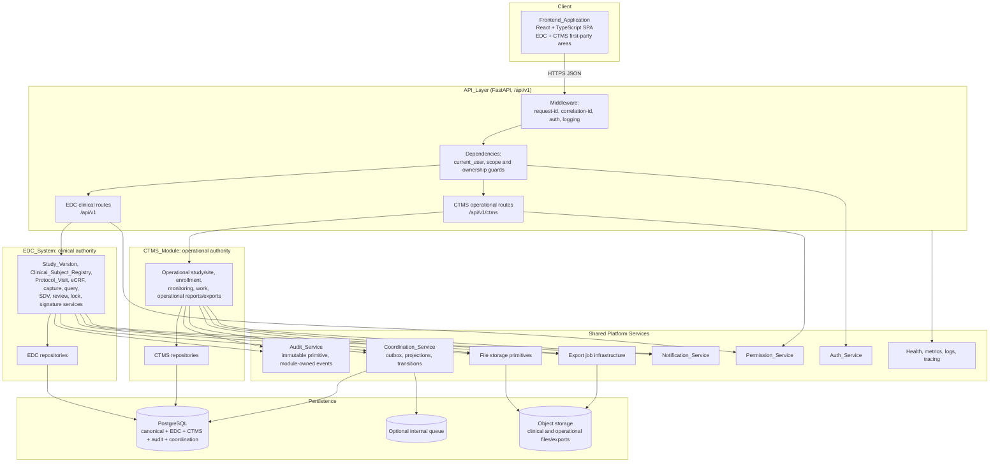
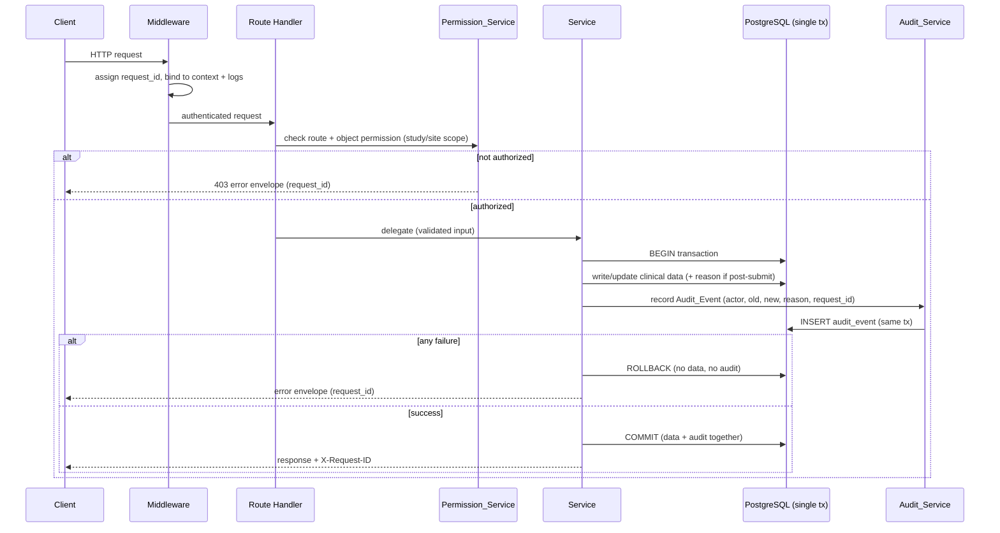
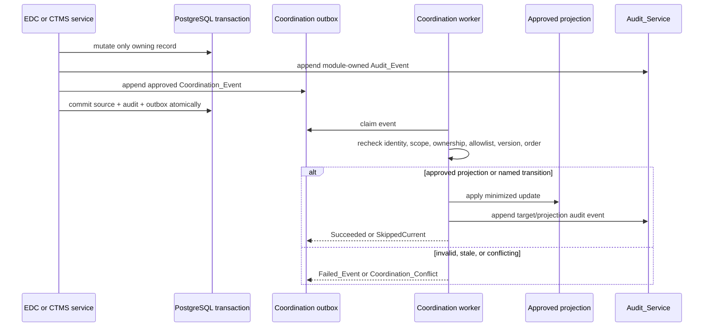
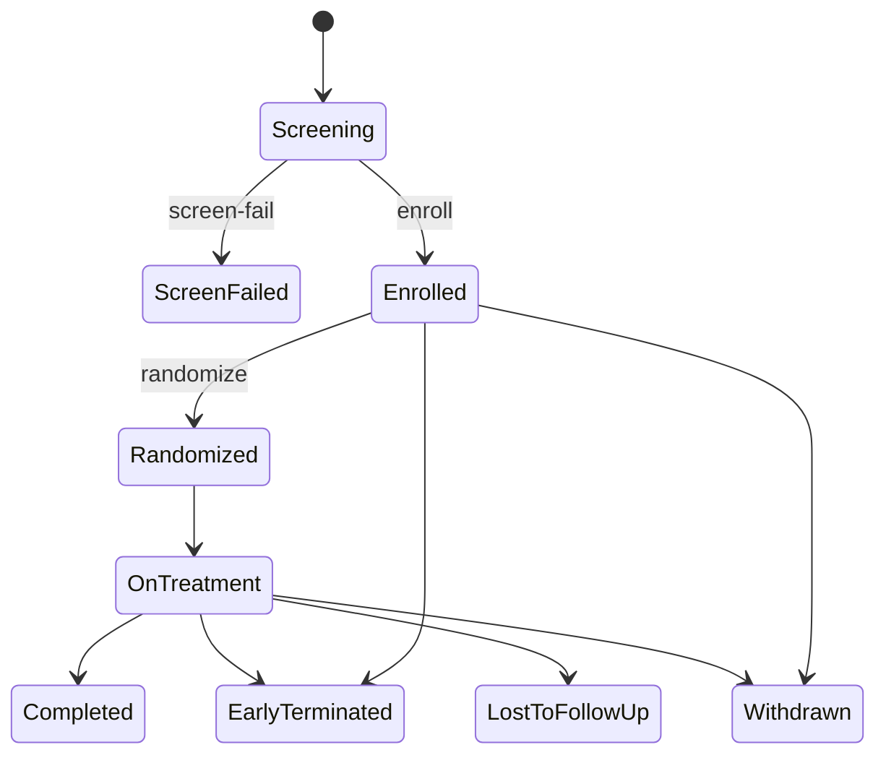
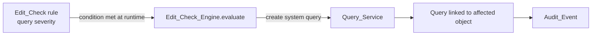
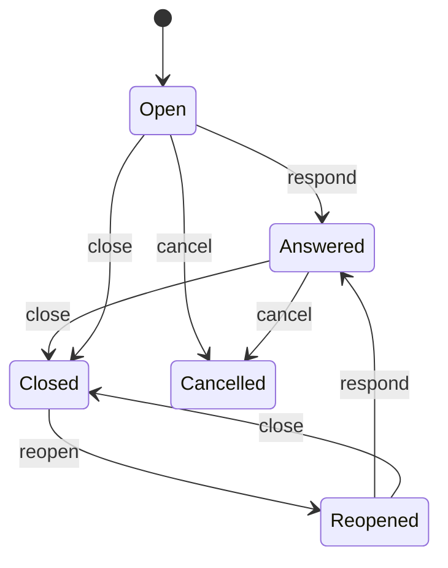
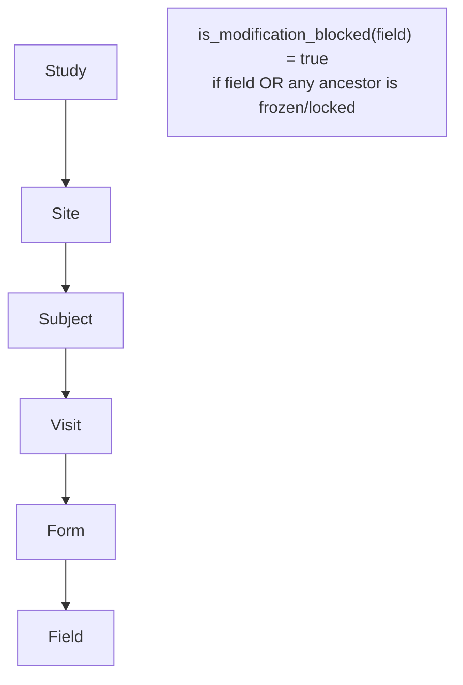
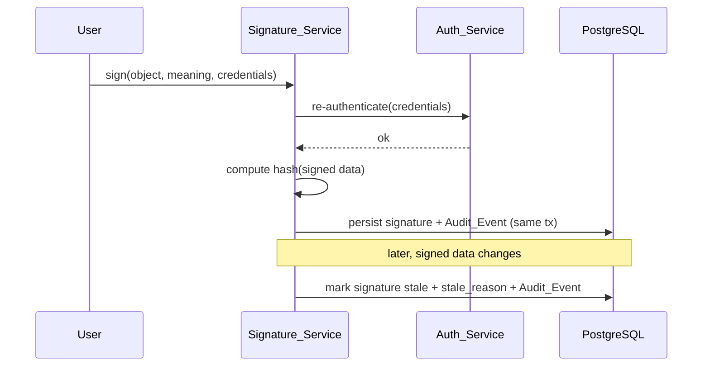
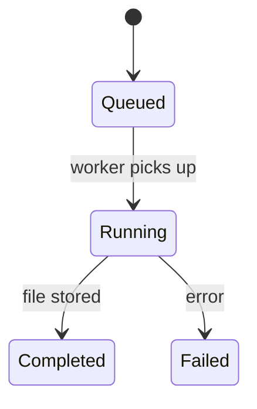
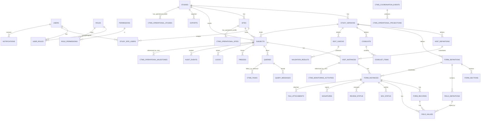

# Design Document

## Overview

The Clinical Electronic Data Capture (`EDC_System`) is the clinical first-party module inside the `Unified_Clinical_Platform`. Together with the co-equal `CTMS_Module`, it operates within one authenticated application boundary and one canonical Study/Site identity model. EDC manages the regulated clinical trial data lifecycle (21 CFR Part 11, GxP, ALCOA+, HIPAA-aware): clinical configuration and Study_Version lifecycle, the Clinical_Subject_Registry, protocol visits and casebooks, eCRF metadata and clinical data capture, clinical quality workflows, immutable clinical audit, clinical attachments, clinical exports, and clinical dashboards/reports.

CTMS is not an external integration and is not a second clinical system of record. CTMS owns operational study and site profiles, readiness and activation, operational contacts, enrollment targets and milestones, Monitoring_Plans and Monitoring_Activities, operational tasks and follow-ups, operational attachments, and operational dashboards/reports/exports. Shared platform services provide authentication, authorization, audit primitives, notifications, file storage, export jobs, observability, environment controls, optional AI controls, API conventions, and `Coordination_Service`; shared primitives do not transfer ownership of module data. CTMS records may reference EDC Subject and Visit_Instance identifiers and may consume approved minimized projections, but CTMS routes and services cannot create or mutate EDC-owned clinical records.

This design satisfies the current 32 EDC requirements in `requirements.md` and the approved first-party boundary, and is organized around six design goals:

1. **Explicit first-party ownership.** Every persisted field has exactly one authoritative module. Canonical Study and Site identity is shared; EDC owns clinical references/use and CTMS owns operational semantics. EDC remains authoritative for Study_Version, clinical subjects, protocol visits, clinical data, clinical quality, clinical attachments, and clinical exports.
2. **Audit-safe by construction.** Every EDC clinical or key-configuration mutation writes an immutable clinical Audit_Event inside the same database transaction as the data change. The audit subsystem rejects updates and deletes at both the application and database layers. There is no code path that mutates clinical data without producing an Audit_Event.
3. **Authoritative server-side authorization.** The shared Permission_Service is the single source of truth for both modules. Every protected route resolves an Authorization_Scope (union of role permission codes applied at study/site scope) and enforces route-level and object-level checks. Frontend permission logic is convenience only.
4. **Safe declarative edit checks.** The Edit_Check_Engine evaluates a constrained JSON DSL with a fixed operator set. It never executes user-provided Python or JavaScript. Rules are validated against a schema before persistence, are testable before publish, and are versioned with their owning Study_Version.
5. **Soft-delete retention.** EDC clinical records and CTMS operational records use module-specific soft deletion/archive rules. Clinical subjects, forms, queries, attachments, and audit data are never physically removed; deletion actor, timestamp, and reason remain attributable.
6. **Independent, coordinated delivery.** EDC clinical workflows remain operational when CTMS is disabled, empty, or unavailable. Cross-module changes use only approved minimized projections or explicitly named coordinated transitions through an internal, idempotent `Coordination_Service`; module boundaries are enforced by internal typed contracts and ownership rules.

### Technology Baseline

| Layer | Technology | Notes |
|---|---|---|
| Backend framework | FastAPI (Python 3.11+) | Async REST/JSON, OpenAPI docs, served by Uvicorn/Gunicorn |
| Schema validation | Pydantic v2 | Request/response models, settings |
| ORM / migrations | SQLAlchemy 2.x + Alembic | Typed ORM, versioned schema migrations |
| Database | PostgreSQL | JSONB hybrid storage, UUID PKs, partial/unique indexes |
| Async jobs | Redis + Arq/Celery/RQ (optional) | Export generation, batch validation, large reads |
| Object storage | AWS S3 (optional) | File attachments and export files, signed URLs |
| Auth (optional) | AWS Cognito / OIDC | JWT validation; local JWT fallback otherwise |
| AI (optional) | AWS Bedrock AgentCore | Chat, edit-check drafting, query summarization |
| Deployment | AWS ECS/Fargate + RDS + CloudWatch (optional) | Environment isolation, structured logs, metrics |
| Lint / format | ruff | Linting and formatting in `pyproject.toml` |
| Tests | pytest + Hypothesis | Example/integration tests + property-based tests |
| Frontend | React + TypeScript + Vite | SPA |
| UI | shadcn/ui + Tailwind CSS | Clinical, high-density components |
| Server state | TanStack Query | Caching, mutations, optimistic updates |
| Routing | TanStack Router | Permission-aware route guards |
| Forms | React Hook Form + Zod | Client validation (server authoritative) |
| Tables | TanStack Table | High-density listings |
| Client state | Zustand | Lightweight UI state |

## Architecture

### System Architecture

The platform is a layered first-party architecture. The SPA calls the versioned API boundary; the API authenticates, authorizes, validates, and delegates to the owning EDC or CTMS service. Routes do not write directly to the database. Services own business logic and transaction boundaries, repositories own database access, and shared services provide reusable primitives without owning module-specific semantics. EDC and CTMS coordinate internally through typed service contracts and the transactional outbox/`Coordination_Service`; neither module bypasses the shared ownership boundary.

EDC clinical mutations and their clinical Audit_Event commit atomically. CTMS operational mutations and their operational Audit_Event/outbox records commit atomically. A cross-module event may update only an approved projection or perform an explicitly configured coordinated transition after rechecking current ownership, authorization, identity, version, ordering, and field-allowlist rules. CTMS worker failure never blocks EDC clinical capture, audit, authentication, protocol visits, or clinical export.



The API routing distinction is structural: `/api/v1` contains EDC clinical routes and `/api/v1/ctms` contains CTMS operational routes. A CTMS route has no mutation dependency for EDC-owned tables or services. A CTMS command containing an EDC-owned field or targeting an EDC-owned record is rejected before either authoritative state or audit state changes.

### Request Lifecycle and the Data+Audit Single Transaction

Every clinical mutation follows the same lifecycle. The defining guarantee (Requirements 10.8, 18.1, 21.4, 23.3) is that the data write and its Audit_Event commit atomically: either both persist or neither does. The request identifier assigned at ingress (Requirement 21.5) is propagated into the Audit_Event and every structured log line (Requirement 30.4).



### Internal Coordination and Projection Boundary

`Coordination_Service` is a shared internal platform service, not an integration adapter. It uses typed contracts and a PostgreSQL transactional outbox to publish approved `Coordination_Event` records between EDC and CTMS. Each event carries an `Idempotency_Key`, `Correlation_Identifier`, source module, target projection or coordinated-transition name, canonical source identifier, source version/sequence, active `Status_Ownership_Rule` version, and an allowlisted payload. No raw clinical payload is transported by default.

The service applies the following rules:

- **Minimized projections only.** EDC may publish approved clinical progress or quality projections to CTMS, such as form completion, open/overdue query counts, SDV progress, or review progress. CTMS may publish approved operational status or milestone projections to EDC. A projection is read-only for its consumer and is labeled with source module, source identifier, rule version, timestamp, and correlation identifier.
- **Explicit coordinated transitions only.** A coordination event may change an EDC-owned status only when the active ownership rule explicitly names that transition, its writable field, allowed source, authorization, and validation requirements. An unconfigured CTMS status remains CTMS-owned and cannot silently change EDC clinical state.
- **No clinical authority transfer.** CTMS cannot create or mutate Study_Version, Clinical_Subject_Registry, Visit_Instance, Form_Instance, Field_Value, Query, SDV, review, freeze/lock, signature, Clinical_Attachment, or clinical export records. A Monitoring_Activity may reference an EDC Visit_Instance but cannot create, reschedule, complete, mark missed, freeze, lock, or otherwise mutate it.
- **Idempotency and order.** Duplicate delivery returns the prior outcome and creates no duplicate projection or side effect. Per-entity source versions/sequence numbers prevent stale events from overwriting current projections; stale events are skipped or recorded as a conflict.
- **Failure isolation.** Unknown or ambiguous references, ownership violations, unauthorized fields, stale versions, and minimization violations become sanitized failures/conflicts without partial target mutation. Retryable infrastructure failures use bounded backoff. CTMS worker outage leaves accepted events durable and does not block EDC clinical workflows.
- **Rebuild safety.** Projection rebuilds derive from authoritative records and write only projection tables. Rebuilds are deterministic and cannot mutate EDC or CTMS source records or source audit history.



### Module-to-Phase Mapping (Current EDC Requirement 26; boundary verification also covers Requirement 32)

| Phase | EDC Requirements | EDC Modules / Services | Unified-platform boundary verification |
|---|---|---|---|
| **Phase 1 (MVP)** | 1, 2, 3, 4, 6, 7, 8, 9, 10, 13 (manual), 18, 19 (CSV), 21, 22, 23, 24, 25, 26, 30, 32 (boundary) | Auth_Service, Permission_Service, User/Role/Invitation, canonical Study/Site clinical references, Study_Service, Site_Service, Subject_Service, Protocol_Visit_Service, Form_Metadata_Service, Data_Capture_Service, Query_Service (manual), Audit_Service, Export_Service (CSV), Dashboard_Service (clinical), API/DB/Frontend foundations | Verify CTMS cannot mutate EDC clinical records; verify shared scope, canonical identity, audit immutability, and protocol-visit ownership before Phase 1 completion. |
| **Phase 2** | 11, 12, 14, 15, 16, 20, 27, 28, selected 26/32 gates | Edit_Check_Engine, Repeating_Record_Service, SDV_Service, Review_Service, Lock_Service, clinical Dashboard_Service, Clinical_Attachment support, Notification_Service | CTMS monitoring/work/projection delivery remains additive and cannot change clinical state; verify frozen/locked visit separation and projection minimization. |
| **Phase 3** | 5 (amendments), 17, 19 (advanced formats), 31, selected 26/32 gates | Signature_Service, Study_Version_Service (amendments), Export_Service (Excel/JSON/XPT/ODM), AI_Assistant_Service | Verify coordinated transitions, advanced export separation, AI confirmation, and EDC resilience when CTMS is disabled or unavailable. |
| **Cross-cutting** | 2, 18, 21, 23, 25, 30, 32 | Shared Auth_Service, Permission_Service, Audit_Service, Request_Context, Coordination_Service, storage/export primitives, observability, environment controls | Shared primitives do not transfer EDC clinical authority to CTMS. CTMS operational audit, exports, attachments, dashboards, and notifications remain CTMS-owned. |

### Backend Package Structure

```text
backend/
  app/
    main.py                       # app factory, router mount under /api/v1, middleware, health
    core/
      config.py                   # Pydantic settings, per-Environment config
      database.py                 # engine, session, unit-of-work / tx scope
      security.py                 # JWT issue/verify, Cognito/OIDC validation, password + re-auth
      permissions.py              # permission codes, role-capability map, scope resolution
      audit.py                    # audit write helper bound to the active tx + request context
      exceptions.py               # domain exceptions -> HTTP error envelope mapping
      request_context.py          # request_id + actor contextvars, log correlation
    api/
      deps.py                     # current_user, db session, permission guard dependencies
      routes/
        auth.py users.py studies.py study_versions.py sites.py subjects.py
        visits.py forms.py form_data.py records.py queries.py edit_checks.py
        sdv.py reviews.py locks.py signatures.py exports.py audit.py
        dashboards.py notifications.py files.py ai_assistant.py health.py
        ctms/                  # operational routes under /api/v1/ctms
          studies.py sites.py enrollment.py milestones.py monitoring.py
          tasks.py contacts.py projections.py coordination.py
          dashboards.py reports.py exports.py health.py
    models/                       # EDC ORM models plus additive ctms_* models
      edc/                        # clinical authoritative aggregates
      ctms/                       # operational records, projections, coordination
    schemas/                      # Pydantic v2 EDC and CTMS contracts
    services/                     # EDC services and CTMS module services
      coordination_service.py    # shared internal coordination boundary
    repositories/                 # data access only, separated by ownership
    workers/                      # export, validation, coordination, rebuild jobs
    tests/                        # unit, integration, permission, audit, property tests
  alembic/                        # additive EDC/CTMS migrations
  pyproject.toml                  # deps + [tool.ruff] lint/format config
  Dockerfile
  .env.example                    # per-Environment configuration template
```

## Components and Interfaces

This section defines one subsection per backend service. Each service exposes a Python interface consumed by thin routes; all database access flows through repositories; all mutations route through the Permission_Service and (for clinical/config changes) the Audit_Service in the same transaction.

### Auth_Service (Requirements 1, 3.5)

Handles login, refresh, logout, current-user, password reset, optional Cognito/OIDC validation, MFA, and inactivity enforcement.

- `login(email, password, mfa_code?) -> TokenPair` — verifies credentials; if MFA enabled for the User, requires a valid code (1.9); rejects inactive Users (3.5); issues signed access + refresh tokens (1.1); rejects invalid credentials without issuing tokens (1.2).
- `refresh(refresh_token) -> AccessToken` — issues a new access token for a valid, unrevoked refresh token (1.3).
- `logout(refresh_token) -> None` — revokes the refresh token (1.4).
- `me(user) -> CurrentUser` — returns identity plus resolved Authorization_Scope (1.5).
- `request_password_reset(email) -> None` and `reset_password(token, new_password) -> None` — issues a single-use reset token and updates the password only when a valid token is presented (1.6).
- `validate_external_token(jwt) -> User` — when Cognito/OIDC is configured, validates the issuer/signature/expiry and maps the token `sub` to an internal User (1.7).
- Inactivity: access tokens carry a last-activity claim / server-side session; tokens idle beyond the configured window are rejected until re-authentication (1.8).

Token validation strategy: a single `get_current_user` dependency resolves either a locally issued JWT or a Cognito-issued JWT based on configuration, normalizing both to an internal User and session.

### Permission_Service (Requirements 2, 3.3, 3.6, 23.4)

Single authority for access control. Resolves and enforces permissions at route and object level.

- `resolve_scope(user) -> AuthorizationScope` — computes the union of permission codes across the User's assigned Roles, each tagged with the study/site scope of its assignment (2.1).
- `require(user, permission, study_id?, site_id?) -> None` — raises an authorization error if the scope lacks the permission for the target study/site (2.2, 2.3, 3.3).
- `filter_studies(user, studies)` / `filter_sites(user, sites)` — returns only in-scope studies/sites (2.4).
- `assert_object_access(user, obj)` — denies access to objects whose study/site is out of scope (2.5).

Enforcement is independent of any frontend check (2.6) and every protected mutation passes through `require` before the service mutates data (23.4).

**Role–capability mapping** (scopes: system `S`, study `T`, site `I`):

| Role | Scope | Representative permission codes |
|---|---|---|
| System Administrator | S | `user.*`, `role.*`, `study.create`, `study.configure`, `site.manage`, `audit.read`, `data.export` |
| Study Administrator | T | `study.configure`, `version.publish`, `site.manage`, `form.configure`, `editcheck.configure`, `user.assign` |
| Data Manager | T | `query.create/close/reopen/cancel`, `editcheck.configure`, `lock.manage`, `data.export`, `audit.read`, `review.manage` |
| Clinical Research Associate (CRA) | T/I | `subject.read`, `form.read`, `sdv.manage`, `query.create/close`, `audit.read` |
| Investigator (PI) | I | `subject.read`, `form.read`, `form.enter`, `form.submit`, `query.respond`, `signature.sign` |
| Site Coordinator / Site User | I | `subject.create/read/update`, `form.enter`, `form.submit`, `query.respond`, `file.upload` |
| Medical Reviewer | T | `form.read`, `review.manage`, `query.create`, `audit.read` |
| Sponsor Viewer | T/I | read-only codes only: `subject.read`, `form.read`, `audit.read`, dashboard read (3.6) |

### CTMS_Module Boundary (Requirements 32 and CTMS contract)

The CTMS_Module is a co-equal first-party module in the same application boundary. Its services and routes are operationally authoritative only for CTMS-owned records:

- `Operational_Study_Service` owns CTMS operational study profiles, planning metadata, readiness, operational milestones, and operational statuses. It references the canonical Study identity read-only and cannot modify EDC Study or Study_Version clinical configuration.
- `Operational_Site_Service` owns CTMS operational site profiles, activation/readiness actions, contacts, monitoring readiness, evidence, planned dates, and operational statuses. It references the canonical Site identity read-only and cannot modify EDC clinical site use or assignments.
- `Enrollment_Service` owns operational recruitment/screening/enrollment targets, operational subject milestones, and operational subject status. It must reference an existing EDC Subject identifier and cannot create a Clinical_Subject_Registry record, allocate a clinical identifier, initialize a casebook, or write Clinical_Data.
- `Monitoring_Service` owns `Monitoring_Plans` and `Monitoring_Activities`, including CRA assignment, scheduling, rescheduling, completion, and cancellation evidence. A Monitoring_Activity may reference an EDC Visit_Instance for context only; it cannot create or mutate a protocol visit.
- `Work_Management_Service` owns `Operational_Tasks`, clinical-query follow-up tasks containing only approved Query identifiers/summaries, operational contacts, dependencies/escalations when enabled, and operational attachments. It cannot change Query lifecycle or store unrestricted query messages.
- CTMS owns operational dashboards/reports, operational exports, and `Operational_Attachments`. The shared Dashboard, Export, File, Notification, Audit, and Coordination services provide primitives only; they do not make CTMS data EDC-owned.

There is one authenticated first-party application boundary. CTMS operational routes are separated from EDC clinical routes by API namespace, service ownership, repository access, and ownership checks. Cross-module coordination uses internal typed contracts, minimized projections, and explicit coordinated transitions; CTMS commands cannot mutate EDC-owned records.

### Study_Service — EDC Clinical Study Reference (Requirement 4)

`Study_Service` is the shared canonical identity boundary with split semantics. EDC owns the canonical clinical Study reference used by Study_Version, protocol, eCRF, subject, and clinical data records. CTMS owns its separate operational study profile, planning, readiness, milestones, and operational status in CTMS-owned records; those fields are not stored or mutated by this service.

- `create_study(data) -> Study` — persists one canonical Study identity with study code, protocol number, title, and EDC clinical status reference (4.1); enforces globally unique study code (4.2); writes an EDC clinical Audit_Event (4.5).
- `transition_status(study, target)` — enforces the EDC clinical status machine `Draft → UAT → Active → Enrollment Closed → Locked → Archived` (4.3) and rejects illegal transitions.
- `get_dashboard(user, study)` — delegates only to the EDC clinical Dashboard_Service for scoped clinical metrics (4.4).
- `get_ctms_projection(user, study)` — returns only an approved, minimized, read-only CTMS operational projection when a `Status_Ownership_Rule` permits it; projected fields are source-labeled and cannot be used to mutate EDC state (4.6).
- All EDC clinical identity and metadata changes write EDC clinical Audit_Events (4.5). CTMS operational changes are handled and audited by `Operational_Study_Service` under `/api/v1/ctms`.
- This service rejects commands containing CTMS-owned planning, readiness, operational owner, enrollment-plan, or operational lifecycle fields (4.7, 32).

### Study_Version_Service (Requirement 5)

Owns version lifecycle and the immutability of published metadata.

- `publish(version, actor) -> StudyVersion` — transitions `draft → published`, records publication actor and timestamp (5.1).
- `guard_mutable(version)` — rejects modifications to a published version and all child visits/forms/fields/code lists/edit checks (5.2). Called by Form_Metadata_Service, Visit_Service, and Edit_Check_Engine before any metadata write.
- `create_amendment(study, reason) -> StudyVersion` — creates a new draft version with an amendment reason (5.3, Phase 3).
- Prior published versions are retained for traceability (5.4); each form definition is associated with exactly one Study_Version (5.5).

### Site_Service — EDC Clinical Site Reference (Requirement 6)

`Site_Service` participates in the shared canonical Site identity but owns only EDC clinical site reference/use and clinical access assignments. CTMS owns operational site profile, activation/readiness, contacts, monitoring readiness, planned dates, evidence, and operational status in CTMS-owned records.

- `create_site(study, data) -> Site` — persists one canonical Site reference with unique site number within the Study and EDC clinical access status (6.1, 6.2).
- `deactivate_site(site)` — sets the EDC clinical site access status inactive, retains the canonical record, and prevents new EDC clinical access assignments (6.4).
- `assign_user(study, site, user, roles)` — records EDC clinical site-level access through the shared Permission_Service without changing CTMS operational access (6.5).
- `get_dashboard(user, site)` — delegates only to EDC clinical site progress metrics (6.3).
- `get_ctms_projection(user, site)` — exposes only an approved, read-only CTMS operational site projection with a CTMS source label; it never persists projected operational status as EDC clinical status (6.7).
- Commands containing CTMS activation, readiness, contacts, operational status, or operational profile fields are rejected. CTMS changes use `Operational_Site_Service` under `/api/v1/ctms` (6.6, 32).

### Subject_Service — Clinical Subject Registry (Requirement 7)

`Subject_Service` is EDC-owned. It owns clinical subject identity, clinical identifier generation, Study/Site and published Study_Version binding, clinical access/status, casebook initialization, and clinical subject data. CTMS `Enrollment_Service` owns operational targets, milestones, and operational subject status in separate records and must reference an existing EDC Subject identifier.

- `create_subject(study, site, data) -> Subject` — persists one `Clinical_Subject_Registry` record bound to the canonical Study, Site, and selected published Study_Version (7.1); generates the clinical subject identifier using the configured EDC rule and enforces uniqueness within the Study (7.2); initializes Visit_Instances and Form_Instances from the bound version atomically (7.4).
- `transition_status(subject, target)` — enforces the configured EDC clinical subject status machine (7.3) and writes an EDC clinical Audit_Event (7.6).
- `get_casebook(user, subject)` — returns only EDC clinical visit/form structure and status (7.5).
- `get_ctms_projection(user, subject)` — supplies only an approved minimized projection such as canonical identifier/reference, approved operational status or milestone signal, site reference, source version, and correlation metadata. It excludes Field_Values, source documents, unrestricted notes, and query messages.
- CTMS commands cannot create a Subject, allocate or replace a clinical identifier, bind a Study_Version, initialize a casebook, or mutate clinical subject status unless an explicit `Status_Ownership_Rule` names a coordinated transition (7.7–7.9, 32).



### Protocol_Visit_Service / Visit_Service — EDC Authority (Requirement 8)

This service is EDC-owned and manages protocol visit definitions and Visit_Instances used by clinical casebooks. CTMS `Monitoring_Service` owns separate `Monitoring_Plans` and `Monitoring_Activities`; a monitoring activity may carry a read-only `edc_visit_instance_id` reference but cannot create or mutate an EDC protocol visit.

- `define_visit(version, data) -> VisitDefinition` — persists name, visit number, type, target day, window bounds, display order, and required flag (8.1); only while the owning version is draft.
- `initialize_instances(subject)` — creates EDC Visit_Instances from the bound version's definitions (8.2).
- `record_visit_date(instance, date)` — computes EDC window status from the subject protocol reference date and configured bounds (8.3).
- `create_unscheduled(subject, data)` — where permitted by the bound Study_Version, creates an unscheduled EDC Visit_Instance without a scheduled visit number (8.4).
- `mark_missed(instance)` — sets the EDC protocol visit status to missed (8.5).
- Any command originating from a CTMS route that attempts to create, reschedule, complete, mark missed, freeze, lock, or otherwise mutate a Visit_Instance or its Clinical_Data is rejected before mutation (8.6, 32).

### Form_Metadata_Service (Requirement 9)

Manages eCRF metadata within a Study_Version. Form versioning is achieved through the `study_version_id` relationship on `form_definitions` — there is **no separate `form_versions` table**; a form's version is the version of its owning Study_Version.

- `create/edit/order_forms(version, ...)` and `create/order_sections_and_fields(...)` — allowed only while the owning version is draft (9.1, 9.2); `guard_mutable` blocks edits on published versions.
- Supported control types (9.3): text, textarea, integer, decimal, date, datetime, time, radio, checkbox, dropdown, multi-select, boolean, file upload, calculated, repeating table, coded term.
- Supported field attributes (9.4): label, variable name, data type, required, code list reference, default value, help text, unit, min, max, max length, decimal precision, regex validation, visibility rule, read-only, calculated.
- Code lists and code list items referenced by fields (9.5).
- **Standard form templates**: AE, CM, DM/Demographics, MH, VS, LB, EX, DS, EG, and a Visit Date form, seedable into a draft version.
- **Calculated fields**: declarative expressions (e.g., BMI from height/weight) evaluated server-side via the same safe expression evaluator used by the Edit_Check_Engine.
- All metadata changes write Audit_Events (9.6).

### Data_Capture_Service (Requirement 10)

Loads, saves, submits, reopens, and edits clinical field values for Form_Instances using **hybrid storage**: the full payload on `form_instances.data_jsonb` for fast retrieval, plus one normalized `field_values` row per field for audit, query, SDV, review, and export.

- `load(form_instance) -> FormInstanceView`.
- `save_draft(form_instance, values)` — persists Field_Values and sets status to In Progress (10.1).
- `submit(form_instance)` — validates required fields, data types, ranges, code list membership, and conditional rules; on success sets status Submitted; on failure returns field-level errors and preserves prior values (10.3, 10.4).
- `change_value(form_instance, field, value, reason?)` — if the instance was already submitted, requires a Reason_For_Change before persisting (10.5); rejects modification if the instance (or any ancestor) is Frozen or Locked (10.7, via Lock_Service).
- `mark_not_applicable(form_instance, field)` — persists the not-applicable state (10.6).
- Form_Instance statuses (10.2): Not Started, In Progress, Submitted, Reviewed, Frozen, Locked, Signed.
- Every create/change of a Field_Value writes an Audit_Event in the same transaction (10.8), keeping `data_jsonb` and `field_values` consistent.

### Repeating_Record_Service (Requirement 11)

- `add_record(form_instance) -> FormRecord` — creates a row with a monotonically assigned sequence number (11.1).
- `edit_record(record, values)` — persists changes and writes an Audit_Event (11.2).
- `soft_delete(record, reason)` — records deletion actor, timestamp, reason; retains the row (11.3).
- `restore(record)` — clears deletion state and writes an Audit_Event (11.4).

### Edit_Check_Engine (Requirement 12)

Evaluates a constrained declarative JSON DSL. It **never executes user-provided code** (12.7).

- DSL: boolean trees of `and`/`or`/`not` over conditions `{field, operator, value | value_field}`. Operators: `is_null`, `not_null`, `==`, `!=`, `>`, `>=`, `<`, `<=`, `in`, `not_in`, `matches` (anchored regex), `before`, `after`, `within_days`.
- `validate_rule(json)` — validates against the operator/condition schema before persisting (12.1).
- Rule types (12.2): required field, range, date comparison, cross-field, cross-form, code list validation, format validation, duplicate record, missing visit/form, conditional required, lab abnormality.
- Severities (12.3): info, warning, error, query.
- `test(rule, sample_data) -> Outcome` — evaluates against sample data without persisting clinical data (12.4); enforces test-before-publish.
- `evaluate(form_instance)` — at runtime, when a `query`-severity condition is met, requests Query_Service to create a system Query linked to the affected object (12.5).
- **Lab normal-range pseudo-fields**: `<field>.normal_low` / `<field>.normal_high` are resolved from codelist/lab reference ranges so abnormality checks reference them as ordinary fields.
- Edit checks are versioned with their owning Study_Version (12.6).
- **Seeded examples**: AE start ≤ end; informed-consent date ≤ first procedure; AE Serious=Yes ⇒ seriousness criteria required; AE Outcome=Fatal ⇒ death date required; visit date within window else warning.



### Query_Service (Requirement 13)

- `create_query(target, text, type)` — links the Query to exactly one affected object among Subject, Visit_Instance, Form_Instance, Form_Record, or field (13.1). Manual (Phase 1) and system-generated (Phase 2).
- Lifecycle (13.2): Open, Answered, Closed, Reopened, Cancelled.
- `respond(query, message)` — site user response transitions Open → Answered and appends to the thread (13.3).
- `close(query)` / `reopen(query)` / `cancel(query)` — transitions with closing actor/timestamp (13.4, 13.5).
- Complete threaded message history is preserved (13.6); every action writes an Audit_Event (13.7).



### SDV_Service (Requirement 14)

- `set_sdv(scope, target, actor)` — persists verified status with actor and timestamp at field/form/visit/subject scope (14.1).
- `clear_sdv(target)` — sets status to not verified (14.2).
- `progress(scope) -> {verified, not_verified}` — returns counts for the requested scope (14.3).
- Every change writes an Audit_Event (14.4).

### Review_Service (Requirement 15)

- `mark_reviewed(form_instance, actor)` — persists reviewed status with actor/timestamp (15.1).
- `clear_review(form_instance)` — sets not reviewed (15.2).
- `progress(scope) -> {reviewed, not_reviewed}` (15.3).
- Every change writes an Audit_Event (15.4).

### Lock_Service (Requirement 16)

Applies and removes freeze and lock across the object hierarchy `field → form → visit → subject → site → study`.

- `freeze(object)` / `lock(object)` — sets freeze/lock state on the target (16.1, 16.2).
- `is_modification_blocked(field)` — returns true if the field or **any ancestor** in the chain is frozen or locked (16.3). Data_Capture_Service and File_Attachment_Service call this before mutating.
- `unlock(object, reason)` — requires a reason and clears the lock (16.4).
- Every freeze/lock/unlock writes an Audit_Event (16.5).



### Signature_Service (Requirement 17)

- `sign(object, meaning, credentials)` — requires re-authentication before recording (17.1); persists signer identity, timestamp, meaning, signed-object reference, and a hash of the signed data (17.2).
- `invalidate_if_changed(object)` — when signed data changes, marks the signature stale and records the stale reason (17.3). Called by Data_Capture_Service after post-signature changes.
- Every signature action writes an Audit_Event (17.4).



### Audit_Service (Requirement 18)

Append-only, two-layer immutability.

- `record(event)` — writes an Audit_Event capturing actor, timestamp, entity type/id, study, site, action, and where applicable field, old value, new value, Reason_For_Change, and request_id (18.1, 18.3). Always invoked inside the caller's transaction.
- **Layer 1 (application):** no service exposes update/delete on audit events.
- **Layer 2 (database):** UPDATE/DELETE privileges on `audit_events` are revoked from the application role and/or a trigger raises on UPDATE/DELETE (18.2).
- `search(filters)` — filterable by user, date, entity, subject, field (18.5).
- `export(selection)` — produces an export of selected events (18.6). File upload/download/deletion actions are audited (18.4).

### Export_Service — EDC Clinical Content (Requirement 19)

`Export_Service` is shared export-job infrastructure with module-owned content. EDC owns clinical data and clinical audit export content, filters, formats, authorization, and download auditing. CTMS uses the same job/status/storage primitives through `/api/v1/ctms` but owns separate operational export content and filters; an EDC export cannot include CTMS operational fields unless an explicitly approved, labeled projection is defined.

- `create_export(study, params) -> ExportJob` — creates an EDC clinical job, enqueues it, and tracks `Queued → Running → Completed/Failed` (19.1).
- Worker generates EDC clinical CSV, Excel, JSON, SAS XPT, or ODM XML and stores the file (19.5).
- Filters (19.3): study, site, clinical subject, protocol visit, form, domain, inclusive UTC date range, changed-since-last-export, locked-data-only, and clean-data-only. Scope filtering is applied before content generation.
- `subject_list_export(scope)` (19.2) produces only authorized EDC clinical subjects.
- `download(export)` (19.4) authorizes only the requesting User's completed EDC job, provides a time-limited signed URL or authenticated stream, and writes an EDC clinical Audit_Event.
- CTMS operational exports are not generated or owned here. The service rejects CTMS-only fields and routes operational requests to the CTMS module's content provider while retaining shared job infrastructure (19.6, 19.7, 32).



### Dashboard_Service — EDC Clinical Metrics (Requirement 20)

`Dashboard_Service` is a shared aggregation and scope-filtering primitive with module-owned metric contracts. EDC owns clinical dashboards/reports and computes them only from EDC clinical records and approved read-only projections explicitly marked as CTMS-sourced. CTMS owns operational dashboards/reports and does not write or become a source for EDC clinical metrics.

- `study_dashboard(user, study)` — subject counts by EDC clinical status, Form_Instance completion, and clinical Query counts (20.1).
- `site_dashboard(user, site)` — EDC clinical site progress only (20.2).
- `query_metrics(user, scope)` — open, answered, overdue, and aging EDC Query metrics (20.3).
- All metrics are strictly within the requesting User's EDC Authorization_Scope and exclude CTMS operational values from clinical calculations (20.4, 20.5, 20.6).
- `ctms_projection(user, scope)` may display an approved minimized CTMS operational projection with a CTMS source label, but projected fields remain read-only and cannot alter EDC clinical metrics or status.

### Notification_Service — EDC Clinical Triggers (Requirement 28)

The `Notification_Service` is shared persistence and delivery infrastructure; EDC owns the clinical triggers and CTMS owns separate operational triggers. EDC notifications contain clinical workflow metadata only and are scoped to the recipient's authorization.

- `on_query_assigned(query)` — notifies recipients in the assigned clinical Role (28.1).
- `on_form_submitted(form_instance)` — notifies responsible clinical reviewers (28.2).
- `on_export_completed(job)` — notifies the requesting User of an EDC clinical export outcome (28.3).
- Statuses: Unread, Read, Archived (28.4); `list_unread(user)` returns only that User's EDC clinical notifications (28.5).
- CTMS task, monitoring, overdue-work, and coordination-failure notifications are CTMS-owned triggers and are not generated by these EDC methods (28.6, 32).

### File_Attachment_Service — EDC Clinical Attachments (Requirement 27)

`File_Attachment_Service` uses shared file-storage primitives but EDC owns `Clinical_Attachment` content, parent semantics, access, retention, and audit. CTMS owns separate `Operational_Attachment` records and cannot use EDC clinical attachment permissions to read or mutate them.

- `upload(parent, file)` — where enabled, stores a non-empty file no larger than 100 MB and persists metadata linked to an EDC clinical object (27.1); rejected if the parent is Frozen or Locked (27.5, via Lock_Service).
- `download(attachment, user)` — granted only if the User has read access to the EDC clinical parent (27.2, via Permission_Service); operational permissions alone do not grant access.
- `soft_delete(attachment, reason)` — logical deletion retains metadata, actor, timestamp, and reason and prevents normal download (27.3).
- Upload, download, and deletion write EDC clinical Audit_Events (27.4, 18.4). The service rejects CTMS operational attachment targets; CTMS uses its own module-owned attachment semantics under `/api/v1/ctms` (27.6, 32).

### AI_Assistant_Service (Requirement 31, optional)

- Endpoints for chat, edit-check drafting, and query summarization backed by AWS Bedrock AgentCore (31.1).
- Responses streamed via Server-Sent Events or WebSocket (31.2).
- `build_context(user, request)` — verifies the requesting User's Authorization_Scope and restricts context strictly to in-scope data before sending it to the model (31.3).
- `apply_suggestion(suggestion)` — if a suggestion would change study data, requires explicit human confirmation before applying (31.4); AI-assisted regulated-data changes write Audit_Events (31.5).

### API Surface (Current EDC Requirement 21; CTMS boundary in Requirement 32)

The API_Layer exposes two first-party route namespaces in the same authenticated application: EDC clinical endpoints under `/api/v1` and CTMS operational endpoints under `/api/v1/ctms`. Both use Pydantic v2 schemas, the shared pagination envelope `{items, page, page_size, total}`, the standard error envelope, `X-Request-ID`, and shared server-side `Permission_Service` checks. No CTMS route directly mutates an EDC-owned resource. An EDC clinical route never treats a CTMS operational field as clinical authority.

Representative EDC mapping:

| Area | Endpoints (under `/api/v1`) |
|---|---|
| Auth | `POST /auth/login`, `/auth/logout`, `/auth/refresh`, `/auth/forgot-password`, `/auth/reset-password`, `/auth/invite/accept`; `GET /auth/me` |
| Users/Roles | `GET/POST /users`, `GET/PATCH /users/{id}`, `POST /users/{id}/deactivate`, `GET/POST /roles`, `GET /permissions`, `POST /studies/{id}/users/{uid}/assign` |
| Studies | `GET/POST /studies`, `GET/PATCH/DELETE /studies/{id}`, `POST /studies/{id}/publish|archive`, `GET /studies/{id}/dashboard` |
| Versions | `GET/POST /studies/{id}/versions`, `POST /versions/{id}/publish`, `POST /studies/{id}/amend` |
| Sites | `GET/POST /studies/{id}/sites`, `GET/PATCH/DELETE /sites/{id}`, `GET /sites/{id}/dashboard` |
| Subjects | `GET/POST /studies/{id}/subjects`, `GET/PATCH /subjects/{id}`, `POST /subjects/{id}/screen-fail|randomize|terminate`, `GET /subjects/{id}/casebook` |
| Visits | `GET /subjects/{id}/visits`, `POST /subjects/{id}/visits/unscheduled`, `GET/PATCH /visits/{id}`, `POST /visits/{id}/mark-missed` |
| Forms (metadata) | `GET/POST /studies/{id}/forms`, `GET/PATCH/DELETE /forms/{id}`, `POST /forms/{id}/sections|fields`, `PATCH/DELETE /fields/{id}` |
| Form data | `GET /form-instances/{id}`, `PATCH /form-instances/{id}/data`, `POST /form-instances/{id}/save|submit|reopen`, `GET /form-instances/{id}/audit` |
| Records | `POST /form-instances/{id}/records`, `PATCH/DELETE /records/{id}`, `POST /records/{id}/restore` |
| Queries | `GET/POST /queries`, `GET /queries/{id}`, `POST /queries/{id}/respond|close|reopen|cancel`, `GET /queries/{id}/history` |
| Edit checks | `GET/POST /studies/{id}/edit-checks`, `GET/PATCH /edit-checks/{id}`, `POST /edit-checks/{id}/test`, `POST /studies/{id}/edit-checks/run` |
| SDV | `POST /fields/{id}/sdv|unsdv`, `POST /form-instances/{id}/sdv|unsdv`, `GET /studies/{id}/sdv-progress` |
| Review | `POST /form-instances/{id}/review|unreview`, `GET /studies/{id}/review-progress` |
| Freeze/Lock | `POST /form-instances/{id}/freeze|unfreeze|lock|unlock`, `POST /subjects/{id}/freeze|lock`, `POST /studies/{id}/lock` |
| Signatures | `POST /form-instances/{id}/sign`, `POST /subjects/{id}/sign`, `GET /subjects/{id}/signatures` |
| Exports | `GET/POST /studies/{id}/exports`, `GET /exports/{id}`, `GET /exports/{id}/download` |
| Audit | `GET /audit-events`, `GET /subjects/{id}/audit`, `GET /form-instances/{id}/audit`, `GET /fields/{id}/audit` |
| Dashboards | `GET /studies/{id}/dashboard`, `GET /sites/{id}/dashboard`, `GET /studies/{id}/query-metrics` |
| Notifications | `GET /notifications`, `POST /notifications/{id}/read|archive` |
| Files | `POST /objects/{type}/{id}/files`, `GET /files/{id}/download`, `DELETE /files/{id}` |
| AI | `POST /ai/chat`, `POST /ai/edit-check-draft`, `POST /ai/query-summary` (SSE/WS) |
| Health | `GET /health/live`, `GET /health/ready`, `GET /metrics` |

CTMS operational routes are separate and ownership-visible:

| CTMS area | Endpoints (under `/api/v1/ctms`) | Authority boundary |
|---|---|---|
| Operational study/site | `GET/POST /studies/{id}/operational-profile`, `GET/PATCH /operational-studies/{id}`, `GET/POST /sites/{id}/operational-profile`, `GET/POST /sites/{id}/activation` | CTMS operational profile, readiness, activation, contacts, and statuses; canonical EDC Study/Site identifiers are read-only |
| Enrollment/milestones | `GET/POST /studies/{id}/enrollment-targets`, `GET/POST /subjects/{subject_id}/operational-milestones` | CTMS targets and milestones reference existing EDC Subject IDs; no clinical subject creation or mutation |
| Monitoring | `GET/POST /studies/{id}/monitoring-plans`, `POST /monitoring-plans/{id}/publish|amend`, `GET/POST /studies/{id}/monitoring-activities`, `POST /monitoring-activities/{id}/reschedule|complete|cancel` | CTMS Monitoring_Plans/Activities; linked EDC Visit_Instance is read-only reference |
| Work/follow-ups | `GET/POST /studies/{id}/tasks`, `POST /queries/{query_id}/follow-ups`, `GET/POST /studies/{id}/contacts` | Operational tasks may reference approved Query identifiers/summaries but cannot change Query lifecycle/messages |
| Projections/coordination | `GET /studies/{id}/projections`, `GET /coordination-events/{id}`, `POST /coordination-events/{id}/replay`, `POST /coordination-conflicts/{id}/resolve` | Only minimized authorized projections and explicit coordinated transitions; sanitized failure/conflict details |
| CTMS reporting/export/files | `GET /studies/{id}/dashboard`, `GET /studies/{id}/reports/{type}`, `POST /studies/{id}/exports`, `GET /exports/{id}/download`, `/objects/{type}/{id}/files` | CTMS operational dashboards, reports, exports, and attachments only |

The API must reject a CTMS request attempting to mutate `Study_Version`, `Clinical_Subject_Registry`, `Visit_Instance`, `Form_Instance`, `Field_Value`, Query lifecycle/messages, SDV, review, freeze/lock, signatures, `Clinical_Attachment`, or clinical export content before either EDC or CTMS state changes. EDC clinical exports and dashboards remain under the EDC routes above; CTMS operational content remains under `/api/v1/ctms`.

### Frontend Architecture (Current EDC Requirement 24; CTMS boundary in Requirement 32)

Feature-based structure keeps EDC clinical workflows and CTMS operational workflows visible as separate first-party areas within one authenticated application. Shared layout, authentication, authorization, notification, file, and export primitives are reused; ownership-specific screens and API clients remain separate.

```text
frontend/src/
  app/            router.tsx, providers.tsx, feature flags
  components/
    ui/           shadcn/ui primitives
    layout/       app shell, nav, study/site switchers
    data-table/   TanStack Table wrappers
    clinical/     EDC reusable clinical components
    ownership/    canonical-id and authoritative-module badges
  features/
    edc/          studies/ sites/ subjects/ casebook/ forms/
                  queries/ sdv/ review/ exports/ audit/ study-setup/
                  notifications/ dashboards/ attachments/
    ctms/         operational-studies/ operational-sites/ enrollment/
                  milestones/ monitoring/ tasks/ contacts/ projections/
                  coordination/ reports/ exports/ attachments/
  lib/
    api.ts        shared transport/error/request-id handling
    edc-api.ts    EDC clinical route client (/api/v1)
    ctms-api.ts   CTMS operational route client (/api/v1/ctms)
    auth.ts permissions.ts ownership.ts utils.ts
  hooks/ types/ schemas/
```

The frontend displays the canonical EDC Study/Site/Subject/Visit identifiers and the authoritative module for every shared status. CTMS views label operational status, Monitoring_Activity, projections, tasks, and operational attachments as CTMS-owned; they never present a Monitoring_Activity as a protocol visit or an operational subject status as an EDC clinical access state. A CTMS projection is visibly read-only and includes source timestamp/rule metadata. `PermissionGuard` hides unavailable actions as a convenience, but direct API calls remain server-authorized. When CTMS is disabled, empty, or unavailable, EDC navigation, clinical status indicators, casebooks, capture, queries, audit, and clinical export remain unchanged.

**Required pages.** Public: Login, Forgot password, Reset password, Accept invitation. Authenticated: Study selector, Study dashboard, Site dashboard, Subject list, Create-subject dialog, Subject casebook, Visit detail, Form data entry, Query inbox, Query detail, SDV worklist, Clinical review worklist, Data listings, Audit trail viewer, Export center, Study configuration, Form builder, Edit-check builder, User management, Site management, Role management, System settings.

**Clinical reusable components.** `SubjectStatusBadge`, `FormStatusBadge`, `QueryStatusBadge`, `SDVStatusBadge`, `ReviewStatusBadge`, `LockStatusBadge`, `ClinicalDataTable`, `FieldQueryIcon`, `FieldAuditHistory`, `ReasonForChangeDialog`, `CasebookVisitCard`, `FormSectionCard`, `RepeatingRecordTable`, `QueryThread`, `PermissionGuard`, `StudySelector`, `SiteSelector`.

**shadcn/ui primitives.** Button, Card, Table, Dialog, Sheet, Tabs, Badge, Dropdown Menu, Command, Form, Input, Textarea, Select, Checkbox, Radio Group, Calendar, Popover, Toast, Alert, Tooltip, Accordion, Separator.

**Key screen specs.**
- *Subject list*: columns Subject ID, Site, Status, Screening date, Randomization date, Last visit, Open queries, Forms complete, SDV status, Review status, Lock status; with search, filter (site/status/query/SDV/lock), sort, pagination, create subject, export.
- *Subject casebook*: subject header (site, status, open-query count, SDV %, review %), visits in chronological order, forms under each visit with completion/query/SDV/review/freeze/lock/signature badges.
- *Form data entry*: subject + visit headers, form status, sections, fields, repeating record tables, query side panel, audit side panel, SDV/review actions if permitted, Save Draft / Submit / Reopen; Zod client validation, required-missing highlighting, open-query highlighting, Reason_For_Change on post-submit edits, disabled controls when frozen/locked, save/submit toast.
- *Query inbox*: columns Query ID, Status, Type, Subject, Visit, Form, Field, Query text, Created by, Created date, Age, Assigned role; filters Study, Site, Subject, Status, Type, Age, Assigned role.

**UI principles.** Clinical, clean, high-density; keyboard-friendly entry; clear status badges; consistent query/audit/SDV/review/lock indicators; never hide important clinical status; side workflows (audit, query threads) use dialogs/sheets (24.5); optimistic updates avoided for audit-sensitive actions (confirm server success).

**Permission behavior.** Render clinical status consistently across list/casebook/data-entry (24.1); validate with Zod while the API stays authoritative (24.2); collect Reason_For_Change before sending post-submit edits (24.3); disable controls for frozen/locked objects (24.4); hide unpermitted actions or show an access-denied view, treating frontend checks as convenience only (24.6, 2.6).

## Data Models

### Storage Strategy (Requirement 22)

- **Metadata vs clinical separation.** Study metadata (`studies`, `study_versions`, `visit_definitions`, `form_definitions`, `form_sections`, `field_definitions`, `codelists`, `codelist_items`, `edit_checks`) is stored separately from clinical subject data (`subjects`, `visit_instances`, `form_instances`, `form_records`, `field_values`) (22.1).
- **Hybrid clinical storage.** Each Field_Value is stored both on `form_instances.data_jsonb` (fast retrieval/rendering) and as a normalized `field_values` row (audit, query, SDV, review, export). The two are written in the same transaction and must stay consistent (22.3).
- **Soft deletion.** Subject, form, query, and audit data are never physically removed; logical deletion records actor/timestamp/reason (22.2).
- **UTC everywhere.** All timestamps are timezone-aware UTC; local conversion happens only in the Frontend_Application (22.4).
- **UUID primary keys** for all tables; common filter columns are indexed: study, site, subject, form, status, created_at (22.6).
- **Uniqueness.** study code globally; site number within study; subject number within study (22.5).

### Unified-platform storage and ownership boundary

The canonical `studies` and `sites` tables provide shared identity and EDC clinical reference fields only. CTMS operational profile, planning, readiness, activation, contact, milestone, and operational-status fields are stored in additive `ctms_*` tables owned by CTMS. EDC does not persist a duplicate CTMS profile and CTMS does not write the EDC clinical tables.

EDC and CTMS may share one PostgreSQL database and object-storage account within an isolated Environment, but table ownership, repository access, service contracts, and migration ownership remain explicit. EDC repositories can read approved canonical identities and approved projections; they cannot write `ctms_*` operational records. CTMS repositories can reference EDC identifiers and projection rows; they cannot write EDC clinical aggregates. Shared Audit, notification, file, and export primitives carry a module/content owner discriminator.

The additive CTMS model includes `ctms_operational_studies`, `ctms_operational_sites`, `ctms_activation_actions`, `ctms_enrollment_targets`, `ctms_operational_milestones`, `ctms_monitoring_plans`, `ctms_monitoring_plan_versions`, `ctms_monitoring_activities`, `ctms_tasks`, `ctms_contacts`, `ctms_operational_attachments`, `ctms_status_ownership_rules`, `ctms_operational_projections`, `ctms_coordination_events`, `ctms_event_attempts`, `ctms_coordination_event_logs`, `ctms_conflicts`, `ctms_outbox`, and `ctms_quality_signals`. These tables contain only CTMS-owned data, approved minimized projections, or coordination metadata; they do not duplicate Field_Values, source documents, unrestricted Query messages, or clinical audit payloads.

### Migration and boundary notes

EDC migrations preserve existing clinical tables and add no CTMS duplicate subject, visit, form, query, or clinical attachment tables. CTMS migrations are additive, phase-gated, and own only `ctms_*` tables and CTMS permission/enum seeds. Database constraints enforce canonical foreign-key references, ownership discriminators, projection allowlists, source-version/idempotency uniqueness, append-only coordination logs, UTC timestamps, and no physical deletion of completed coordination/audit records. A migration or service verification fails if it introduces a route/repository dependency that allows CTMS writes to EDC-owned aggregates or EDC writes to CTMS operational fields.


### Entity-Relationship Diagram



### Tables

**users**: `id` (UUID PK), `email` (unique), `full_name`, `status` (pending/active/inactive), `auth_provider_id` (Cognito sub, nullable), `mfa_enabled`, `created_at`, `updated_at`, `deactivated_at`. Deactivation retains the record (3.4).

**roles**: `id`, `name` (unique), `description`, `scope` (system/study/site).

**permissions**: `id`, `code` (unique, e.g. `form.enter`), `description`.

**role_permissions**: `id`, `role_id` FK, `permission_id` FK. Unique (`role_id`,`permission_id`).

**user_roles**: `id`, `user_id` FK, `role_id` FK, `study_id` FK (nullable), `site_id` FK (nullable), `assigned_at`, `assigned_by`. Encodes the study/site scope of each grant (2.1). Index (`user_id`).

**studies**: `id` (UUID PK), `study_code` (**unique globally**), `protocol_number`, `title`, EDC clinical `status` (Draft/UAT/Active/Enrollment Closed/Locked/Archived), `timezone`, `created_at`, `updated_at`. EDC owns this canonical identity and clinical reference. CTMS sponsor, phase, therapeutic area, indication planning metadata, operational owner, readiness, operational lifecycle, enrollment plans, and operational milestones are stored in `ctms_operational_studies` and related CTMS tables, not in this EDC-owned clinical record.

**study_versions**: `id`, `study_id` FK, `version_number`, `status` (draft/published/retired), `effective_date`, `published_at`, `published_by`, `amendment_reason`. Unique (`study_id`,`version_number`).

**sites**: `id`, `study_id` FK, `site_number`, EDC clinical site reference/access fields, `status` (active/inactive), `timezone`, `created_at`, `updated_at`. **Unique (`study_id`,`site_number`)** (6.2, 22.5). CTMS operational profile, activation/readiness, contacts, monitoring readiness, planned dates, evidence, and operational status are stored in `ctms_operational_sites` and related CTMS tables, not in this EDC-owned clinical record.

**study_site_users**: `id`, `study_id` FK, `site_id` FK (nullable for study-scope), `user_id` FK, `role_id` FK, `created_at`. Records site/study assignments (6.5).

**subjects**: `id`, `study_id` FK, `site_id` FK, `study_version_id` FK (bound published version), `subject_number`, `screening_number`, `randomization_number`, `sex`, `screening_date`, `enrollment_date`, `randomization_date`, `status` (subject state machine), `created_at`, `updated_at`. **Unique (`study_id`,`subject_number`)** (7.2, 22.5). Index (`study_id`,`site_id`,`status`).

**visit_definitions**: `id`, `study_version_id` FK, `name`, `visit_number`, `visit_type`, `target_day`, `window_lower`, `window_upper`, `display_order`, `is_required`.

**visit_instances**: `id`, `subject_id` FK, `visit_definition_id` FK, `name`, `visit_date`, `status` (scheduled/in-progress/missed/unscheduled/completed), `window_status` (before/in/after window), `sequence_number`.

**form_definitions**: `id`, `study_version_id` FK, `oid`, `name`, `domain`, `form_type`, `is_repeating`, `display_order`, `status`. Versioned via `study_version_id` (5.5; no `form_versions` table).

**form_sections**: `id`, `form_definition_id` FK, `name`, `display_order`.

**field_definitions**: `id`, `form_definition_id` FK, `section_id` FK, `oid`, `variable_name`, `label`, `data_type`, `control_type`, `required`, `readonly`, `hidden`, `is_calculated`, `default_value`, `min_value`, `max_value`, `max_length`, `decimal_precision`, `regex`, `codelist_id` FK (nullable), `unit`, `help_text`, `sdtm_domain`, `sdtm_variable`, `display_order`, `visibility_rule_json`, `validation_rule_json`, `calculation_json`.

**codelists**: `id`, `study_version_id` FK, `name`, `description`.

**codelist_items**: `id`, `codelist_id` FK, `code`, `label`, `display_order`, `normal_low` (nullable), `normal_high` (nullable). Lab pseudo-fields draw on the normal range.

**form_instances**: `id`, `subject_id` FK, `visit_instance_id` FK, `form_definition_id` FK, `status` (Not Started/In Progress/Submitted/Reviewed/Frozen/Locked/Signed), `data_jsonb`, `submitted_at`, `submitted_by`, `created_at`, `updated_at`. Index (`subject_id`,`visit_instance_id`,`form_definition_id`).

**form_records**: `id`, `form_instance_id` FK, `sequence_number`, `status`, `deleted_at`, `deleted_by`, `delete_reason`. Soft deletion (11.3).

**field_values** (Item_Value): `id`, `form_instance_id` FK, `record_id` FK (nullable), `field_definition_id` FK, `value_text`, `value_number`, `value_date`, `value_datetime`, `value_boolean`, `value_json`, `is_na`, `status`, `updated_at`, `updated_by`. Index (`form_instance_id`,`field_definition_id`).

**edit_checks**: `id`, `study_version_id` FK, `name`, `rule_type`, `severity` (info/warning/error/query), `definition_json` (validated DSL), `message`, `target_form`, `status` (draft/active), `created_at`. Versioned with study version (12.6).

**validation_results**: `id`, `edit_check_id` FK, `form_instance_id` FK, `record_id` FK (nullable), `field_definition_id` FK (nullable), `severity`, `outcome` (passed/failed), `message`, `evaluated_at`. Links a run of a check to the affected object; query-severity failures spawn a Query.

**queries**: `id`, `study_id` FK, `site_id` FK, `subject_id` FK, `visit_instance_id` FK (nullable), `form_instance_id` FK (nullable), `record_id` FK (nullable), `field_definition_id` FK (nullable), `query_type` (manual/system), `status` (Open/Answered/Closed/Reopened/Cancelled), `query_text`, `assigned_role`, `created_by`, `created_at`, `closed_by`, `closed_at`. Exactly one affected-object target (13.1). Index (`study_id`,`status`), (`site_id`,`status`).

**query_messages**: `id`, `query_id` FK, `message_text`, `message_type` (query/response/comment), `created_by`, `created_at`. Append-only thread (13.6).

**sdv_status**: `id`, `scope` (field/form/visit/subject), `object_type`, `object_id`, `verified` (bool), `verified_by`, `verified_at`. Unique (`object_type`,`object_id`).

**review_status**: `id`, `form_instance_id` FK, `reviewed` (bool), `reviewed_by`, `reviewed_at`. Unique (`form_instance_id`).

**freezes**: `id`, `object_type`, `object_id`, `status`, `reason`, `created_by`, `created_at`, `removed_by`, `removed_at`, `remove_reason`. Index (`object_type`,`object_id`).

**locks**: `id`, `object_type`, `object_id`, `status`, `reason`, `created_by`, `created_at`, `removed_by`, `removed_at`, `remove_reason` (unlock reason required, 16.4). Index (`object_type`,`object_id`).

**signatures**: `id`, `object_type`, `object_id`, `signed_by`, `signed_at`, `signature_meaning`, `data_hash`, `status` (valid/stale), `stale_reason`. Index (`object_type`,`object_id`).

**audit_events**: `id`, `study_id`, `site_id`, `subject_id`, `entity_type`, `entity_id`, `action`, `field_definition_id` (nullable), `old_value_json`, `new_value_json`, `reason`, `user_id`, `timestamp` (UTC, server clock), `ip_address`, `user_agent`, `request_id`. **Append-only**: UPDATE/DELETE revoked + trigger guard (18.2). Index (`study_id`,`timestamp`), (`entity_type`,`entity_id`), (`subject_id`), (`field_definition_id`).

**file_attachments**: EDC-owned `Clinical_Attachment` metadata: `id`, `object_type`, `object_id`, `study_id`, `site_id`, `subject_id` (nullable), `filename`, `content_type`, `size_bytes`, `storage_key` (S3/local), `uploaded_by`, `uploaded_at`, `deleted_at`, `deleted_by`, `delete_reason`. Soft delete (27.3). CTMS `Operational_Attachment` metadata is stored separately in CTMS-owned tables and uses shared storage primitives only.

**exports**: EDC-owned clinical export jobs: `id`, `study_id` FK, `requested_by`, `format` (CSV/Excel/JSON/XPT/ODM), `filters_json`, `status` (Queued/Running/Completed/Failed), `storage_key`, `created_at`, `completed_at`, `module_owner=EDC`. CTMS operational exports use the shared job infrastructure with separate CTMS-owned content and authorization.

**notifications**: shared notification primitive with `id`, `user_id` FK, `module_owner` (EDC/CTMS), `type`, `payload_json`, `status` (Unread/Read/Archived), `created_at`, `read_at`, and correlation metadata. EDC and CTMS triggers and recipient semantics remain module-owned; indexes include (`user_id`,`module_owner`,`status`).

### Integrity Notes

- Foreign keys enforce study/site/version containment; object-level permission checks add scope enforcement at the service layer.
- Canonical Study/Site foreign keys are shared references; CTMS operational tables are additive and do not duplicate EDC clinical subjects, visits, forms, queries, attachments, or exports.
- Unique constraints: `studies.study_code`; (`sites.study_id`,`site_number`); (`subjects.study_id`,`subject_number`); (`study_versions.study_id`,`version_number`); (`role_permissions.role_id`,`permission_id`); CTMS idempotency and projection source keys.
- Append-only `audit_events` and coordination logs (no UPDATE/DELETE); soft-delete/archive columns retain clinical and operational history without cross-module cascades.
- All `*_at` timestamps are `TIMESTAMPTZ` in UTC. Projections contain only typed allowlisted fields, source version, rule version, source timestamp, and correlation identifier.

## Correctness Properties

*A property is a characteristic or behavior that should hold true across all valid executions of a system — essentially, a formal statement about what the system should do. Properties serve as the bridge between human-readable specifications and machine-verifiable correctness guarantees.*

The following properties are the consolidated, deduplicated set derived from the prework analysis. Audit, soft-delete, uniqueness, lock, scope, status-machine, and toggle criteria were merged into single comprehensive properties to remove redundancy. Each property is universally quantified and is implemented by exactly one property-based test.

### Property 1: Authorization scope is the union of role grants

*For any* User with any set of Role assignments, the resolved Authorization_Scope equals the union of the permission codes of those Roles, each tagged with the study/site scope of its assignment — no extra grants and no missing grants.

**Validates: Requirements 2.1**

### Property 2: Access is permitted if and only if in scope

*For any* User, required Permission, and target study/site, a protected operation is permitted exactly when the resolved Authorization_Scope contains that Permission for that study/site, and is denied otherwise (including out-of-scope object access, inactive users, and Sponsor Viewer attempting any write).

**Validates: Requirements 2.2, 2.3, 2.5, 3.5, 3.6, 23.4, 26.4**

### Property 3: Listing and aggregation are scope-filtered

*For any* User and any backing EDC dataset, every EDC study, site, clinical object, clinical dashboard metric, approved in-scope AI context item, EDC notification, and approved projection returned to that User belongs to the User's Authorization_Scope, and no in-scope item that matches the request is omitted.

**Validates: Requirements 2.4, 4.4, 6.3, 20.1, 20.2, 20.3, 20.4, 28.5, 31.3**

### Property 4: Authentication issues tokens only for valid, active, MFA-satisfied credentials

*For any* credential attempt, the Auth_Service issues an access+refresh token pair exactly when the credentials are valid, the User is active, and any required MFA code is correct; otherwise no token is issued.

**Validates: Requirements 1.1, 1.2, 1.9, 3.5**

### Property 5: Session token round-trip and revocation

*For any* issued session, a valid unrevoked refresh token yields a usable new access token, while a logged-out (revoked) refresh token, an idle-beyond-window session, and a single-use password-reset token already consumed are all rejected.

**Validates: Requirements 1.3, 1.4, 1.6, 1.8**

### Property 6: Invitation lifecycle round-trip

*For any* invitation, accepting a valid single-use invitation token activates the pending User and applies the invited Roles at their study/site scope, and the same token cannot be accepted twice.

**Validates: Requirements 3.1, 3.2**

### Property 7: Scoped uniqueness is enforced

*For any* two records of the same kind, the system rejects a second study with a duplicate study code, a second site with a duplicate site number within a study, a second subject with a duplicate subject number within a study, and a duplicate study-version number within a study.

**Validates: Requirements 4.2, 6.2, 7.2, 22.5**

### Property 8: Only legal status transitions are accepted

*For any* entity governed by a status machine (study, study version, subject, query, export job) and any attempted transition, the transition succeeds if and only if it is permitted by that entity's defined state machine; illegal transitions are rejected and leave the state unchanged.

**Validates: Requirements 4.3, 5.1, 7.3, 13.2, 13.3, 13.4, 13.5, 19.1**

### Property 9: Persisted records round-trip

*For any* valid study, site, visit definition, site assignment, or subject, creating the record and then reading it back returns the same metadata that was written.

**Validates: Requirements 4.1, 6.1, 6.5, 8.1**

### Property 10: Published study versions are immutable

*For any* Study_Version, modifications to the version or any of its child visits, forms, sections, fields, code lists, or edit checks are accepted while the version is draft and rejected once it is published.

**Validates: Requirements 5.2, 9.1, 9.2, 12.6**

### Property 11: Amendment preserves prior versions and binds forms to one version

*For any* study, creating an amendment yields a new draft Study_Version with an amendment reason while every previously published version is retained, and every form definition is associated with exactly one Study_Version.

**Validates: Requirements 5.3, 5.4, 5.5**

### Property 12: Subject binding and instance initialization

*For any* Subject created under a published Study_Version, the Subject is bound to that version and the set of created Visit_Instances and Form_Instances corresponds exactly to the visit and form definitions of the bound version.

**Validates: Requirements 7.1, 7.4, 8.2**

### Property 13: Visit window status is computed correctly

*For any* visit date and configured window bounds, the computed window status is `before_window`, `in_window`, or `after_window` according to whether the date falls below, within, or above `target_day` adjusted by the window bounds.

**Validates: Requirements 8.3**

### Property 14: Draft save persists values and sets In Progress

*For any* set of field values saved as a draft, the values are persisted and the Form_Instance status becomes In Progress.

**Validates: Requirements 10.1, 10.6**

### Property 15: Submission validates atomically and preserves data on failure

*For any* Form_Instance and candidate values, submission sets status to Submitted exactly when all required-field, data-type, range, code-list, and conditional-rule validations pass; if any validation fails, field-level errors are returned and the previously entered values are preserved unchanged.

**Validates: Requirements 10.3, 10.4**

### Property 16: Post-submission changes require a reason

*For any* Field_Value change to an already-submitted Form_Instance, the change is persisted only when a Reason_For_Change is supplied, and rejected otherwise.

**Validates: Requirements 10.5, 18.3**

### Property 17: Clinical mutations write an atomic, complete Audit_Event

*For any* clinical or key-configuration mutation, exactly one Audit_Event is committed in the same database transaction as the data change (both persist or neither does), capturing actor, UTC server timestamp, entity type/id, study, site, action, and where applicable field, old value, new value, and Reason_For_Change.

**Validates: Requirements 4.5, 7.6, 9.6, 10.8, 11.2, 13.7, 14.4, 15.4, 16.5, 17.4, 18.1, 21.4, 22.4, 25.2, 31.5**

### Property 18: The audit trail is immutable

*For any* persisted Audit_Event, every attempt to update or delete it is rejected at both the application and database layers.

**Validates: Requirements 18.2**

### Property 19: Request identifier is returned and propagated

*For any* request, the request identifier returned to the client equals the request identifier recorded in every Audit_Event produced by that request and in that request's structured log entries.

**Validates: Requirements 21.5, 30.4**

### Property 20: Audit search matches its filters

*For any* audit query with filters on user, date, entity, subject, or field, every returned Audit_Event satisfies all supplied filter predicates and no matching event is omitted.

**Validates: Requirements 18.5**

### Property 21: Repeating-record sequence is monotonic and soft-delete round-trips

*For any* sequence of row additions to a repeating Form_Instance, assigned sequence numbers are strictly increasing; soft-deleting a row retains it marked deleted with actor/timestamp/reason, and restoring it returns the instance to its pre-deletion logical state.

**Validates: Requirements 11.1, 11.3, 11.4**

### Property 22: Soft deletion retains records

*For any* deletion of a subject, form record, file attachment, user, or site, the underlying row is retained (logically deleted or deactivated) and is never physically removed.

**Validates: Requirements 3.4, 6.4, 22.2, 27.3**

### Property 23: Edit-check rule serialization round-trip and safe evaluation

*For any* edit-check rule, the rule is persisted only if it validates against the operator/condition schema, serializing then deserializing the stored rule yields an equivalent rule, and evaluation against arbitrary input (including adversarial strings) only ever applies whitelisted operators and never executes user-provided code.

**Validates: Requirements 12.1, 12.7**

### Property 24: Edit-check test does not persist clinical data

*For any* edit check tested against sample data, the engine returns an evaluation outcome and no clinical Field_Value is written as a side effect.

**Validates: Requirements 12.4**

### Property 25: Query-severity checks generate a linked system query

*For any* runtime evaluation where a query-severity edit-check condition is met, a system Query is created and linked to exactly one affected object.

**Validates: Requirements 12.5**

### Property 26: A query is linked to exactly one affected object with an ordered, append-only thread

*For any* Query, exactly one of its affected-object references (subject, visit, form instance, form record, or field) is set, and for any sequence of messages the threaded history is preserved in creation order and is append-only.

**Validates: Requirements 13.1, 13.6**

### Property 27: SDV and review toggles round-trip and counts are accurate

*For any* SDV or review target, setting then clearing status returns it to not-verified/not-reviewed, and for any collection of statuses within a scope the reported verified/not-verified (or reviewed/not-reviewed) counts equal the actual tallies.

**Validates: Requirements 14.1, 14.2, 14.3, 15.1, 15.2, 15.3**

### Property 28: Modification is blocked under any frozen or locked ancestor

*For any* field, modification (including data change and file upload to its parent) is blocked exactly when the field or any ancestor in the chain field → form → visit → subject → site → study is frozen or locked.

**Validates: Requirements 10.7, 16.1, 16.2, 16.3, 27.5**

### Property 29: Unlock requires a reason and clears the lock

*For any* unlock action, the lock is cleared only when a reason is supplied (and the reason is recorded); without a reason the unlock is rejected and the lock remains.

**Validates: Requirements 16.4**

### Property 30: Signatures require re-authentication and bind to signed data

*For any* signature attempt, no signature is recorded without successful re-authentication; a recorded signature stores signer identity, timestamp, meaning, signed-object reference, and a hash of the signed data, and any subsequent change to the signed data marks the signature stale with a stale reason.

**Validates: Requirements 17.1, 17.2, 17.3**

### Property 31: Hybrid storage stays consistent

*For any* set of saved field values, the values in `form_instances.data_jsonb` and the corresponding normalized `field_values` rows represent the same data after every save, submit, and change.

**Validates: Requirements 22.3**

### Property 32: Pagination envelope is well-formed

*For any* list request with a page and page size over any dataset, the returned envelope reports the correct total, the items length never exceeds the page size, and paging through all pages yields every matching item exactly once.

**Validates: Requirements 21.2, 29.2**

### Property 33: Error envelope is standard and leak-free

*For any* failing request, the response is a standard error envelope containing a code, message, and details, and never exposes internal database error text.

**Validates: Requirements 21.3**

### Property 34: Export filtering and content fidelity

*For any* EDC clinical export request with filters, every row in the produced EDC file satisfies the filter predicates, the serialized content round-trips back to the source clinical values for round-trippable formats (CSV/JSON/ODM), and downloading the file records one EDC clinical Audit_Event.

**Validates: Requirements 18.4, 19.3, 19.4, 19.5**

### Property 35: File download requires parent read access

*For any* EDC Clinical_Attachment and User, download is granted exactly when the User has read access to the attachment's EDC clinical parent, and denied otherwise; CTMS operational attachment permissions do not grant access to clinical content.

**Validates: Requirements 27.1, 27.2**

### Property 36: Workflow events create notifications for the right recipients

*For any* EDC clinical query assignment, clinical form submission, or completed EDC clinical export job, exactly one appropriately scoped EDC notification is created for each resolved recipient (assigned clinical role members, responsible clinical reviewers, or the requesting User respectively); CTMS operational triggers are handled by CTMS-owned notification logic.

**Validates: Requirements 28.1, 28.2, 28.3**

### Property 37: AI data changes require human confirmation

*For any* AI suggestion that would change study data, no change is applied without explicit human confirmation.

**Validates: Requirements 31.4**

### Property 38: Canonical identity has one authoritative owner

*For any* canonical Study, Site, Subject, or Visit_Instance reference, resolution returns one stable identifier and exactly one authoritative module; CTMS may reference EDC Subject and Visit_Instance identifiers but cannot create a competing clinical identity or replace the canonical identifier with a display value.

**Validates: Requirements 32.1**

**Validates: Requirements 4.1, 4.2, 6.1, 6.2, 7.1, 7.2, 7.7–7.9, 8.6, 32.1–32.3**

### Property 39: CTMS operational writes cannot mutate EDC clinical state

*For any* CTMS command involving an operational study/site profile, enrollment milestone, Monitoring_Activity, task/follow-up, operational dashboard/report/export, or operational attachment, the command changes only CTMS-owned state and leaves EDC Study_Version, Clinical_Subject_Registry, Visit_Instance, Form_Instance, Field_Value, Query, SDV, review, freeze/lock, signature, Clinical_Attachment, and clinical export state unchanged.

**Validates: Requirements 32.3**

**Validates: Requirements 4.6, 6.6, 7.7–7.9, 8.6, 19.6–19.7, 27.6, 32.2–32.3**

### Property 40: Protocol visits and monitoring activities remain separate

*For any* Monitoring_Activity sequence, including activities linked to frozen or locked EDC Visit_Instances, scheduling, assignment, rescheduling, completion, and cancellation change only CTMS operational records while EDC protocol definitions, Visit_Instances, visit windows, missed state, casebook state, and Clinical_Data remain unchanged.

**Validates: Requirements 32.3**

**Validates: Requirements 8.1–8.6, 16.3, 32.3**

### Property 41: Cross-module projections are minimized and read-only

*For any* approved cross-module projection payload, the stored projection contains exactly the typed allowlisted fields plus source identity, source timestamp/version, rule version, and correlation identifier; prohibited clinical values, source documents, unrestricted Query messages, credentials, and raw audit data are rejected and never become writable target state.

**Validates: Requirements 32.4**

**Validates: Requirements 4.6, 6.7, 7.8, 20.5, 21.5, 32.4–32.6**

### Property 42: Coordination is idempotent, ordered, and policy-checked

*For any* `Coordination_Event` and `Idempotency_Key`, repeated processing produces at most one projection update or explicitly configured coordinated transition, stale events cannot overwrite newer source versions, and a current ownership, authorization, identity, or allowlist violation produces a sanitized failure/conflict without partial mutation.

**Validates: Requirements 32.4**

**Validates: Requirements 21.5, 23.3, 25.1, 25.5, 30.4, 32.4–32.5**

### Property 43: EDC remains functional without CTMS

*For any* EDC authentication, clinical capture, audit, protocol-visit, clinical lifecycle, or clinical-export workflow, disabling CTMS, having no CTMS operational records, or making the CTMS worker unavailable leaves the EDC result and authority unchanged; accepted coordination events remain queued, pending, or reported unavailable.

**Validates: Requirements 32.8**

**Validates: Requirements 26.1–26.6, 30.1–30.5, 32.8**

### Property 44: Clinical and operational content remain separated

*For any* EDC clinical dashboard/report/export/audit search/Clinical_Attachment operation, returned content contains only authorized EDC clinical records and explicitly approved labeled projections; CTMS operational records, unrestricted operational attachments, and CTMS-only export fields are excluded unless an approved projection field is explicitly defined.

**Validates: Requirements 32.7**

**Validates: Requirements 18.5–18.7, 19.6–19.7, 20.4–20.6, 27.1–27.6, 32.4, 32.7**

## Error Handling

All EDC errors surface through the shared standard envelope under `/api/v1`; CTMS errors use the same envelope under `/api/v1/ctms`. Neither namespace exposes internal database or stack details, raw coordination payloads, prohibited projection values, credentials, or unrestricted clinical content (Requirement 21.3 and Requirement 32).

### Standard Error Envelope

```json
{
  "error": {
    "code": "FORM_LOCKED",
    "message": "This form is locked and cannot be edited.",
    "details": {}
  }
}
```

The `X-Request-ID` header accompanies every response (success or error) so any failure can be correlated to its structured log entry and Audit_Events (Requirements 21.5, 30.4).

### Exception → HTTP Mapping

| Domain exception | HTTP status | Error code | Trigger |
|---|---|---|---|
| `AuthenticationError` | 401 | `UNAUTHENTICATED` | Invalid/expired/idle token, failed re-auth (1.2, 1.8, 17.1) |
| `PermissionDeniedError` | 403 | `FORBIDDEN` | Out-of-scope or missing permission (2.3, 2.5, 27.2) |
| `NotFoundError` | 404 | `NOT_FOUND` | Object missing or out of scope (masked as not found where appropriate) |
| `ValidationError` | 422 | `VALIDATION_FAILED` | Pydantic/Zod-equivalent server validation, submit failures (10.3, 10.4) |
| `ReasonRequiredError` | 422 | `REASON_REQUIRED` | Post-submission change or unlock without reason (10.5, 16.4) |
| `ImmutableVersionError` | 409 | `VERSION_PUBLISHED` | Edit to published version/children (5.2) |
| `FrozenOrLockedError` | 409 | `OBJECT_LOCKED` | Modification under frozen/locked ancestor (16.3, 27.5) |
| `UniquenessError` | 409 | `DUPLICATE_KEY` | Duplicate study/site/subject/version key (4.2, 6.2, 7.2) |
| `IllegalTransitionError` | 409 | `ILLEGAL_TRANSITION` | Disallowed status-machine transition (4.3, 7.3, 13.x, 19.1) |
| `AuditImmutabilityError` | 409 | `AUDIT_IMMUTABLE` | Attempt to update/delete an Audit_Event (18.2) |
| `RateOrSizeError` | 413/429 | `LIMIT_EXCEEDED` | Oversized upload / throttling |
| `InternalError` | 500 | `INTERNAL_ERROR` | Unexpected failure; details suppressed, request_id logged |

### CTMS boundary error conditions

The shared exception mapping also covers first-party boundary failures. CTMS returns `CTMS_SCOPE_DENIED` for missing operational scope, `CTMS_RECORD_NOT_FOUND` for unknown canonical references, `AMBIGUOUS_REFERENCE` for multiple matches, `PROJECTION_FIELD_NOT_ALLOWED` for minimized-field violations, `COORDINATION_OUT_OF_ORDER` for stale events, `COORDINATION_FAILED_EVENT` for bounded retry exhaustion, and `COORDINATION_CONFLICT` for ownership-rule conflicts. A CTMS command targeting an EDC-owned record returns an ownership error before either EDC or CTMS state changes. Rejected coordination details retain only sanitized fingerprints and identifiers; they never expose prohibited values.

### Principles

- **Transactional integrity:** any failure in a clinical mutation rolls back both the data write and its Audit_Event together (Property 17). No partial writes.
- **Scope-aware masking:** out-of-scope objects return `403` or are masked as `404` so existence is not leaked.
- **No internal leakage:** database driver messages and stack traces are logged with the request_id but never returned to clients.
- **Deterministic mapping:** services raise typed domain exceptions; a single exception handler maps them to the envelope, keeping routes thin (Requirement 23.1).

## Testing Strategy

The system uses a dual testing approach: example/integration/component tests for concrete behavior, persistence, infrastructure, UI, and first-party module boundaries; and property-based tests (Hypothesis) for universal EDC and unified-platform properties. Property-based testing is appropriate because authorization resolution, status machines, the edit-check DSL, hybrid-storage round-trips, audit atomicity, pagination, serialization, canonical identity, ownership rules, projection minimization, coordination idempotency/order, and export separation have large input spaces. Infrastructure, UI rendering, timing, capacity, notification delivery, migrations, object storage, and model-provider behavior use example, snapshot, integration, security, performance, and smoke tests.

### Property-Based Tests (Hypothesis)

- Library: **Hypothesis** (Python). Property-based tests are not implemented from scratch.
- Each of the 44 EDC/unified-platform properties is implemented by exactly one property-based test; boundary properties may use deterministic in-memory CTMS fakes and repositories.
- Each test runs a minimum of 100 iterations (`@settings(max_examples=100)` or higher).
- Each test is tagged with a comment referencing its design property in the format:
  `# Feature: clinical-edc-system, Property {n}: {property_text}`
- Generators produce randomized role assignments, scopes, canonical Study/Site/Subject/Visit references, ownership rules, operational/clinical status sequences, field values across all control types (including unicode, boundary numerics, nulls, NA), edit-check rule trees, minimized/prohibited projection payloads, duplicate and stale coordination events, lock/freeze ancestor configurations, pagination parameters, and CTMS-disabled/worker-failure modes.
- Database-touching properties (17, 18, 22, 27, 31, 39, 40, 42, 44) run against transactional test databases with rollback per example; pure-logic and boundary properties use deterministic in-memory repositories/fakes.

### Required Backend Test Categories

- **Unit tests:** services and pure helpers (window-status, scope resolution, DSL evaluation, pagination math, calculated fields, canonical identity, ownership-rule evaluation, projection allowlists, source ordering, idempotency, retry classification).
- **API integration tests:** every `/api/v1` EDC endpoint and every delivered `/api/v1/ctms` endpoint for happy paths, boundary rejection, and the shared error envelope.
- **Permission and ownership tests:** route-level and object-level enforcement across EDC and CTMS roles/scopes; direct CTMS attempts to mutate EDC Study_Version, subjects, protocol visits, clinical data, Queries, quality state, attachments, and exports (Properties 1–3, 38–40, 44).
- **Audit and coordination tests:** EDC and CTMS module-owned audit events, atomicity, request/correlation propagation, immutable logs, outbox behavior, projection minimization, idempotency, ordering, retries, Failed_Events, conflicts, replay revalidation, and projection rebuild safety (Properties 17–20, 39–43).
- **Edit-check tests:** schema validation, safe evaluation, test-without-persist, system-Query generation (Properties 23–25).
- **Export and attachment tests:** EDC clinical job lifecycle/filter/content fidelity/audited download; CTMS operational content separation; Clinical_Attachment versus Operational_Attachment access and retention (Properties 34–35, 44).
- **Locking and monitoring-separation tests:** freeze/lock ancestor blocking, unlock reason, and CTMS Monitoring_Activity changes while linked EDC Visit_Instances are frozen/locked (Properties 28–29, 40).
- **Electronic signature tests:** re-authentication, hash binding, staleness (Property 30).

### Frontend Tests

- **EDC component tests:** clinical components and status badges (Vitest + Testing Library); snapshot tests for consistent clinical status rendering (24.1).
- **CTMS component tests:** operational status ownership labels, canonical identifiers, projection freshness/read-only badges, Monitoring_Activity versus protocol-visit presentation, task/follow-up and operational dashboard views.
- **Route permission tests:** guarded EDC and CTMS routes hide/deny per scope; access-denied views; direct API denial remains authoritative (24.6, 32.7).
- **Form validation tests:** Zod schemas, required-missing, Reason_For_Change dialog (24.2, 24.3).
- **Workflow tests:** EDC query thread/data-entry/save/submit/reopen/frozen/locked behavior; CTMS enrollment, monitoring, task, projection, and sanitized coordination remediation workflows.
- **Ownership regression tests:** CTMS disabled, empty, or worker-unavailable states preserve EDC navigation, casebook, clinical status, capture, queries, audit, attachments, and clinical export behavior.
- **End-to-end tests:** Playwright or Cypress covering login → EDC subject/data workflow → clinical query/export and separately login → CTMS operational profile/monitoring/task/report workflow without cross-module mutation.

### Compliance and Validation Testing

- **21 CFR Part 11 / ALCOA+:** dedicated suites assert attributable, legible, contemporaneous, original, accurate records — audit completeness/immutability (Properties 17, 18), Reason_For_Change (Property 16), and signature rigor (Property 30).
- **Environment separation:** smoke tests verify isolated DB, object storage, secrets, auth, and logging per Environment (25.1); UTC clock derivation verified (Properties 17, 22.4). Shared EDC/CTMS database deployments additionally verify table/repository ownership and no cross-module mutation path (32.1–32.8).
- **Qualification evidence:** OQ/PQ scripts cover shared authentication, RBAC, scoping, canonical Study/Site identity, EDC subject creation, protocol visits, clinical data capture, Reason_For_Change, audit immutability, clinical Query workflow, locking, clinical export, CTMS non-modification of EDC records, projection minimization, and coordination recovery, feeding the Traceability_Matrix (25.4, 25.6, 26, 32).

- **Backup/restore and retention:** integration tests validate restore of EDC clinical and CTMS operational records within their own authoritative boundaries, verify soft-deleted data survives, and ensure restoring one module does not create or overwrite the other module's authoritative records (25.3, Property 22, Requirement 32).

### Phased Test Alignment (Current EDC Requirement 26 and Unified Boundary Requirement 32)

- **EDC Phase 1:** Properties 1–22, 26, 31–33, 38–39, 43–44; permission, canonical identity, ownership, and audit suites independently verify that CTMS cannot mutate EDC state before Phase 1 completion.
- **EDC Phase 2:** Properties 23–29, 34–36, 40–42; edit-check, repeating-record, SDV, review, lock, monitoring-separation, projection, and coordination suites.
- **EDC Phase 3:** Properties 30, 37, 41–44 and advanced-format export fidelity in Property 34; signature, amendment, AI confirmation, projection/recovery, and clinical/operational separation suites.
## Traceability Summary

| EDC requirement area | Design coverage | Primary verification |
|---|---|---|
| 1–3 Shared authentication, authorization, users, roles, invitations | Auth_Service, Permission_Service, shared request context, scope guards | Properties 1–6; permission/security/API tests |
| 4–9 Clinical Study/Site references, Study_Version, subjects, protocol visits, eCRF metadata | EDC-owned services and canonical identity boundary; CTMS operational counterparts explicitly separated | Properties 7–13, 38–40; identity, ownership, lifecycle, and casebook tests |
| 10–18 Clinical capture, repeating records, edit checks, Queries, SDV, review, locks, signatures, audit | EDC clinical services, atomic audit, immutable history, lifecycle controls | Properties 14–30; clinical unit/integration/qualification tests |
| 19–20 Clinical exports and dashboards/reports | EDC-owned content and filters on shared job/aggregation primitives; approved CTMS projections are read-only and labeled | Properties 3, 34, 44; export/report scope and separation tests |
| 21–25 API, persistence, layering, frontend, compliance/environment | `/api/v1` EDC routes, repositories, hybrid storage, frontend clinical area, UTC/audit controls | Properties 19, 31–33; API, schema, migration, frontend, compliance tests |
| 26 EDC phased delivery and testing | Phase gates, qualification evidence, CTMS non-modification prerequisite | Phase alignment and qualification suites |
| 27–31 Clinical attachments, notifications, performance, observability, optional AI | EDC-owned clinical content using shared primitives; scoped AI and resilience controls | Properties 35–37, 43–44; attachment, notification, performance, health, AI tests |
| 32 Unified-platform clinical ownership and coordination | Co-equal EDC/CTMS modules, canonical Study/Site identity, ownership rules, minimized projections, explicit coordinated transitions, and internal typed coordination | Properties 38–44; ownership-boundary, coordination, projection, resilience, and route tests |

The CTMS requirements/design remain authoritative for CTMS operational study/site management, enrollment targets/milestones, Monitoring_Plans/Activities, operational work, operational dashboards/reports/exports/attachments, coordination recovery, and CTMS qualification. This EDC design preserves the clinical authority defined by the current EDC requirements and specifies only the shared boundary needed for EDC to coexist safely with the first-party CTMS_Module.
