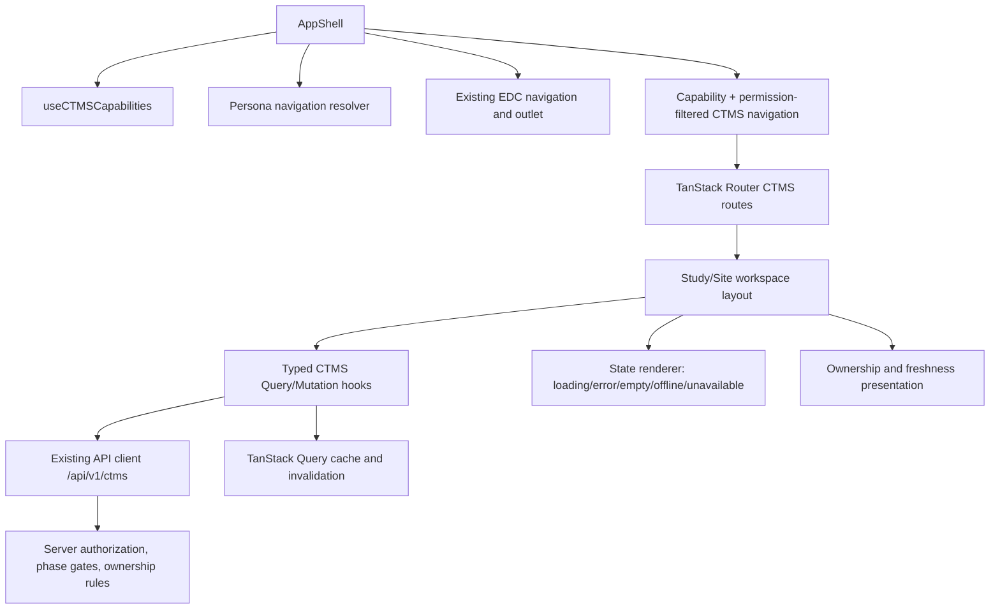
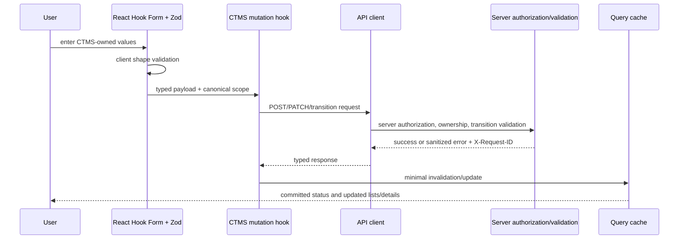

# Design Document

## Overview

The CTMS frontend is completed as an additive feature boundary within the existing React 19 application. The design extends `frontend/src/features/ctms/`, `frontend/src/lib/router.ts`, `frontend/src/components/layout/AppShell.tsx`, and the existing permission and study/site context primitives. It does not introduce a second app, duplicate the EDC shell, or move EDC clinical authority into CTMS.

The implementation uses the repository baseline: TypeScript, Vite, TanStack Router, TanStack Query, React Hook Form, Zod, Tailwind/shadcn-style components, Vitest, Testing Library, and Playwright. Existing CTMS read models and ownership components are preserved and refactored behind smaller components and typed contracts where necessary. The frontend consumes server-owned authorization, phase/capability metadata, status-transition choices, projection allowlists, report filters, export options, attachment constraints, and remediation policies rather than reproducing server policy locally.

### Goals

- Productize the existing CTMS routes into role/persona-aware study and site workspaces.
- Add validated create/update/status-transition forms for CTMS operational records.
- Make dashboards, reports, projections, exports, attachments, failed events, and conflicts safe and understandable.
- Make loading, error, empty, offline, disabled, unavailable, and worker-unavailable states distinct.
- Preserve EDC navigation and clinical workflows under every CTMS degraded mode.
- Make ownership, read-only semantics, freshness, and server-authoritative authorization visible.
- Provide typed API/query contracts and minimal, predictable cache invalidation.

### Non-goals

- No duplicate application shell or authentication system.
- No frontend mutation route for EDC-owned Study_Version, clinical subjects, Visit_Instances, Form_Instances, Field_Values, Queries, SDV, review, freeze/lock, signatures, Clinical_Attachments, or clinical exports.
- No client-side replacement for server authorization, study/site scope enforcement, ownership rules, projection allowlists, or transition validation.
- No client-side calculation of unauthorized report totals or unrestricted clinical metrics.

### Existing implementation baseline

The current implementation already provides:

- CTMS routes under the authenticated AppShell for study, site activation, reports, exports, health, projections, failed events, and conflicts.
- `capabilities.ts` with a disabled fallback manifest and a five-minute TanStack Query capability lookup.
- `api.ts` models and read hooks for CTMS records plus replay and conflict-resolution calls.
- `WorkspacePage.tsx` with loading/error/empty rendering, basic read-only ownership presentation, and remediation mutations.
- `OwnershipPresentation.tsx` with module badges, canonical identifiers, freshness, read-only labels, guarded actions, and sanitized remediation copy.
- An EDC regression test proving EDC pages remain usable when CTMS is disabled, empty, worker-unavailable, or capability loading fails.

The completion work should preserve these safety properties while replacing broad eager queries and generic tables with capability-aware, form-ready, filterable, accessible components.

### Traceability to the integration specification

The existing `.kiro/specs/ctms-integration/requirements.md` and `design.md` define backend ownership, canonical identities, API error envelopes, server permissions, projections, coordination, exports, attachments, and phase delivery. This design consumes those contracts. The frontend-specific requirements map to the integration requirements as follows: frontend ownership and non-mutation to integration Requirements 1, 8, 10, 11, and 12; forms/workspaces to Requirements 3–7; projections to Requirement 8; replay/conflicts to Requirement 9; capability phases to Requirement 14; and resilience to Requirements 13 and 14.

## Architecture

### Module topology



`AppShell` remains the only global shell. A `ctmsNavigation` resolver consumes the manifest and user permissions to produce navigation as a convenience filter. It does not perform scope authorization. The router keeps direct routes available so server responses can produce access-denied or unavailable views rather than relying on navigation hiding.

The CTMS workspace has four layers:

1. **Context layer**: route parameters, selected study/site context, capability phase, user persona, and scope labels.
2. **Data layer**: typed query and mutation hooks, query-key factories, request/response parsing, error normalization, and invalidation.
3. **Presentation layer**: page layouts, tables/cards, forms, filters, ownership/freshness labels, and action guards.
4. **State layer**: shared query state rendering, offline detection, worker health, mutation feedback, and focus/announcement behavior.

### Route model

Existing routes remain compatible. New route aliases should be added only when needed to expose a productized page without duplicating a workspace implementation:

```text
/ctms
/studies/$studyId/ctms
/studies/$studyId/ctms/profile
/studies/$studyId/ctms/plans
/studies/$studyId/ctms/enrollment
/studies/$studyId/ctms/milestones
/studies/$studyId/ctms/tasks
/studies/$studyId/ctms/contacts
/studies/$studyId/ctms/monitoring-plans
/studies/$studyId/ctms/monitoring-activities
/studies/$studyId/ctms/projections
/studies/$studyId/ctms/reports/$type
/studies/$studyId/ctms/exports
/studies/$studyId/ctms/coordination/failed-events
/studies/$studyId/ctms/coordination/conflicts
/studies/$studyId/ctms/health
/sites/$siteId/ctms/activation
```

Route search parameters are the canonical home for supported report/list filters and pagination. The selected study/site store remains useful for global EDC navigation, but a CTMS route parameter wins for a scoped CTMS workspace. Navigation links must use TanStack Router `Link`/navigation rather than raw anchors so search state and focus behavior remain predictable.

### Capability and persona resolution

The capability manifest is normalized into a view model with:

- `enabled` and request status (`ready`, `disabled`, `unavailable`);
- numeric phase;
- capability codes;
- optional `environment` and `platform_capabilities` values;
- a route/action matrix maintained in one frontend module;
- a safe fallback that hides CTMS navigation while leaving EDC navigation untouched.

The persona resolver maps server permission codes to affordances, not authority:

- `CTMS_Admin`: read all permitted CTMS areas, operational administration, export/attachment controls, health, replay, and conflict-resolution controls within server scope;
- `CTMS_Operations_User`: operational create/update/transition and supported export/attachment controls within server scope;
- `CTMS_Viewer`: read-only CTMS views and projections;
- mixed or unknown permission sets: union of explicitly granted affordances, never an inferred elevated role.

The frontend must not assume that a role name implies all scope grants. The server response remains authoritative for object-level and study/site-level decisions.

### State model

A reusable `CTMSQueryState`/`CTMSMutationState` presentation layer classifies:

- loading: request is in flight and no usable data exists;
- refreshing: prior data exists while a new request is in flight;
- success with data;
- success empty: request succeeded with zero records;
- unauthorized/scope denied;
- disabled: server says CTMS is off;
- unavailable: capability or CTMS API cannot be reached;
- offline: browser cannot reach the network, with cached data clearly marked;
- worker unavailable: CTMS service responds but coordination worker health is unavailable/degraded;
- generic retryable request error.

The classifier preserves safe previously loaded data on refresh/error where possible, but labels its timestamp and never presents stale mutation results as committed. EDC routes do not depend on CTMS query success.

### Form and mutation flow

Each form follows the same sequence:



Forms submit only fields owned by CTMS. Server-returned transition metadata controls status choices and reason requirements. Mutations are not optimistically applied for status, ownership, projections, exports, attachments, replay, or conflict resolution unless a later API contract explicitly guarantees safe rollback semantics. Default behavior is authoritative response then cache invalidation.

### Offline and worker behavior

The frontend uses `navigator.onLine` and browser online/offline events only as a user-experience signal. It does not claim that online means authorized or that offline means the server rejected a request. Safe GET data may remain in TanStack Query cache and is marked cached with its last successful timestamp. Non-idempotent CTMS mutations are disabled offline by default. A durable offline command queue is out of scope until a server idempotency contract and product decision exist.

Worker health is read from the CTMS health/coordination response. A worker-unavailable state does not invalidate successful CTMS writes or block EDC. Accepted asynchronous operations retain correlation and status information and can be refreshed from coordination/event queries.

## Components and Interfaces

### Proposed frontend component boundaries

```text
frontend/src/features/ctms/
  api.ts                         typed resource contracts and endpoint functions
  capabilities.ts                manifest normalization and phase/action matrix
  navigation.ts                  persona and capability convenience resolver
  queryKeys.ts                   scoped query-key factory and invalidation helpers
  state.ts                       query/error/offline/worker state classification
  forms/
    OperationalStudyForm.tsx
    StudyPlanForm.tsx
    OperationalSiteForm.tsx
    ActivationActionForm.tsx
    EnrollmentTargetForm.tsx
    OperationalMilestoneForm.tsx
    MonitoringPlanForm.tsx
    MonitoringActivityForm.tsx
    OperationalTaskForm.tsx
    OperationalContactForm.tsx
    StatusTransitionForm.tsx
    schemas.ts
  workspaces/
    CTMSWorkspaceLayout.tsx
    StudyWorkspacePage.tsx
    SiteWorkspacePage.tsx
    DashboardFilters.tsx
    ReportFilters.tsx
  components/
    CTMSQueryState.tsx
    CTMSMutationFeedback.tsx
    OwnershipPresentation.tsx
    ProjectionFreshness.tsx
    ResponsiveRecordList.tsx
    OperationalAttachmentPanel.tsx
    OperationalExportPanel.tsx
    CoordinationRemediationPanel.tsx
  hooks/
    useCTMSMutations.ts
    useCTMSFilters.ts
    useCTMSOfflineState.ts
    useCTMSAnnouncements.ts
```

Existing `WorkspacePage.tsx` can remain as a compatibility dispatcher while view-specific content moves to focused components. The change should avoid one component invoking every query for every view: hooks should be enabled only for the active view and manifest capability. This reduces unnecessary calls and makes unavailable states specific.

### API and hook interfaces

The frontend API layer should expose typed functions with the existing API client, for example:

```ts
export interface CTMSMutationMeta {
  requestId?: string
  correlationId?: string
  outcome?: 'accepted' | 'succeeded' | 'queued' | 'failed'
}

export interface CTMSPage<T> {
  items: T[]
  page: number
  page_size: number
  total: number
  next_cursor?: string | null
}

export interface CTMSErrorEnvelope {
  error: {
    code: string
    message: string
    details?: Record<string, unknown>
  }
  request_id?: string
}

export interface CTMSTransitionOption {
  status: string
  requires_reason?: boolean
  reason_label?: string
}

export interface CTMSFilterState {
  status?: string
  siteId?: string
  ownerId?: string
  from?: string
  to?: string
  priority?: string
  dueCategory?: string
  page?: number
  pageSize?: number
}
```

Resource functions should cover the existing reads plus typed mutations for operational profiles/plans, activation, targets, milestones, monitoring plans/activities, tasks, contacts, attachments, export creation/download metadata, replay, and conflict resolution. The exact URL and payload fields are inherited from the integration API design and must be confirmed through OpenAPI/contract tests. The frontend must not invent endpoint paths for EDC-owned mutations.

Mutation hooks should return normalized metadata including request/correlation identifiers where the server provides them. Error normalization should preserve error code, safe message, request ID, validation field details, and correlation ID without exposing raw response bodies.

### Cache key and invalidation contract

Use one key factory with scope and filters included:

```ts
const ctmsKeys = {
  all: ['ctms'] as const,
  capabilities: () => [...ctmsKeys.all, 'capabilities'] as const,
  study: (studyId: string) => [...ctmsKeys.all, 'study', studyId] as const,
  site: (siteId: string) => [...ctmsKeys.all, 'site', siteId] as const,
  list: (resource: string, scope: string, filters: CTMSFilterState) =>
    [...ctmsKeys.all, resource, scope, filters] as const,
  detail: (resource: string, id: string) => [...ctmsKeys.all, resource, 'detail', id] as const,
}
```

Invalidation is mutation-specific:

| Mutation | Invalidate/update | Do not invalidate |
|---|---|---|
| Study/site profile, plan, activation | same detail, list, dashboard, affected reports | EDC clinical queries/casebook caches |
| Enrollment target/milestone | enrollment lists, study/site dashboard, enrollment reports | EDC subject/form/visit data caches |
| Monitoring plan/activity | monitoring lists, dashboard, monitoring reports, linked workspace | EDC Visit_Instance or clinical data caches |
| Task/contact/attachment | corresponding list/detail, dashboard, task report | EDC Query lifecycle or clinical attachments |
| Export create/retry/download | export job list/detail and notification summaries | clinical export caches |
| Projection refresh | projection list/detail, dashboards/reports using the projection | authoritative EDC caches |
| Replay | failed events, coordination events, projections, affected operational resource | clinical caches unless server explicitly provides a safe projection update |
| Conflict resolution | conflicts, events, projections, affected operational resource | EDC authoritative caches |

### Form interfaces and validation

Zod schemas validate required client shape, date formats, numeric ranges, string lengths, supported enum values, attachment metadata, and reason presence. Schemas must not encode server scope or ownership decisions as if they were authorization. `useForm` error mapping supports field errors plus a form-level server error. Draft values that could contain sensitive clinical data must not be persisted to local storage.

### Ownership and freshness interfaces

The existing `ModuleBadge`, `StatusPresentation`, `OwnershipCard`, `ReadOnlyIndicator`, and `ProjectionFreshness` remain the visual primitives. They should accept structured ownership metadata rather than infer authority from route names. A projection display requires source module, source record ID if permitted, source timestamp, projected timestamp, source/rule version, status, and read-only semantics. Operational and clinical status labels use different `StatusKind` values and explanatory copy.

### Accessibility interfaces

All reusable controls use the repository's button, input, select, dialog, table, badge, alert, and toast conventions. Components expose accessible labels and test IDs only where needed for behavior tests. Modal forms manage focus, validation errors use `aria-describedby`/`aria-invalid`, async mutation feedback uses an `aria-live` region, and status badges communicate meaning through text and not color alone. Tables retain a semantic header and an accessible mobile alternative when horizontal scrolling would hide essential actions.

## Data Models

### Client-side model categories

The frontend models are API representations, not authority replicas:

- **Capability**: module, enabled state, phase, capabilities, environment, platform availability, request status.
- **Canonical reference**: EDC study/site/subject/visit/query identifiers with display labels only as presentation fields.
- **Operational record**: CTMS-owned record data, status, timestamps, scope, owner, and optional audit/correlation metadata.
- **Projection**: minimized payload plus source module, source record, source/rule version, source/projected timestamps, freshness, and read-only state.
- **Mutation result**: resource or accepted/queued outcome, request ID, correlation ID, and server status.
- **Export job**: CTMS ownership, type, filters, status, timestamps, expiration/download metadata, and permitted download URL or token.
- **Attachment metadata**: operational ownership, parent, filename/type/size, status, retention, timestamps, and permitted download action; no file content is kept in query cache.
- **Coordination record**: sanitized event/conflict identity, status, reason code/type, correlation, versions, available actions, and policy choices.

### Scope and filter model

All scoped requests carry route scope or explicit query parameters. A filter model stores only supported fields and serializes to API names in one adapter. Unknown URL search parameters are ignored or preserved without being sent as arbitrary server filters. Dates are sent as API-supported ISO values; display localization occurs only in presentation components.

### Server assumptions required by the UI

The UI assumes the following API behaviors from the CTMS integration design:

1. Lists return `items`, `page`, `page_size`, `total`, and optional cursor metadata.
2. Errors use the baseline error envelope and provide `X-Request-ID`; validation details are sanitized.
3. Capability responses identify enabled phase and capability codes; unavailable responses are distinguishable from disabled responses when possible.
4. Create/update/transition endpoints return the committed resource or an accepted asynchronous outcome with correlation identifier.
5. Status-transition endpoints return current status, allowed transitions, and reason requirements or expose them through a typed detail contract.
6. Report/dashboard endpoints apply server scope and filters and identify projected metrics with source/freshness metadata.
7. Export and attachment endpoints return lifecycle/retention constraints and scope-checked actions.
8. Replay and conflict endpoints return sanitized policy choices, current status, correlation, and outcome without raw event content.
9. The server rejects EDC-owned field injection and clinical mutation paths even if a malicious client bypasses frontend controls.

If an API does not currently satisfy one of these assumptions, the implementation must add an adapter or contract-test fixture rather than weakening the frontend ownership boundary.

## PBT Applicability Decision

Property-based testing applies to deterministic frontend logic with meaningful input variation: capability-to-route gating, persona affordance resolution, filter serialization, ownership/freshness classification, mutation-to-cache invalidation mapping, sanitized error normalization, and safe payload projection. These are pure or mostly pure functions that can be tested with generated manifests, permissions, filters, dates, records, errors, and mutation outcomes.

Property-based testing does not replace component and browser tests for visual layout, focus behavior, responsive rendering, browser online events, file chooser behavior, network delivery, server authorization, or external export/storage services. Those concerns use Vitest/Testing Library, Playwright, API contract tests, and representative integration examples.

## Correctness Properties

*A property is a characteristic or behavior that should hold true across all valid executions of a system—essentially, a formal statement about what the system should do. Properties serve as the bridge between human-readable specifications and machine-verifiable correctness guarantees.*

The prework classified UI layout, focus, browser online events, file chooser behavior, server authorization, external storage/export delivery, and EDC workflow preservation as integration, example, or smoke concerns. The reflection consolidated overlapping ownership-label, capability, sanitization, and invalidation checks while retaining unique clinical-boundary and degraded-state guarantees. Each property below is intended for one property-based test with at least 100 generated examples; component/browser and API integration tests remain mandatory for the non-property criteria.

### Property 1: Phase and persona affordances never exceed server metadata

*For any* CTMS capability manifest, phase, permission set, route/action descriptor, and persona combination, the CTMS_Frontend affordance resolver SHALL expose an action only when the action is enabled by the delivered phase, declared capability, and frontend permission convenience check, and SHALL never expose an EDC mutation or an elevated action inferred from a role name alone.

**Validates: Requirements 2.1–2.6, 3.1–3.5, 12.6**

### Property 2: Scope and filters round-trip without ambiguity

*For any* valid study/site scope, supported filter state, pagination state, and capability phase, serialization then parsing SHALL return an equivalent scope/filter model, include every response-affecting value in query keys, and produce request parameters that preserve the route-authoritative scope.

**Validates: Requirements 4.4, 6.2, 6.5, 11.2–11.3, 11.7**

### Property 3: Operational payloads cannot become clinical mutation requests

*For any* operational form input, linked EDC reference, projection descriptor, attachment/export descriptor, and arbitrary extra fields, the CTMS_Frontend request/action adapter SHALL retain only CTMS-owned fields and approved canonical references, SHALL remove prohibited clinical fields and clinical content, and SHALL produce no CTMS mutation action for an EDC-owned resource.

**Validates: Requirements 1.2, 1.5, 5.1–5.4, 7.3–7.4, 8.1, 8.6, 12.2–12.6**

### Property 4: Ownership and freshness presentation is explicit

*For any* operational status, clinical status, projection metadata, linked subject/query/visit reference, and quality signal, the ownership view model SHALL identify the authoritative module, preserve canonical identifiers, distinguish operational from clinical semantics, and render read-only and freshness metadata whenever the source is projected.

**Validates: Requirements 1.3, 1.6, 6.3, 7.1–7.5, 12.1–12.4**

### Property 5: Form validation follows server transition metadata

*For any* valid form model, server-provided transition options, reason requirements, safe field errors, and unrelated draft values, the form adapter SHALL allow only returned transitions, require reasons when declared, map errors to the correct field or form, and preserve unrelated safe values.

**Validates: Requirements 5.5–5.6, 5.9**

### Property 6: Mutation outcomes produce minimal cache effects

*For any* CTMS mutation type, scope, resource identifier, success result, failure result, and existing query-key set, the cache policy SHALL update or invalidate every affected CTMS detail/list/dashboard/report key, SHALL invalidate coordination/projection keys for remediation where required, SHALL preserve authoritative data after failure, and SHALL never invalidate unrelated EDC clinical key families.

**Validates: Requirements 2.4, 5.7–5.8, 9.5, 10.6, 11.4–11.5**

### Property 7: Error and remediation view models are sanitized

*For any* API error envelope or coordination record containing permitted details, raw event bodies, credentials, Clinical_Data, prohibited projection values, unrestricted query messages, or stack traces, the CTMS_Frontend normalizer SHALL preserve only safe codes/messages/identifiers/correlation data and SHALL expose replay or resolution actions only when the required convenience permission is present.

**Validates: Requirements 9.1–9.2, 9.6–9.7, 10.2, 11.6**

### Property 8: Export lifecycle actions follow server state

*For any* operational export status, supported filter/format set, permission set, and server-provided action metadata, the export view model SHALL serialize only supported operational options, expose only the permitted lifecycle action, identify CTMS ownership, and never expose a clinical export action.

**Validates: Requirements 8.1–8.3, 8.6**

### Property 9: Query state categories remain distinct

*For any* query status, prior data snapshot, network state, capability state, worker state, and retry result, the CTMS_Frontend state classifier SHALL distinguish loading, refreshing, empty, offline, disabled, unavailable, unauthorized, generic error, and worker-unavailable states, SHALL retain safe prior data only with cached/stale labeling, and SHALL replace the degraded state after a successful retry.

**Validates: Requirements 2.3, 10.1–10.7**

### Property 10: Server totals and filter results remain authoritative

*For any* server page response, server total, active filter state, and client-visible row subset, the CTMS_Frontend SHALL display the server-provided scope, total, ordering, and filter result metadata without reconstructing unauthorized totals or presenting rows from a previous filter as current.

**Validates: Requirements 6.2, 6.4–6.6, 11.7**

### Property 11: Projection and operational status never grant clinical authority

*For any* CTMS Projection, operational subject status, monitoring activity link, query follow-up link, and user permission set, the action resolver SHALL permit only CTMS operational actions and SHALL never produce controls that authorize clinical access, clinical data changes, protocol visit changes, query lifecycle changes, clinical attachment access, or clinical export access.

**Validates: Requirements 1.5, 7.3–7.4, 8.6, 12.2–12.6**

### Property 12: Capability changes are monotonic toward safety

*For any* old and new capability manifests, active route/action set, and cached CTMS data, a manifest change that removes enablement or capability SHALL remove the affected mutation affordances, invalidate dependent CTMS queries, and preserve EDC navigation and EDC query families; a manifest change SHALL never grant an action not present in the new server metadata.

**Validates: Requirements 2.2–2.5, 10.6, 11.3–11.5, 12.5**

## Error Handling

The frontend normalizes API failures into a safe `CTMSClientError` containing `code`, `message`, optional field details, `requestId`, `correlationId`, retryability, and category. The normalizer drops stack traces, raw event bodies, credentials, clinical values, prohibited projection values, unrestricted query messages, and database details.

| Condition | UI category | Behavior |
|---|---|---|
| CTMS disabled | disabled | Hide CTMS navigation; direct CTMS route explains that CTMS is disabled; EDC remains usable |
| Capability request failure | unavailable | Preserve EDC; show retry and unavailable explanation; do not show mutation affordances |
| 401 | unauthenticated | Use existing auth/session behavior; do not expose CTMS details |
| 403/scope denied | unauthorized | Hide or explain action; preserve existing safe data; show request ID |
| 404 canonical record | not found | Show scoped not-found state; do not fabricate a record or identity |
| 409 transition/ownership/conflict | conflict | Keep form values; show current status/allowed action or remediation guidance |
| 422 validation/projection field | validation | Map safe field/form errors; do not echo prohibited values |
| 429/413 | throttled/too large | Explain server limit and preserve draft-safe values |
| 5xx/network | unavailable | Retry where safe; keep EDC available; show cached timestamp when prior data exists |
| offline | offline | Mark cache state; prevent non-idempotent writes by default; retry reads when online |
| worker unavailable | worker-unavailable | Keep accepted operation/correlation visible; refresh coordination/health; do not block EDC |

Mutation errors never trigger broad cache invalidation. A failed mutation leaves the last server-confirmed data in place. A successful mutation invalidates only affected CTMS query families. A capability failure cannot turn into an empty data state.

## Testing Strategy

The feature uses complementary tests rather than treating all frontend behavior as property-based:

- **Vitest unit tests** for pure capability, persona, route/action, filter, payload, freshness, error, and invalidation helpers.
- **Vitest + Testing Library component tests** for forms, ownership labels, states, action guards, focus behavior, filter interactions, tables/cards, mutation feedback, and CTMS fallback within AppShell.
- **API contract/integration tests** with mocked API responses for pagination, server errors, authorization denial, transitions, projections, exports, attachments, replay, conflicts, and correlation identifiers.
- **Playwright tests** for persona navigation, study/site workflows, forms, filters, projections, export/attachment flows, remediation, responsive layout, and EDC regression modes.
- **Smoke checks** for capability loading, offline listeners, file constraints, and worker health display.

Every property test runs at least 100 generated examples using **fast-check** with the repository's Vitest setup. Add a pinned `fast-check` dependency only if the frontend does not already provide one; do not implement a generator framework from scratch. Component and browser tests remain the source of truth for UI rendering and accessibility.

Each property-based test uses a comment tag in the form `Feature: ctms-frontend, Property N: [property text]`. Integration tests must verify that frontend convenience checks do not replace API authorization by directly mocking or calling denied server responses.

## Traceability Summary

| Requirement | Design coverage | Primary verification |
|---|---|---|
| 1. Module boundary | AppShell integration, canonical references, no EDC mutation controls | route/component regression and API-boundary tests |
| 2. Capability/phase gating | manifest normalization, route/action matrix, disabled/unavailable states | unit, component, and Playwright tests |
| 3. Personas | navigation and affordance resolver | unit/component persona tests and browser navigation |
| 4. Workspaces | study/site route layout, scoped context, empty states | component and Playwright workspace tests |
| 5. Forms/lifecycles | RHF/Zod forms, server transition metadata, mutation hooks | unit, component, API contract tests |
| 6. Dashboards/reports | query-state filters, server totals, freshness labels | component, contract, and report browser tests |
| 7. Projections | ownership/freshness/read-only primitives | unit/component projection tests |
| 8. Exports/attachments | operational-only payloads, lifecycle, storage actions | integration and Playwright tests |
| 9. Remediation | sanitized replay/conflict panels and invalidation | component, contract, and Playwright tests |
| 10. Degraded states | shared state classifier, offline indicator, worker health | unit/component/smoke and EDC regression tests |
| 11. API/cache | typed client, scoped keys, minimal invalidation | unit and API contract tests |
| 12. Ownership/EDC preservation | labels and no clinical controls | component and EDC regression tests |
| 13. Accessibility/responsive | semantic controls, focus, live regions, mobile tables | Testing Library accessibility assertions and Playwright viewport tests |
| 14. Delivery evidence | layered tests and phase qualification | CI test matrix and phase checkpoints |
