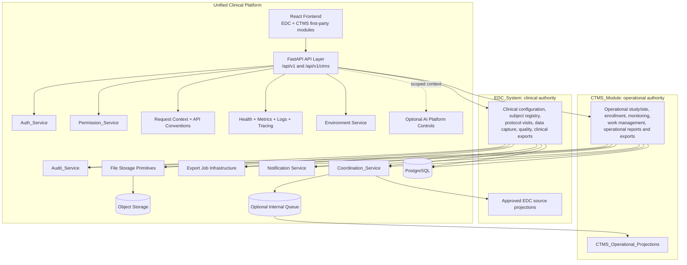
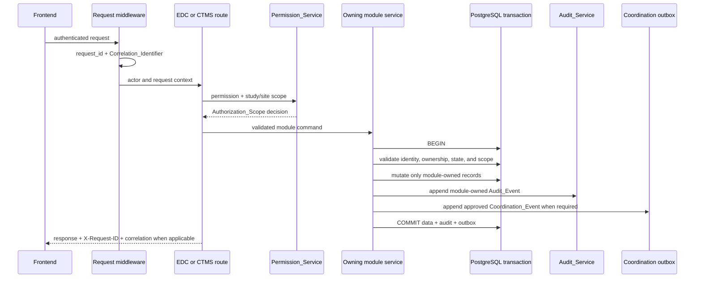
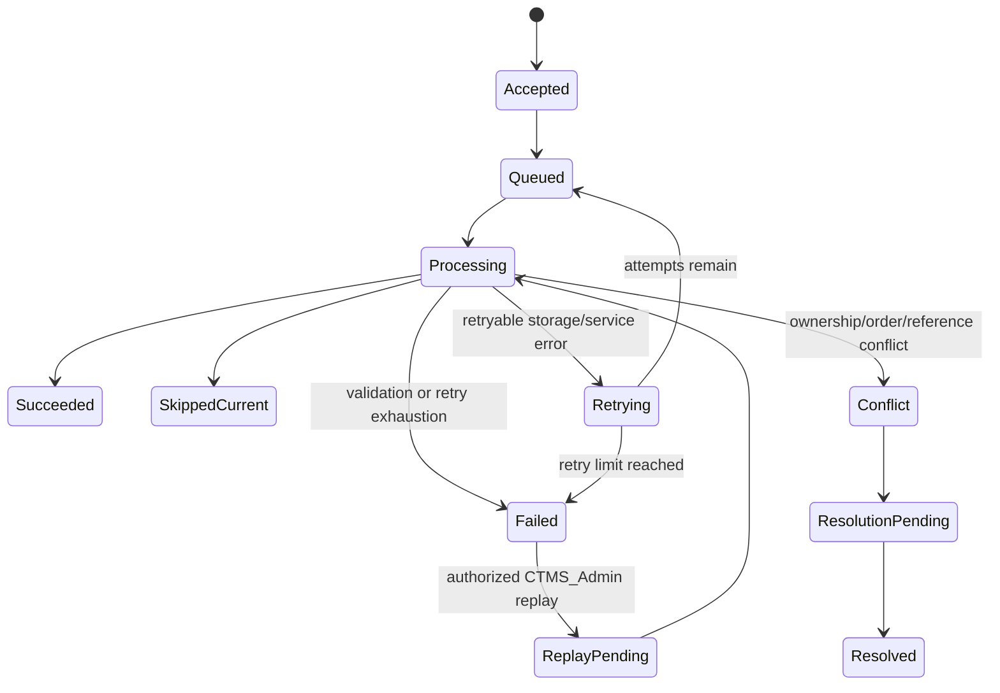
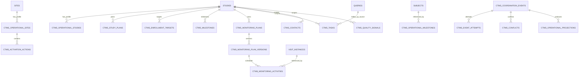

# Design Document

## Overview

The Unified_Clinical_Platform contains two co-equal first-party modules: the EDC_System and the CTMS_Module. They share one authenticated application boundary and shared platform services, but they own different records and workflows. CTMS is a peer operational module, not a second clinical system of record, and it does not become a second clinical system of record through coordination or projections. EDC remains authoritative for clinical configuration, clinical subject records, protocol visits, clinical data, clinical quality workflows, and clinical exports. CTMS is authoritative for operational planning and execution records, including operational study and site management, enrollment planning and milestones, monitoring, work management, operational dashboards, reports, and operational exports.

Both modules use canonical Study and Site identities, and CTMS references EDC-owned Subject and Visit_Instance identities where operational records need clinical context. A CTMS projection is an explicit, minimized, versioned read model. It is not a shared write model. A Coordination_Event may update an approved projection or perform an explicitly configured coordinated transition, but it may never silently mutate EDC-owned clinical state.

The design uses the existing platform baseline established by the EDC design: Python 3.11+, FastAPI, Pydantic v2, SQLAlchemy 2.x, Alembic, PostgreSQL, pytest/Hypothesis, React/TypeScript/Vite, TanStack Router/Query/Table, React Hook Form/Zod, Tailwind/shadcn/ui, and optional Redis workers and S3-compatible object storage. Shared services are reused as platform capabilities; module-owned services remain responsible for their own data semantics, validation, transactions, and audit content.

### Design goals

1. **Co-equal module boundary.** EDC and CTMS are independently owned first-party modules in one authenticated platform.
2. **One canonical identity.** Study and Site use one shared identity; Subject and Visit_Instance use the EDC clinical identity as the canonical reference.
3. **Explicit authority.** Every persisted shared field has exactly one authoritative module and a versioned `Status_Ownership_Rule`.
4. **Clinical protection.** CTMS cannot create competing clinical subjects or modify EDC Study_Version, Clinical_Subject_Registry, Visit_Instance, Form_Instance, Field_Value, Query, SDV, review, freeze/lock, signature, Clinical_Attachment, or clinical export records.
5. **Operational completeness.** CTMS owns the operational profile, planning, readiness, monitoring, enrollment, task, contact, dashboard, report, and export workflows needed by study operations.
6. **Safe coordination.** Projections and explicitly approved transitions are coordinated through idempotent, ordered, retryable, conflict-aware internal events.
7. **Independent resilience.** CTMS failure or absence does not block core EDC clinical workflows.
8. **Phased verification.** Delivery starts with operational study/site/enrollment foundations, adds monitoring/work management/projections, then adds quality signals, recovery, advanced reporting, exports, and qualification evidence.

### Research and design findings

The existing EDC requirements and design establish the clinical authorities that this design preserves: `Study_Version_Service` owns published clinical configuration; `Clinical_Subject_Registry`/`Subject_Service` owns clinical subject identity and binding; `Protocol_Visit_Service`/`Visit_Service` owns protocol visits and casebooks; `Form_Metadata_Service`, `Data_Capture_Service`, `Repeating_Record_Service`, and `Edit_Check_Engine` own clinical configuration and data; `Query_Service` owns query lifecycle and complete message history; `SDV_Service`, `Review_Service`, `Lock_Service`, and `Signature_Service` own clinical quality and governance; and clinical attachment and export behavior remains EDC-owned.

The revised CTMS requirements decompose broad EDC service names rather than duplicating them. `Study_Service`, `Site_Service`, `Subject_Service`, `Visit_Service`, `Dashboard_Service`, `Export_Service`, `File_Attachment_Service`, `Notification_Service`, `Auth_Service`, `Permission_Service`, and `Audit_Service` therefore appear in the ownership matrix below with explicit shared, CTMS, or EDC dispositions. The platform reuses shared primitives but never transfers ownership of the data those primitives process.

## Architecture

### Platform and module topology

The EDC_System and CTMS_Module are feature modules in the same authenticated deployment. They may be organized as separate backend packages and frontend feature areas, but they share request context, authorization, audit, storage, export-job, notification, observability, environment, and optional AI controls. CTMS does not call EDC over its public HTTP API for first-party coordination; approved service contracts and the shared transaction/session boundary are used inside the platform. External integrations, if introduced later, use the versioned API and cannot bypass ownership rules.



The platform feature flag may disable CTMS navigation and operations, but it does not remove CTMS data or alter EDC routes. If CTMS has no operational records, EDC continues normally. If a CTMS worker is unavailable, accepted coordination work remains durable and visible as pending or failed while EDC capture, authentication, clinical audit, clinical export, and clinical lifecycle operations continue.

### Request and transaction boundaries

Every module route follows the shared request path: authenticate, assign request and correlation identifiers, resolve `Authorization_Scope`, validate the module-owned command, invoke the module service, and return the standard response contract. Routes are thin and do not write directly to the database.



A synchronous mutation and its status history, audit event, and outbox row commit atomically. Coordination processing is a separate transaction. The worker claims one event, revalidates the current permission/ownership/allowlist/order state, updates only an approved projection or explicitly permitted target, appends the target audit record, and commits the outcome. A target failure rolls back target data and target audit together; the event attempt records only a sanitized outcome.

### Ownership enforcement model

`Status_Ownership_Rule` is a versioned configuration record containing entity type, field path, authoritative module, writable module, projection target, allowed transitions, field allowlist, effective version, and status. The rule is checked at command acceptance and again immediately before coordination application. A stale or changed rule cannot silently grant write authority.

Default policy is conservative:

- EDC owns clinical configuration, Clinical_Subject_Registry identity and binding, protocol visits, clinical data, queries, SDV/review, freeze/lock, signatures, clinical attachments, and clinical exports.
- CTMS owns operational study/site/enrollment/monitoring/work records, operational attachments, operational dashboards/reports, and operational exports.
- Shared platform services own reusable capabilities, not module content semantics.
- A projection is read-only for its consumer. A coordinated transition is possible only when explicitly named by the active rule.

### Coordination lifecycle

Approved cross-module changes use a PostgreSQL transactional outbox and durable coordination log. Delivery is at-least-once and processing is idempotent.



Each event has an `Idempotency_Key`, `Correlation_Identifier`, source module, target projection, canonical source identifier, source version/sequence, and rule version. Duplicate delivery returns the prior outcome and cannot create a duplicate record or side effect. Per-entity ordering uses source sequence/version. Older events are skipped or recorded as a conflict and cannot overwrite a current projection. Retryable failures use bounded backoff; schema, authorization, ownership, prohibited-field, unknown-reference, and ambiguous-reference failures do not retry automatically. Replay revalidates current authorization, identity, ownership, and allowlists.

### Projection and rebuild strategy

`CTMS_Operational_Projection` is a typed, minimized read model. Each projection stores source module, source record ID, source version, rule version, correlation ID, projected timestamp, payload fingerprint, and current/rejected/stale state. Payloads are schema-specific; arbitrary source JSON is not accepted.

A rebuild is a scope-limited asynchronous job that reads authoritative records in stable order, applies the active field allowlist, upserts only the projection table, and records a generation/watermark. It never emits a reverse mutation event and never changes EDC or CTMS authoritative records. Repeated rebuilds over unchanged source data produce the same projection payload and fingerprint.

## Components and Interfaces

### Shared Platform / CTMS / EDC ownership matrix

The following is the migration disposition for existing EDC service names and the explicit ownership boundary after CTMS delivery. “Shared” means the platform owns the primitive and both modules use it; it does not mean the platform owns either module's business records.

| Existing service or capability | Disposition | Shared Platform responsibility | CTMS responsibility | EDC responsibility | Migration boundary |
|---|---|---|---|---|---|
| `Auth_Service` | Shared Platform | Authentication, sessions, identity-provider validation, logout, password reset, MFA, invitations, deactivation for both modules | Uses shared identity and session controls | Uses shared identity and session controls | No CTMS identity system; users and session history remain shared |
| `Permission_Service` | Shared Platform | Resolve one `Authorization_Scope` at system/study/site scope and enforce server-side | Register CTMS roles/permissions and require scope on all CTMS operations | Retain all clinical role/permission enforcement | One scope model; frontend checks never replace server checks |
| `Audit_Service` | Shared Platform primitive with module-owned event content | Immutable append-only storage, request context, UTC timestamps, search/export primitives | Emit CTMS operational, projection, coordination, attachment, and operational export events | Emit clinical data, configuration, quality, attachment, and clinical export events | Shared table/primitive; event ownership and payload semantics remain module-specific |
| Request context/API conventions | Shared Platform | Request ID, correlation ID, error envelope, pagination, validation, OpenAPI, UTC conventions | Use `/api/v1/ctms` and shared contracts | Use `/api/v1` clinical contracts | No module-specific error or identity bypass |
| `Study_Service` | Split: canonical identity shared; operational service CTMS; clinical version service EDC | Canonical Study identity and cross-module reference resolution | `Operational_Study_Service` owns sponsor, phase, therapeutic area, indication planning metadata, operational owner, readiness, operational lifecycle, study plans, enrollment plans, operational milestones, and operational dashboards/reports | Retains canonical clinical Study identity, Study_Version, protocol configuration, eCRF metadata, clinical edit checks, and clinical dashboards/reports | Existing broad Study_Service is decomposed by field ownership; CTMS cannot edit clinical Study_Version/configuration |
| `Site_Service` | Split: canonical identity shared; operational service CTMS; clinical use EDC | Canonical Site identity and scope relationship to Study | `Operational_Site_Service` owns operational profile, activation/readiness, monitoring readiness, operational contacts, responsible roles, planned dates, completion evidence, operational status, and operational site dashboards/reports | Retains canonical clinical Site reference and clinical configuration use, site-scoped clinical assignments and data access | Activation/readiness is not an EDC clinical site mutation |
| `Subject_Service` | Split: CTMS enrollment operations; EDC clinical registry | Shared canonical Subject reference resolution | `Enrollment_Service` owns targets, operational milestones, operational subject status, and approved projections | Clinical_Subject_Registry owns subject identity, clinical identifiers, site/study-version binding, clinical access state, clinical lifecycle needed by EDC, Visit_Instances, Form_Instances, and Clinical_Data | CTMS receives/references an EDC subject ID; it cannot create a competing subject or replace the clinical identifier |
| `Visit_Service` | Split: EDC protocol visits; CTMS monitoring visits | Shared canonical references and coordination primitives | `Monitoring_Service` owns Monitoring_Plans and Monitoring_Activities, including schedules, CRA assignment, completion/cancellation evidence | `Protocol_Visit_Service` remains authoritative for protocol visit definitions, Visit_Instances, protocol dates, visit windows, missed visits, and casebooks | A Monitoring_Activity may link to an EDC Visit_Instance by reference only and cannot create/reschedule/complete/freeze/lock it |
| `Form_Metadata_Service` | EDC | — | CTMS can reference approved form/visit identifiers in projections or follow-up context only | Owns eCRF metadata, fields, code lists, and clinical configuration | No CTMS form-definition or field-definition writes |
| `Data_Capture_Service` | EDC | — | CTMS may consume approved aggregate/projection signals only | Owns Form_Instances, Field_Values, validation, submission, and clinical data changes | No CTMS operational command can mutate clinical values |
| `Repeating_Record_Service` | EDC | — | No operational equivalent of clinical repeating records | Owns clinical Form_Records and history | Operational task/contact data is not clinical repeating data |
| `Edit_Check_Engine` | EDC | — | May consume approved quality signals; cannot author or run clinical edit checks as CTMS data | Owns clinical validation rules and query-producing edit checks | CTMS does not duplicate edit-check definitions or results |
| `Query_Service` | EDC | Shared request/audit primitives | `Work_Management_Service` creates operational query follow-up tasks containing an EDC Query identifier and approved summary only | Owns Query status transitions, complete message history, affected clinical objects, and clinical query exports | Follow-up task never changes the EDC Query or stores unrestricted messages |
| `SDV_Service` | EDC | — | May consume approved SDV progress signal | Owns SDV state and progress | CTMS receives aggregate/minimized signal only |
| `Review_Service` | EDC | — | May consume approved review progress signal | Owns clinical review state and progress | CTMS receives aggregate/minimized signal only |
| `Lock_Service` | EDC | Shared authorization/audit | CTMS scheduling and completion remain allowed when a linked EDC visit is Frozen or Locked | Owns freeze/lock state and clinical modification blocking | Monitoring activity never writes lock or clinical data |
| `Signature_Service` | EDC | Shared authentication/audit primitive | No CTMS ownership | Owns electronic signatures, signed data, re-authentication, and stale signatures | CTMS cannot sign or invalidate clinical records |
| `Dashboard_Service` | Shared aggregation platform with module-owned metrics | Scope filtering, aggregation primitives, query/report job support | Owns operational dashboards/reports for targets, readiness, monitoring, tasks, milestones, and approved data-quality signals | Owns clinical dashboards/reports for subjects, forms, queries, SDV, review, and clinical status | Separate contracts and content; shared scope and infrastructure |
| `Export_Service` | Shared export-job infrastructure with module-owned content | Job creation/status, queueing, storage, download controls, failure handling, download audit | Supplies CTMS operational content and approved projections; owns operational export filters/formats | Supplies clinical content, clinical filtering, audit behavior, and clinical export formats | One job primitive; no cross-module data blending without explicit approved fields |
| `File_Attachment_Service` | Split: shared file primitives; CTMS operational attachments; EDC clinical attachments | Object storage, metadata, access checks, retention, soft deletion | Owns `Operational_Attachment` metadata/content and operational access policy | Owns `Clinical_Attachment` metadata/content and clinical/source access policy | CTMS permissions cannot read clinical file content; metadata-only reference requires explicit EDC rule |
| `Notification_Service` | Shared Platform with module-owned triggers | Notification persistence, delivery state, read/archive lifecycle | Triggers task assignment, monitoring assignment/reschedule/overdue, and failed coordination notifications | Triggers clinical query/form/export notifications | Shared delivery does not transfer event ownership |
| Health, metrics, logs, tracing | Shared Platform | Health endpoints, readiness, metrics, structured logs, tracing, sanitized observability | CTMS queue/worker/projection/failed/conflict metrics | EDC clinical/API/worker metrics | Logs never contain clinical values, credentials, raw event bodies, or unrestricted messages |
| Environment management | Shared Platform | Isolated database, storage, secrets, authentication, logging, retention, backup/restore per Environment | CTMS feature flags and operational settings | EDC clinical settings and migration gates | CTMS configuration cannot collapse environment isolation |
| Optional `AI_Assistant_Service` | Shared Platform controls with module-scoped authorization | AI transport, context minimization, confirmation, audit hooks | CTMS-scoped operational context/actions only | EDC-scoped clinical context/actions only | AI never bypasses module ownership or server-side confirmation |
| Clinical/source attachments and clinical exports | EDC | Shared storage/job primitives only | No authority; may receive approved metadata-only reference | Retains content, filtering, access, audit, and export authority | CTMS deletion/unavailability cannot remove or alter clinical content |

### Backend package structure

```text
backend/app/
  api/routes/
    ...existing EDC routes...
    ctms/
      studies.py sites.py enrollment.py milestones.py
      monitoring.py tasks.py contacts.py projections.py
      coordination.py dashboards.py reports.py exports.py health.py
  models/
    ...existing EDC models...
    ctms/
      common.py ownership.py operational_study.py operational_site.py
      enrollment.py monitoring.py work.py projection.py coordination.py
  schemas/
    ...existing EDC schemas...
    ctms/
      common.py ownership.py study.py site.py enrollment.py monitoring.py
      work.py projection.py coordination.py dashboard.py report.py export.py
  repositories/
    ...existing EDC repositories...
    ctms/
      operational_repository.py monitoring_repository.py
      projection_repository.py coordination_repository.py report_repository.py
  services/
    ...existing EDC services...
    operational_study_service.py
    operational_site_service.py
    enrollment_service.py
    monitoring_service.py
    work_management_service.py
    ctms_projection_service.py
    coordination_service.py
    ctms_dashboard_service.py
    ctms_report_service.py
    ctms_health_service.py
  workers/
    coordination_worker.py projection_rebuild_worker.py ctms_export_worker.py
```

Shared services are imported, not forked. CTMS modules receive an `AsyncSession` from the route or worker and do not create independent sessions inside service methods.

### Module-owned service interfaces

```python
from dataclasses import dataclass
from datetime import date, datetime
from enum import StrEnum
from typing import Any, Mapping
from uuid import UUID
from sqlalchemy.ext.asyncio import AsyncSession

class Module(StrEnum):
    EDC = "EDC"
    CTMS = "CTMS"

@dataclass(frozen=True)
class ActorContext:
    user_id: UUID
    request_id: str
    correlation_id: str

@dataclass(frozen=True)
class OwnershipDecision:
    authoritative_module: Module
    writable_fields: frozenset[str]
    projection_target: str | None
    allowlist: frozenset[str]
    rule_version: int

class OperationalStudyService:
    async def create_profile(self, session: AsyncSession, *, study_id: UUID,
                             payload: Mapping[str, Any], actor: ActorContext) -> Any: ...
    async def update_profile(self, session: AsyncSession, *, study_id: UUID,
                             changes: Mapping[str, Any], actor: ActorContext) -> Any: ...
    async def transition_status(self, session: AsyncSession, *, study_id: UUID,
                                status: str, reason: str | None,
                                actor: ActorContext) -> Any: ...
    async def create_plan(self, session: AsyncSession, *, study_id: UUID,
                          payload: Mapping[str, Any], actor: ActorContext) -> Any: ...

class OperationalSiteService:
    async def create_profile(self, session: AsyncSession, *, site_id: UUID,
                             payload: Mapping[str, Any], actor: ActorContext) -> Any: ...
    async def create_activation_action(self, session: AsyncSession, *, site_id: UUID,
                                       payload: Mapping[str, Any], actor: ActorContext) -> Any: ...
    async def complete_activation_action(self, session: AsyncSession, *, action_id: UUID,
                                         evidence: Mapping[str, Any], actor: ActorContext) -> Any: ...

class EnrollmentService:
    async def create_target(self, session: AsyncSession, *, study_id: UUID,
                            payload: Mapping[str, Any], actor: ActorContext) -> Any: ...
    async def record_milestone(self, session: AsyncSession, *, subject_id: UUID,
                               payload: Mapping[str, Any], actor: ActorContext) -> Any: ...
    async def publish_status_projection(self, session: AsyncSession, *, subject_id: UUID,
                                        actor: ActorContext) -> Any: ...

class MonitoringService:
    async def publish_plan(self, session: AsyncSession, *, plan_id: UUID,
                           actor: ActorContext) -> Any: ...
    async def amend_published_plan(self, session: AsyncSession, *, plan_id: UUID,
                                   reason: str, actor: ActorContext) -> Any: ...
    async def schedule_activity(self, session: AsyncSession, *, plan_version_id: UUID,
                                payload: Mapping[str, Any], actor: ActorContext) -> Any: ...
    async def reschedule_activity(self, session: AsyncSession, *, activity_id: UUID,
                                  planned_date: date, reason: str,
                                  actor: ActorContext) -> Any: ...
    async def complete_activity(self, session: AsyncSession, *, activity_id: UUID,
                                notes: str | None, evidence: Mapping[str, Any] | None,
                                actor: ActorContext) -> Any: ...

class WorkManagementService:
    async def create_task(self, session: AsyncSession, *, study_id: UUID,
                          payload: Mapping[str, Any], actor: ActorContext) -> Any: ...
    async def create_query_follow_up(self, session: AsyncSession, *, query_id: UUID,
                                     payload: Mapping[str, Any], actor: ActorContext) -> Any: ...
    async def create_contact(self, session: AsyncSession, *, study_id: UUID,
                             payload: Mapping[str, Any], actor: ActorContext) -> Any: ...

class CTMSProjectionService:
    async def apply_event(self, session: AsyncSession, *, event_id: UUID,
                          worker_id: str) -> Any: ...
    async def rebuild(self, session: AsyncSession, *, study_id: UUID,
                      projection_type: str, generation: UUID,
                      actor: ActorContext) -> Any: ...

class CoordinationService:
    async def accept(self, session: AsyncSession, *, event_type: str,
                     source_module: Module, entity_type: str,
                     source_record_id: UUID, source_version: int,
                     payload: Mapping[str, Any], rule_version: int,
                     idempotency_key: str, actor: ActorContext | None) -> Any: ...
    async def process(self, session: AsyncSession, *, event_id: UUID,
                      worker_id: str) -> Any: ...
    async def replay(self, session: AsyncSession, *, event_id: UUID,
                     actor: ActorContext) -> Any: ...
    async def resolve_conflict(self, session: AsyncSession, *, conflict_id: UUID,
                               policy: str, selected_value: Any | None,
                               reason: str, actor: ActorContext) -> Any: ...
```

### Operational study boundary

`Operational_Study_Service` owns the CTMS operational study profile and planning aggregate: sponsor, phase, therapeutic area, indication planning metadata, operational owner, readiness criteria, operational status, study plans, enrollment plans, operational milestones, and operational dashboard/report calculations. Operational statuses are `Draft`, `Planning`, `Ready`, `Active`, `Enrollment Closed`, `Suspended`, and `Closed`.

The shared canonical `Study.id` and EDC study identifier are read-only references in CTMS. EDC retains the canonical clinical Study identity, Study_Version lifecycle, protocol definitions, form metadata, clinical edit checks, and clinical study configuration. CTMS profile updates create CTMS audit events and cannot modify EDC Study_Version or clinical metadata. An EDC projection of operational study status is permitted only when the active `Status_Ownership_Rule` defines the field and target.

### Operational site boundary

`Operational_Site_Service` owns operational site profile, site activation/readiness actions, monitoring readiness, contacts, responsible roles, planned dates, completion evidence, operational status, and operational site dashboards/reports. Operational site statuses are `Not Started`, `In Progress`, `Ready for Activation`, `Active`, `Suspended`, and `Closed`.

The canonical `Site.id` and EDC site identifier remain read-only references. EDC retains clinical site configuration use, clinical assignment relationships, clinical access, and clinical data. Completing or changing an operational activation action produces operational history and may publish approved status fields, but never changes EDC clinical site configuration. Duplicate activation requests for one canonical site and action type return the existing action.

### Enrollment boundary and duplicate-subject prevention

`Enrollment_Service` owns recruitment, screening, and enrollment `Enrollment_Target` records, operational subject milestones, operational subject status, and enrollment reports. Targets are distinct by type and scoped to a canonical Study/Site/planning dimension. Operational subject statuses include `Screening`, `Screen Failed`, `Enrolled`, `Randomized`, `On Treatment`, `Completed`, `Early Terminated`, `Lost to Follow-up`, and `Withdrawn`.

The EDC `Clinical_Subject_Registry` remains authoritative for Subject identity, clinical subject identifier, site binding, study-version binding, clinical access state, and clinical data. A CTMS milestone command must include an existing canonical EDC `subject_id`; it resolves that ID through the shared identity/reference service and cannot accept a display name as identity. CTMS does not insert into `subjects`, allocate clinical identifiers, initialize casebooks, or create Visit_Instances/Form_Instances. If the canonical subject is unknown, ambiguous, outside scope, withdrawn/soft-deleted under a rule that disallows new milestones, or the command includes prohibited clinical fields, the command is rejected without changing CTMS or EDC state. An operational pseudonym is a display/reference field only and never replaces the EDC identifier.

Approved EDC subject status or progress signals may be projected into CTMS. A CTMS operational status may be projected back only as a read-only projection or through a named coordinated transition in the active rule. An unconfigured status never silently changes EDC clinical access state.

### Protocol visit and monitoring separation

`Protocol_Visit_Service` remains EDC-owned for protocol visit definitions, Visit_Instances, dates, visit-window calculation, missed visits, and casebook schedule/state. CTMS `Monitoring_Service` owns independent `Monitoring_Plan`, immutable published plan versions, and `Monitoring_Activity` records with activity type, planned date, assigned CRA, status, completion evidence, and optional `edc_visit_instance_id`.

A Monitoring_Activity reference is informational and coordination context only. Scheduling, rescheduling, completing, or cancelling it cannot create, reschedule, complete, mark missed, freeze, lock, or otherwise modify an EDC Visit_Instance or Clinical_Data. CTMS scheduling and completion remain permitted while a linked EDC Visit_Instance is Frozen or Locked.

### Work management and query follow-ups

`Work_Management_Service` owns operational tasks, follow-ups, dependencies and escalations when enabled, operational contacts, and operational attachments. A query follow-up stores the EDC Query identifier and approved summary metadata, then tracks operational ownership, due dates, status, and completion history. `Query_Service` remains the only authority for EDC query status, messages, affected clinical objects, and clinical query exports. Work management never stores unrestricted query messages, clinical values, source documents, or clinical audit history.

Assignment validates active users and study/site scope. Operational task status history and configured reason requirements are append-only and auditable. Assignment creates a shared notification for the assigned user.

### Dashboards, reports, exports, and attachments

CTMS dashboards and reports calculate only CTMS operational records and approved, scoped projections. They include enrollment target/actual/variance, study/site readiness, activation status, monitoring activity status, task ownership and aging, milestone progress, and approved aggregate `Data_Quality_Signals`. Projected clinical metrics display as read-only and include their source timestamp and source module.

EDC dashboards/reports remain clinical: subject status, form completion, clinical query metrics, SDV, review, and clinical lifecycle. The shared `Dashboard_Service` supplies scope filtering and aggregation primitives, but separate module contracts and content prevent accidental blending.

The shared `Export_Job_Service` owns queueing, status, storage, download, and failure handling. CTMS owns operational export content and approved projections; EDC owns clinical export content, clinical filters, and clinical audit export behavior. Operational exports exclude Clinical_Data, source documents, unrestricted messages, credentials, and unrestricted clinical audit history. A downloaded operational export is recorded with CTMS scope in the shared audit trail.

Shared file primitives provide storage metadata, access checks, retention, and soft deletion. `Operational_Attachments` are CTMS-owned and may be used by operational plans, activities, tasks, contacts, or activation actions. `Clinical_Attachments` remain EDC-owned and retain clinical/source authority. CTMS operational permissions cannot download clinical content; an explicit EDC permission and metadata-only projection rule are required even to reference a clinical attachment.

### API surface and ownership-visible routes

All CTMS routes are under `/api/v1/ctms`, use authenticated dependencies, shared `Permission_Service` guards, Pydantic v2 schemas, the standard error envelope, pagination, and `X-Request-ID`. No CTMS route directly mutates EDC-owned resources.

| Resource | Routes | Ownership-visible behavior |
|---|---|---|
| Operational studies | `GET/POST /studies/{study_id}/operational-profile`, `PATCH /operational-studies/{id}`, `GET/POST /studies/{study_id}/plans` | Shows canonical EDC Study ID as read-only and CTMS-owned operational fields/status |
| Operational sites | `GET/POST /sites/{site_id}/operational-profile`, `GET/POST /sites/{site_id}/activation`, `POST /activation-actions/{id}/complete` | Shows canonical EDC Site ID, activation/readiness owner, evidence, and CTMS authority |
| Enrollment | `GET/POST /studies/{study_id}/enrollment-targets`, `PATCH /enrollment-targets/{id}`, `GET/POST /subjects/{subject_id}/operational-milestones` | Requires canonical EDC Subject ID; exposes operational status separately from EDC clinical access/status |
| Monitoring | `GET/POST /studies/{study_id}/monitoring-plans`, `POST /monitoring-plans/{id}/publish|amend`, `GET/POST /studies/{study_id}/monitoring-activities`, `POST /monitoring-activities/{id}/reschedule|complete|cancel` | Labels Monitoring_Activity as operational and linked EDC Visit_Instance as read-only reference |
| Work | `GET/POST /studies/{study_id}/tasks`, `PATCH /tasks/{id}`, `POST /queries/{query_id}/follow-ups`, `GET/POST /studies/{study_id}/contacts` | Shows EDC Query ID as a source link; task completion cannot close or edit the query |
| Projections | `GET /studies/{study_id}/projections`, `GET /projections/{id}` | Displays source module, source identifier, rule version, freshness, and read-only badge |
| Coordination | `GET /studies/{study_id}/coordination-events`, `GET /coordination-events/{id}`, `POST /coordination-events/{id}/replay` | Exposes sanitized processing state and permissioned replay only |
| Conflicts | `GET /studies/{study_id}/coordination-conflicts`, `POST /coordination-conflicts/{id}/resolve` | Shows conflict type, versions, fingerprints, policy, and sanitized remediation details |
| Dashboards/reports | `GET /studies/{study_id}/dashboard`, `GET /sites/{site_id}/dashboard`, `GET /studies/{study_id}/reports/{type}` | Clearly separates operational values from projected clinical signals |
| Operational exports | `POST /studies/{study_id}/exports`, `GET /exports/{id}`, `GET /exports/{id}/download` | Returns CTMS-owned content only and uses shared export-job lifecycle |
| Health | `GET /health` | Returns CTMS worker/event/projection health without raw event or clinical data |

The API does not expose CTMS mutation routes for EDC Study_Version, Clinical_Subject_Registry, Visit_Instance, Form_Instance, Field_Value, Query lifecycle/messages, SDV, review, freeze/lock, signatures, Clinical_Attachments, or clinical exports. Any command that contains an EDC-owned field is rejected with an ownership or projection validation error before mutation.

### Frontend routes and ownership presentation

The React frontend adds CTMS feature routes below the authenticated `AppShell` without moving EDC pages into CTMS:

```text
/ctms
/studies/$studyId/ctms
/studies/$studyId/ctms/plans
/studies/$studyId/ctms/enrollment
/studies/$studyId/ctms/milestones
/studies/$studyId/ctms/tasks
/studies/$studyId/ctms/contacts
/sites/$siteId/ctms/activation
/studies/$studyId/ctms/monitoring-plans
/studies/$studyId/ctms/monitoring-activities
/studies/$studyId/ctms/projections
/studies/$studyId/ctms/coordination/failed-events
/studies/$studyId/ctms/coordination/conflicts
/studies/$studyId/ctms/reports/$type
/studies/$studyId/ctms/health
```

CTMS screens show canonical EDC Study/Site/Subject/Visit identifiers, the authoritative module for each shared status, source timestamp for projections, and read-only badges on projected clinical data. `PermissionGuard` hides unavailable actions as a convenience; direct API calls remain server-authorized. CTMS views never present a monitoring activity as a protocol visit, an operational subject status as an EDC clinical access state, or a query follow-up as a query lifecycle action. When CTMS is disabled or empty, baseline EDC navigation and clinical indicators remain unchanged.

## Data Models

### Storage and integrity rules

CTMS operational tables are additive tables in the same PostgreSQL database, use the `ctms_` prefix, and do not duplicate EDC clinical tables. Existing EDC `studies`, `sites`, `subjects`, `visit_instances`, `form_instances`, `field_values`, `queries`, clinical attachments, and clinical exports remain authoritative. CTMS foreign keys/reference columns point to canonical EDC identities; no CTMS table copies clinical payloads.

All records use UUID primary keys where CTMS owns the record, `TIMESTAMPTZ` UTC timestamps, study/site scope, actor/correlation metadata, and soft-deletion/archive fields where deletion is supported. JSONB is limited to validated configuration, evidence metadata, or allowlisted projection payloads. Partial indexes exclude soft-deleted rows. Alembic revisions are additive and phase-gated; no CTMS migration rewrites EDC clinical tables.

### Entity relationship diagram



### CTMS operational tables

**`ctms_operational_studies`**: one CTMS operational profile per canonical `study_id`; sponsor, phase, therapeutic area, indication planning fields, operational owner, readiness criteria, operational status, archived state, timestamps, and audit references. It does not replace `studies` or `study_versions`.

**`ctms_study_plans`**: operational study plans with objective, owner, planning scope, lifecycle status, and linked milestones. Enrollment plans are CTMS records linked to targets and periods.

**`ctms_operational_sites`**: one operational profile per canonical `site_id`; readiness, monitoring readiness, responsible roles, operational status, planned dates, contacts reference, and archived state. Clinical site configuration remains in EDC.

**`ctms_activation_actions`**: site activation/readiness action type, responsible role/user, planned date, completion criteria, completion actor/time, evidence reference, status, and unique active `(site_id, action_type)` key. Duplicate requests return the existing action.

**`ctms_enrollment_targets`**: canonical study/site reference, target type (`Recruitment`, `Screening`, `Enrollment`), quantity, planning period, optional cohort/treatment dimension, owner, status (`Draft`, `Active`, `Met`, `Expired`, `Cancelled`), and timestamps. Active dimension/period uniqueness prevents competing target rows.

**`ctms_operational_milestones`**: canonical EDC `subject_id` when subject-scoped, study/site scope, approved pseudonym/reference, milestone type/date, operational status, source/correlation metadata, and retention state. It contains no Field_Value, clinical note, source document, or unrestricted query content.

**`ctms_tasks`**: title, description, owner, study/site scope, due date, priority, status (`Open`, `In Progress`, `Blocked`, `Completed`, `Cancelled`, `Archived`), optional EDC `query_id` for follow-ups, optional source event, timestamps, and soft-deletion fields.

**`ctms_contacts`**: operational contact name, role, organization, study/site scope, validated contact channels, status (`Active`, `Inactive`, `Archived`), and effective dates.

**`ctms_task_dependencies`** and optional **`ctms_escalations`**: CTMS-owned dependency links, escalation status/reason, and timestamps, created only when enabled for the Environment.

**`ctms_status_history`**: append-only entity/status transitions with actor, UTC timestamp, reason, scope, and correlation ID.

### CTMS monitoring tables

**`ctms_monitoring_plans`**: stable plan key, study/site scope, current version, lifecycle state, and timestamps.

**`ctms_monitoring_plan_versions`**: version number, objectives, activity types, cadence, responsibilities, scope, completion criteria, amendment reason, publication actor/time, and status (`Draft`, `Published`, `Retired`). Published versions are immutable; amendment creates one new Draft version.

**`ctms_monitoring_activities`**: canonical Study/Site, plan version, activity type (`Site Initiation`, `Routine Monitoring`, `Close-out`, `Remote Review`, `Triggered Review`), planned date, assigned CRA, operational status, completion/cancellation evidence, rescheduling history, optional read-only `edc_visit_instance_id`, and timestamps. No EDC visit state is copied into a writable CTMS field.

### Ownership and projection tables

**`ctms_status_ownership_rules`**: entity type, field path, authoritative module, projection type, writable module, allowed transitions, allowlist, version, effective interval, and active/retired status. One active rule applies to a field/effective interval.

**`ctms_operational_projections`**: projection type, source module, canonical source record ID, study/site/subject/query/visit references where approved, source version, rule version, typed allowlisted payload, payload fingerprint, projection status (`Current`, `Stale`, `Rejected`, `Archived`), projected timestamp, correlation ID, and rebuild generation. Unique `(projection_type, source_module, source_record_id)` prevents duplicates.

Approved subject projection fields are limited to subject reference/pseudonym, canonical Site reference, approved operational status, approved milestone date, and source version metadata. Approved query summary fields are limited to query ID/type, canonical Study/Site, approved subject pseudonym, form/visit reference, timestamps, status, and summary text. Prohibited values include Field_Values, source documents, unrestricted query messages, credentials, and unrestricted clinical audit history.

### Coordination and recovery tables

**`ctms_coordination_events`**: event type, source/target module, entity type, canonical source record ID, source version/sequence, rule version, allowlisted payload, payload fingerprint, idempotency key, correlation ID, status, accepted/processed timestamps, resulting projection ID, sanitized reason, and retention metadata. Unique `(source_module, idempotency_key)`.

**`ctms_event_attempts`**: event ID, attempt number, worker ID, start/end timestamps, outcome, error category, and sanitized detail. It stores no prohibited values or raw event bodies.

**`ctms_coordination_event_logs`**: immutable processing record for source, target projection, rule version, correlation, outcome, and current version. Updates and physical deletion are rejected at application and database layers.

**`ctms_conflicts`**: event ID, entity/field, conflict type (`OUT_OF_ORDER`, `OWNERSHIP`, `VERSION`, `AMBIGUOUS_REFERENCE`, `POLICY`), source/current versions, policy, status, selected value/fingerprint, resolver, reason, and resolution time. Prohibited values are excluded.

**`ctms_outbox`**: coordination event ID, aggregate type/id, publish status, available/claimed/published timestamps, attempt count, and sanitized last error category. Unique event ID prevents duplicate publication.

### Reporting, health, notification, and attachment metadata

**`ctms_quality_signals`**: authorized study/site aggregate signal type (`Open Query Count`, `Overdue Query Count`, `Form Completion Percentage`, `SDV Progress`, `Review Progress`), value, numerator/denominator where applicable, source watermark, calculation time, scope, and correlation ID. It is a cache/read model and never becomes clinical authority.

Shared notification rows identify CTMS event type, recipient, status (`Unread`, `Read`, `Archived`), correlation, and sanitized payload. Shared file metadata identifies ownership module, attachment type (`Operational_Attachment` or `Clinical_Attachment`), parent reference, storage key, scope, retention, and soft-deletion state; content semantics remain module-owned.

Operational exports use shared export job rows with a module/content owner discriminator, validated CTMS filters, storage key, status (`Queued`, `Running`, `Completed`, `Failed`), and download audit reference. Clinical export rows remain EDC-owned in content and filtering even if the same job infrastructure is used.

### Migration and integrity plan

1. **Phase 1 migration:** add operational study/profile, operational site/profile, plans, enrollment targets, milestones, tasks, contacts, activation actions, status history, CTMS permission seeds, and indexes. Add no duplicate clinical tables.
2. **Phase 2 migration:** add monitoring plans/versions/activities, status ownership rules, projections, outbox/events, event logs, and CTMS notification types.
3. **Phase 3 migration:** add query summary projections, quality signals, attempts, conflicts, retry metadata, report indexes, export metadata, health counters, and qualification metadata.
4. Each revision has upgrade/downgrade behavior and feature-flag gating. Deployment enables a phase only after shared authorization, audit, ownership, and boundary tests pass.
5. Database constraints enforce UUIDs, UTC timestamps, enum/check values, reference containment, active uniqueness, append-only event logs, and no physical deletion of completed coordination logs.
6. Service validation enforces `Authorization_Scope`, canonical identity resolution, ownership rules, minimization, transition reasons, and module-specific content semantics.
7. Retention jobs archive or soft-delete CTMS records according to configured policy without cascading into EDC Clinical_Data, clinical attachments, clinical audit records, or clinical exports.

## PBT Applicability Decision

Property-based testing applies to deterministic CTMS logic with broad input spaces: canonical identity resolution, ownership rules, authorization scope, lifecycle transitions, projection allowlists, idempotency, source ordering, retry classification, conflict policies, projection rebuilds, report scoping, pagination, and serialization. These tests use generated records and deterministic in-memory repositories/fakes.

Property-based testing does not replace boundary tests for PostgreSQL transactions, queue delivery, object storage, notification delivery, migrations, infrastructure configuration, frontend rendering, timing, capacity, or external service behavior. Those concerns use example, integration, snapshot, security, performance, or smoke tests.

## Correctness Properties

*A property is a characteristic or behavior that should hold true across all valid executions of a system—essentially, a formal statement about what the system should do. Properties serve as the bridge between human-readable specifications and machine-verifiable correctness guarantees.*

The prework classified external delivery, deployment configuration, UI presentation, notification delivery, timing, capacity, and migration setup as example, integration, or smoke tests. The following properties are the reflected, consolidated set for deterministic CTMS logic. Redundant checks were combined: identity and ownership checks are separated from lifecycle checks; projection minimization is separated from coordination delivery; audit completeness and traceability are one property; reporting scope is separate from export content; and EDC resilience is separate from queue correctness. Each property maps to one Hypothesis test with at least 100 examples and uses deterministic repositories/fakes where a real boundary is not required.

### Property 1: Exactly one authoritative owner governs each field

*For any* shared entity, field path, and active `Status_Ownership_Rule`, exactly one module is authoritative, only that module or an explicitly named coordinated transition can write the field, and all other module access is read-only projection access.

**Validates: Requirements 1.2**

**Validates: Requirements 1.2, 1.5, 1.6, 1.8, 3.7–3.8, 4.5–4.8, 5.8–5.11, 6.15, 8.10, 14.4**

### Property 2: Canonical references are stable and unambiguous

*For any* Study, Site, EDC Subject, EDC Visit_Instance, or EDC Query referenced by CTMS, repeated resolution uses the canonical source identifier, preserves that identifier despite display-name changes, and rejects unknown or ambiguous references.

**Validates: Requirements 1.3**

**Validates: Requirements 1.3–1.7, 3.6, 4.7, 5.4, 6.7, 7.5–7.6, 9.4, 9.10–9.11**

### Property 3: Authorization is exact and module-wide

*For any* User, role set, permission, system/study/site scope, module operation, and target record, the operation succeeds exactly when the shared `Authorization_Scope` contains the required permission and target scope; otherwise it changes no CTMS, projection, coordination, attachment, or EDC state.

**Validates: Requirements 2.1**

**Validates: Requirements 2.1–2.3, 2.7, 2.10–2.11, 3.9, 4.10, 5.15, 6.8, 6.12, 7.8, 7.10, 8.6–8.7, 10.1–10.18, 13.6, 14.5**

### Property 4: Operational study lifecycle is independent of clinical configuration

*For any* valid operational study profile, plan, enrollment plan, readiness criterion, milestone, and status sequence, CTMS persists normalized operational state and required history/reasons while the canonical EDC Study, Study_Version, protocol, and clinical configuration remain unchanged.

**Validates: Requirements 3.1**

**Validates: Requirements 3.1–3.10**

### Property 5: Operational site lifecycle is independent of clinical site use

*For any* valid operational site profile, activation/readiness action, contact, monitoring-readiness record, and status sequence, CTMS persists required evidence/history and duplicate activation requests are idempotent, while the canonical EDC Site and clinical configuration remain unchanged.

**Validates: Requirements 4.1**

**Validates: Requirements 4.1–4.11**

### Property 6: Enrollment operations never duplicate or replace clinical subjects

*For any* valid Enrollment_Target or operational subject milestone referencing an existing EDC Subject, CTMS persists the operational record and approved pseudonym/status projection while preserving the EDC Clinical_Subject_Registry identifier, clinical identifier, site/study-version binding, clinical access state, Visit_Instances, Form_Instances, and Clinical_Data; commands without a valid canonical subject or with prohibited clinical fields are rejected without mutation.

**Validates: Requirements 5.1**

**Validates: Requirements 5.1–5.15, 8.2, 8.4, 8.10, 14.4**

### Property 7: Published monitoring plans are immutable and amend by version

*For any* published `Monitoring_Plan`, direct changes are rejected; an amendment with a non-empty reason creates exactly one new Draft version, and every prior Published version remains retrievable and unchanged.

**Validates: Requirements 6.3**

**Validates: Requirements 6.3–6.5**

### Property 8: Monitoring activities remain separate from protocol visits

*For any* `Monitoring_Activity` sequence and EDC `Visit_Instance` state, CTMS scheduling, assignment, rescheduling, completion, and cancellation retain operational history and optional EDC reference while protocol visit definitions, dates, windows, missed-visit state, casebook state, and Clinical_Data remain unchanged, including when the EDC visit is Frozen or Locked.

**Validates: Requirements 6.1**

**Validates: Requirements 6.1–6.2, 6.6–6.15, 14.7**

### Property 9: Work management remains operational and query follow-ups remain non-clinical

*For any* Operational_Task, Operational_Contact, follow-up, dependency, escalation, and status sequence, CTMS enforces operational lifecycle, scope, active-user assignment, history, and reasons, retains linked EDC Query identifiers on completion, and never persists or changes clinical query messages, Clinical_Data, source documents, or clinical audit history.

**Validates: Requirements 7.1**

**Validates: Requirements 7.1–7.12**

### Property 10: Projection payloads obey versioned minimization allowlists

*For any* source record, projection type, active rule, and payload containing arbitrary nested values, the resulting `CTMS_Operational_Projection` contains exactly the approved typed fields and excludes Field_Values, source documents, unrestricted query messages/notes, credentials, unrestricted clinical audit data, and prohibited identifiers; rejected payloads retain only a sanitized fingerprint.

**Validates: Requirements 8.1**

**Validates: Requirements 1.6, 5.12–5.13, 8.1–8.9, 8.11–8.12, 12.11–12.12**

### Property 11: Coordination is idempotent

*For any* accepted `Coordination_Event` and `Idempotency_Key`, processing the event zero or more times with duplicate delivery produces at most one logical projection update or coordinated side effect, returns one stable outcome and target identifier, and records duplicate/skipped outcomes without duplicate records.

**Validates: Requirements 9.2**

**Validates: Requirements 1.7, 4.11, 9.2–9.8, 9.18**

### Property 12: Coordination preserves source order and freshness

*For any* correlated entity and arbitrary permutation of source-versioned events, the Coordination_Service applies events in source order, does not allow a stale event to overwrite a current projection, and records the current version when an event is skipped or conflicted.

**Validates: Requirements 9.8**

**Validates: Requirements 8.11–8.12, 9.8–9.9, 9.17–9.18**

### Property 13: Coordination failures are bounded and sanitized

*For any* worker result sequence and configured retry policy, retryable failures retry only within the bound; unknown, ambiguous, schema, authorization, ownership, minimization, and exhausted failures become the specified `Failed_Event` or `Coordination_Conflict`, with no partial target mutation and no prohibited value in retained details.

**Validates: Requirements 9.10**

**Validates: Requirements 9.10–9.15, 13.13–13.15**

### Property 14: Replay revalidates current policy

*For any* `Failed_Event` replayed after authorization, ownership, identity, or allowlist changes, the replay applies only when all current checks pass; otherwise it remains failed/conflicted and authoritative records remain unchanged.

**Validates: Requirements 9.16**

**Validates: Requirements 9.16, 10.9–10.10**

### Property 15: Projection rebuilds are source-preserving and repeatable

*For any* authoritative CTMS/EDC record set and active rule generation, rebuilding a projection produces the same allowlisted payload and fingerprint on repeated runs and never mutates authoritative source records, source audit history, or source status.

**Validates: Requirements 9.17**

**Validates: Requirements 8.1–8.7, 9.17, 14.6**

### Property 16: Audit, correlation, and traceability are complete and atomic

*For any* CTMS mutation, projection update, coordination event, retry/failure, replay, conflict resolution, attachment action, or operational export action, the immutable audit and coordination records contain actor or worker, UTC timestamp, scope, action, source/target identifiers, rule version where applicable, reason where required, and Correlation_Identifier; the authoritative change and its audit/outbox record commit or roll back together, and the resulting source-to-outcome trace is traversable.

**Validates: Requirements 12.1**

**Validates: Requirements 1.7, 2.4–2.5, 3.5, 4.4, 6.14, 7.8, 7.11, 9.1, 9.3–9.4, 9.7, 9.18, 12.1–12.5, 12.10, 14.6**

### Property 17: Operational dashboards and reports are scope-consistent

*For any* generated CTMS operational records, approved quality projections, report filters, and `Authorization_Scope`, every dashboard/report row, total, variance, trend, and status bucket is derived only from in-scope records and equals the corresponding in-scope reference calculation; projected clinical metrics remain labeled read-only with source freshness.

**Validates: Requirements 13.1**

**Validates: Requirements 5.15, 8.5–8.7, 10.11, 11.12, 13.1–13.7**

### Property 18: Export and attachment ownership is separated

*For any* export or attachment request and authorized User, shared job/storage infrastructure preserves lifecycle and download auditing, CTMS operational exports and Operational_Attachments contain only CTMS-owned or approved projection data, clinical exports and Clinical_Attachments remain EDC-owned, and CTMS operational permissions cannot read clinical content.

**Validates: Requirements 12.6**

**Validates: Requirements 2.7–2.8, 8.4, 10.11, 11.5, 12.6–12.12, 12.15**

### Property 19: Optional CTMS failure does not alter EDC behavior

*For any* EDC clinical workflow with no CTMS records, disabled CTMS, or an unavailable CTMS worker, EDC authentication, clinical capture, clinical audit, clinical export, protocol visit/casebook behavior, and clinical lifecycle results are unchanged; accepted CTMS work remains queued, pending, or reported unavailable.

**Validates: Requirements 14.10**

**Validates: Requirements 12.14–12.15, 13.14–13.16, 14.4, 14.7, 14.10**

### Property 20: Soft deletion, archival, and immutable coordination retention preserve history

*For any* deletable CTMS operational record, projection, coordination log, conflict, or audit-linked record within its configured retention period, deletion produces only the configured soft-deletion/archive state with actor/time/reason, required references remain queryable, and completed coordination logs/audit records cannot be updated or physically deleted.

**Validates: Requirements 12.13**

**Validates: Requirements 1.10, 3.10, 4.9, 5.14, 9.18, 12.4–12.5, 12.13**

### Property 21: CTMS API contracts are consistent and non-leaking

*For any* CTMS list request or failing command, successful responses contain `items`, `page`, `page_size`, and `total`, failures use the baseline error envelope and `X-Request-ID`, and neither response details nor raw logs expose stack traces, credentials, Clinical_Data, prohibited projection values, raw event bodies, or unrestricted query messages.

**Validates: Requirements 11.1**

**Validates: Requirements 2.5, 8.8–8.9, 11.1–11.10, 13.13**

### Property 22: Phase gates preserve the ownership boundary

*For any* enabled delivery phase and its feature manifest, only that phase's CTMS capabilities are writable, all shared authorization/audit/identity safeguards remain active, and the EDC clinical ownership boundary remains enforced before and after phase enablement.

**Validates: Requirements 14.1**

**Validates: Requirements 14.1–14.10**

## Error Handling

CTMS uses the baseline EDC error envelope and request-ID behavior for every response:

```json
{
  "error": {
    "code": "COORDINATION_CONFLICT",
    "message": "The requested operational change conflicts with the current ownership rule.",
    "details": {}
  }
}
```

Every response includes `X-Request-ID`. Accepted asynchronous commands return a `Correlation_Identifier` and processing outcome. Error details may contain field names, allowed statuses, current versions, correlation IDs, and sanitized remediation instructions, but never Clinical_Data values, source documents, credentials, unrestricted query messages, raw event bodies, database errors, or stack traces.

| Domain condition | HTTP | Error code | Handling |
|---|---:|---|---|
| Missing/invalid session | 401 | `UNAUTHENTICATED` | Shared Auth_Service behavior |
| Missing CTMS permission/scope | 403 | `CTMS_SCOPE_DENIED` | No state change; request ID returned |
| Unknown canonical record | 404 | `CTMS_RECORD_NOT_FOUND` / `RECORD_NOT_FOUND` | Asynchronous event becomes Failed_Event |
| Ambiguous canonical reference | 409 | `AMBIGUOUS_REFERENCE` | Failed_Event/Coordination_Conflict; no target mutation |
| Duplicate activation/event | 200/409 | `CTMS_DUPLICATE_RECORD` / prior outcome | Return existing record or prior idempotent outcome |
| Illegal operational transition | 409 | `CTMS_INVALID_TRANSITION` | Include current/allowed statuses only |
| Published monitoring plan mutation | 409 | `CTMS_PLAN_PUBLISHED` | Require amendment operation |
| Invalid monitoring assignment | 422 | `CTMS_ASSIGNMENT_INVALID` | Do not reveal unrelated scope details |
| Prohibited projection field | 422 | `PROJECTION_FIELD_NOT_ALLOWED` | Retain only field fingerprint |
| Stale/out-of-order event | 409 | `COORDINATION_OUT_OF_ORDER` | Record conflict/current version |
| Retryable coordination failure | 202 | `COORDINATION_RETRYING` | Return correlation and retry status |
| Failed event | 409 | `COORDINATION_FAILED_EVENT` | Expose sanitized remediation reason |
| Ownership conflict | 409 | `COORDINATION_CONFLICT` | Apply configured policy or require resolution |
| Duplicate replay | 409 | `COORDINATION_REPLAY` | Return prior replay outcome |
| Report outside scope | 403 | `REPORT_SCOPE_DENIED` | Return no report rows |
| Rate/size threshold | 413/429 | `CTMS_REQUEST_TOO_LARGE` / `CTMS_RATE_LIMITED` | Shared throttling envelope |
| Unexpected error | 500 | `INTERNAL_ERROR` | Log details with request ID; suppress response details |

A synchronous CTMS mutation rolls back operational data, status history, audit, and outbox together on failure. A coordination worker rolls back projection/approved target changes and target audit together; a separate attempt record is committed only after the rollback outcome is known. Retry and replay are safe because idempotency and current policy checks occur before mutation.

## Testing Strategy

The CTMS test strategy uses dual testing: Hypothesis property tests for deterministic, input-varying invariants and example/integration/smoke tests for UI, persistence, queues, migrations, external services, notifications, timing, and infrastructure. No property test calls an external service or depends on nondeterministic wall-clock timing.

### Property-based tests

- Library: **Hypothesis**. It is not implemented from scratch.
- Implement exactly one property-based test for each of the 22 design properties.
- Configure every property test for at least 100 generated examples (`@settings(max_examples=100)` or higher).
- Tag every test with `# Feature: ctms-integration, Property N: [property title]`.
- Generate UUIDs, canonical reference maps, display-name collisions, ownership rules, roles/scopes, operational status sequences, plan versions, subjects/visits, projection payloads, prohibited fields, event permutations, duplicate deliveries, source versions, worker failures, policies, report filters, pagination inputs, retention states, and phase manifests.
- Use deterministic in-memory repositories, transaction snapshots, worker fakes, notification fakes, file-store fakes, and export-store fakes for property logic.
- Property 6/8 generators explicitly include attempted duplicate clinical-subject creation, replacement identifiers, linked frozen/locked visits, and monitoring operations.
- Property 10/18/21 generators include unicode, nested structures, prohibited clinical keys, credentials, raw event bodies, unrestricted messages, and sensitive error strings.
- Property 11–15/22 generators include duplicate delivery, stale delivery, missing sequence numbers, transient failure sequences, policy changes, rebuild restarts, and phase enablement changes.

### Example and unit tests

Example/unit suites cover every finite enum and representative state machine: operational study/site/target/subject/task/contact statuses, monitoring activity types, error codes, notification statuses, projection statuses, event statuses, valid/invalid reasons, Pydantic v2 normalization, ownership-rule compilation, allowlist fingerprints, report formulas, UTC serialization, and frontend status/ownership badges. They also cover empty datasets, missing optional references, duplicate display names, withdrawn subjects, archived sites, missing completion evidence, invalid dates, and whitespace-only reasons.

### Module and database boundary tests

Using the existing async SQLAlchemy/PostgreSQL harness and shared EDC services, integration tests cover:

- additive Phase 1/2/3 Alembic migrations, downgrade paths, constraints, indexes, and no clinical-table duplication;
- canonical Study/Site/Subject/Visit references and rejection of ambiguous/unknown references;
- operational study/site profile, readiness, activation, target, milestone, task, contact, and status-history transactions;
- transaction atomicity for operational record + status history + audit + outbox, including forced audit/database failures;
- published Monitoring_Plan immutability, amendment versioning, CRA assignment, rescheduling, completion, cancellation, and frozen/locked EDC Visit_Instance behavior;
- EDC Query lifecycle plus CTMS follow-up creation without query mutation;
- projection refresh, stale handling, allowlists, rebuild, correlation, and sanitized failures;
- duplicate coordination delivery, ordering, retry, Failed_Event, Conflict, replay, and worker restart;
- direct API authorization as CTMS_Admin, CTMS_Operations_User, CTMS_Viewer, out-of-scope users, inactive users, and removed site scopes;
- immutable audit/event logs, request/correlation propagation, and rollback of data when audit/outbox writes fail;
- operational versus clinical attachment access and operational versus clinical export content using shared infrastructure;
- worker outage/backpressure while EDC capture, clinical audit, authentication, protocol visits, and clinical exports continue.

### API contract and security tests

OpenAPI snapshot tests verify `/api/v1/ctms` paths, Pydantic v2 schemas, pagination, enum values, ownership rules, event types, conflict/failure codes, and the absence of direct EDC mutation routes. Security tests call the API directly to attempt EDC-owned field injection, duplicate clinical-subject creation, raw event payload injection, prohibited projection fields, out-of-scope reads, viewer mutations, replay bypass, clinical attachment access, and log/error leakage.

### Frontend tests

Vitest/Testing Library tests cover CTMS route registration under the authenticated shell, permission-aware actions, access-denied states, canonical EDC identifiers, authoritative-module badges, projection freshness, operational versus protocol visit labels, monitoring/task/enrollment workflows, dashboard filters, sanitized remediation views, operational export filters, attachment access, and CTMS_Viewer read-only behavior. Playwright tests cover login → study CTMS workspace → operational profile/target/task → monitoring activity → dashboard/report → failure review. Regression tests run baseline EDC navigation, casebook, data capture, query, clinical export, and clinical attachment flows with CTMS disabled, empty, and worker-unavailable.

### Reports, notifications, health, performance, and qualification

Dashboard/report tests compare representative outputs with reference calculations for scope, variance, trends, status buckets, projected metric labels, and source timestamps. Notification integration tests verify task assignment, monitoring assignment/reschedule/overdue, Failed_Event, and Unread/Read/Archived behavior. Health tests verify worker status, pending/failed/conflict counts, projection lag, last successful processing time, and redaction.

Performance and resilience tests verify common reads under the existing target, asynchronous acknowledgement behavior, bounded page sizes, job handoff for large reports/exports/rebuilds, bounded backpressure, and retained event-log capacity. These are benchmark and boundary tests, not PBT properties.

Qualification gates are phase-specific. Phase 1 proves canonical study/site identity, operational foundations, CTMS roles/scope, audit atomicity, soft deletion, dashboards, and the CTMS non-modification boundary. Phase 2 proves monitoring/work management, projections, outbox coordination, idempotency, ordering, notifications, and EDC operation during CTMS worker outage. Phase 3 proves query summaries, quality signals, retries, Failed_Events, conflicts, replay revalidation, advanced reports/exports, health/lag, retention, backup/restore, and production rollout evidence.

## Phased Delivery

### Phase 1: Operational study/site/enrollment foundation

Deliver canonical Study/Site references, `Operational_Study_Service`, `Operational_Site_Service`, operational study/site plans and readiness, enrollment targets, operational milestones, CTMS roles, scoped authorization, shared audit use, operational status history, core operational dashboards/reports, `/api/v1/ctms` API scaffolding, frontend CTMS workspace shell, additive migrations, and retention foundations. Phase 1 commands are synchronous within the unified service transaction. Phase 1 must prove CTMS cannot modify EDC Study_Version, Clinical_Subject_Registry, Visit_Instance, Form_Instance, Field_Value, Query, clinical attachments, or clinical exports.

### Phase 2: Monitoring, work management, and projections

Deliver `Monitoring_Service`, immutable Monitoring_Plan versions, Monitoring_Activities, `Work_Management_Service` tasks/follow-ups/contacts, optional dependencies/escalations, Operational_Attachments, `CTMS_Operational_Projections`, `Status_Ownership_Rules`, transactional outbox, `Coordination_Service`, asynchronous workers, idempotency/order handling, projection rebuild, notifications, operational reports, and remediation frontend views. Phase 2 must prove monitoring/protocol separation, duplicate delivery safety, source ordering, projection-only updates, allowlist enforcement, and EDC operation during CTMS worker outage.

### Phase 3: Quality signals, recovery, advanced reports, and qualification

Deliver approved query summaries using EDC `Query_Service`, aggregate `Data_Quality_Signals`, retry/backoff, `Failed_Event` handling, `Coordination_Conflict` resolution, replay, advanced operational reports, operational exports, health/lag operations, capacity/performance qualification, retention/backup/restore evidence, and production rollout controls. Phase 3 must prove sanitized failures, current-policy replay validation, deterministic conflicts, end-to-end traceability, and strict clinical/operational export separation.

Feature flags are evaluated server-side and returned as capability metadata. Disabling CTMS hides CTMS actions but does not delete CTMS records or alter EDC routes. Each phase has an Alembic revision set, API/OpenAPI contract snapshot, backend/frontend/security/permission/audit evidence, ownership-boundary evidence, and rollback procedure.

## Traceability Summary

| Requirement | Design coverage | Primary verification |
|---|---|---|
| 1. Explicit module boundary and canonical identity | Ownership matrix; canonical references; projections; UTC; soft deletion; coordination metadata | Properties 1–2, 6, 15, 20; identity/ownership boundary tests |
| 2. Shared platform services | Shared Auth, Permission, Audit, Request Context, Notification, File Storage, Export Jobs, Health/Observability, Environment, optional AI | Property 3, 16, 18, 19, 21; integration/security/smoke tests |
| 3. Operational study management | `Operational_Study_Service`, CTMS profiles/plans/readiness/milestones/status, EDC clinical Study/Study_Version authority | Property 4; study lifecycle, audit, scope, and non-mutation tests |
| 4. Operational site management | `Operational_Site_Service`, activation/readiness/contacts/status, canonical EDC Site reference | Property 5; activation idempotency, archive, audit, and scope tests |
| 5. Enrollment and subject operations | `Enrollment_Service`, target/milestone models, clinical subject boundary, approved status projections | Property 6, 10, 17; duplicate-subject, projection, report, and clinical protection tests |
| 6. Protocol and monitoring visits | EDC `Protocol_Visit_Service`; CTMS `Monitoring_Service`; reference-only EDC Visit_Instance link | Properties 7–8; monitoring version/activity and frozen/locked visit tests |
| 7. Operational work management and contacts | `Work_Management_Service`, tasks/follow-ups/dependencies/escalations/contacts/operational attachments; EDC Query authority | Property 9, 16, 18; task/query follow-up, assignment, attachment, and audit tests |
| 8. Projection minimization and clinical boundary | Typed allowlists, source versions, quality signals, stale conflicts, no clinical authority | Properties 1, 6, 10, 12, 15, 18; minimization/security/rebuild tests |
| 9. Internal coordination/recovery | Outbox, idempotency, ordering, retries, Failed_Events, conflicts, replay, rebuilds | Properties 11–16; worker, fault-injection, and recovery tests |
| 10. Authorization and role boundaries | Shared scope model, CTMS roles, server-side guards, replay/conflict permissions | Property 3; direct API permission and deactivation/scope-removal tests |
| 11. API/frontend ownership presentation | `/api/v1/ctms`, Pydantic schemas, pagination/errors, ownership labels, permission-aware views | Property 21; OpenAPI, API contract, frontend, and EDC regression tests |
| 12. Audit/attachments/exports/privacy | Shared immutable audit/storage/export primitives with module-owned content and allowlists | Properties 10, 16, 18, 20–21; audit, attachment, export, privacy, and retention tests |
| 13. Dashboards/reports/notifications/health/resilience | CTMS operational reporting, approved quality metrics, notifications, health, queue resilience, EDC fallback | Properties 17, 19, 21; report/notification/health/resilience tests |
| 14. Phased delivery and verification | Phase gates, independent ownership/authorization/audit/coordination verification, automated suites | Property 22; phase qualification and CI evidence |

The EDC requirements document remains authoritative for EDC clinical requirements and services identified in the ownership matrix. This design narrows the existing broad EDC service names by data authority; it does not transfer clinical configuration, clinical records, protocol visits, clinical quality, clinical attachments, or clinical exports to CTMS. CTMS operational records and projections are additive and cannot become a competing clinical system of record.
