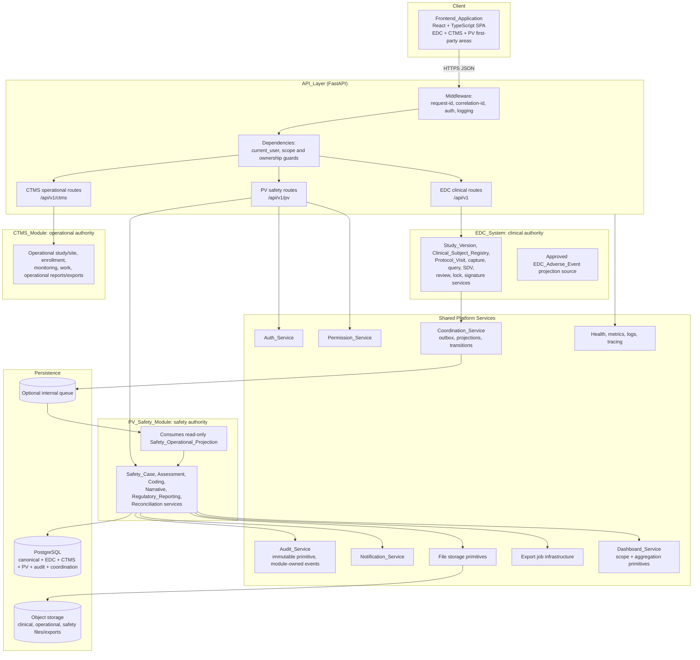
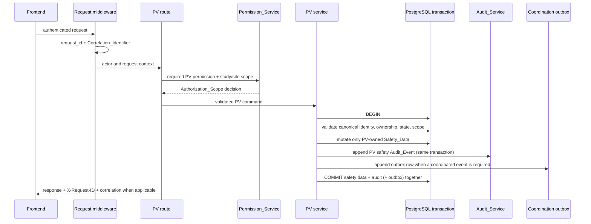
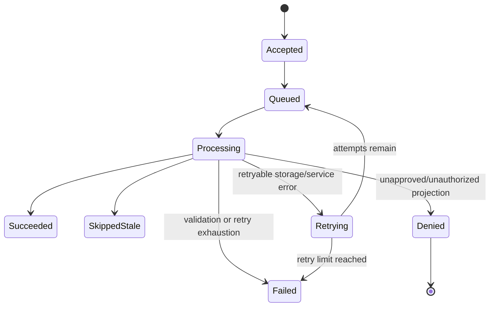
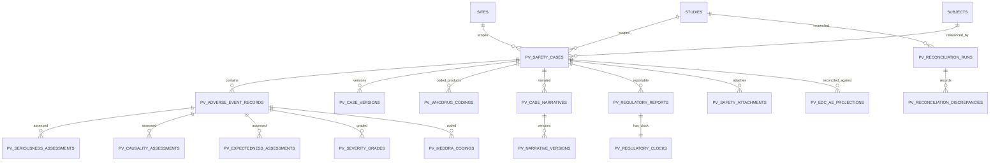

# Design Document

## Overview

The `PV_Safety_Module` (pharmacovigilance and safety) is the third co-equal first-party module inside the `Unified_Clinical_Platform`, alongside the `EDC_System` and the `CTMS_Module`. The three modules share one authenticated application boundary, one canonical Study/Site identity model, and one set of shared platform services, but each owns different records and workflows. PV is the safety case system of record: it owns Safety_Case intake and capture, the case lifecycle state machine, initial/follow-up Case_Versions, seriousness/causality/expectedness/severity assessments, MedDRA and WHODrug coding, Case_Narratives, regulatory reporting with expedited Regulatory_Clocks, ICSR/E2B(R3) produce/parse, EDC adverse-event reconciliation, safety notifications, the immutable PV safety audit trail, safety attachments, safety exports, and safety dashboards/reports.

PV is not an external integration and is not a second clinical data-capture system of record. EDC remains authoritative for clinical configuration, the Clinical_Subject_Registry, protocol Visit_Instances, eCRF metadata and clinical data capture, EDC Queries, SDV, clinical review, freeze/lock, clinical Electronic_Signatures, Clinical_Attachments, and clinical exports. CTMS remains authoritative for operational study/site profiles, enrollment, monitoring, work management, operational attachments, and operational exports. PV references the canonical Study and Site identity and the EDC Subject_Reference and Visit_Instance identity where a safety case needs clinical context, and it consumes EDC_Adverse_Events only through an approved, minimized, read-only `Safety_Operational_Projection` delivered by the shared `Coordination_Service`. Reconciliation is one-way and read-only: no PV path creates, allocates, or mutates any EDC clinical record or CTMS operational record.

This design satisfies the 25 PV requirements and the 8 Safety Correctness Properties in `requirements.md`, and is organized around these design goals:

1. **Explicit first-party ownership.** Every persisted field has exactly one authoritative module. Canonical Study and Site identity is shared; Subject and Visit_Instance use the EDC clinical identity as the canonical reference. PV is authoritative for Safety_Data and never becomes a competing clinical or operational authority.
2. **Audit-safe by construction.** Every PV Safety_Data mutation and every Safety_Attachment action writes exactly one immutable PV safety Audit_Event inside the same database transaction as the change. If the audit write fails, the change rolls back. There is no PV code path that mutates Safety_Data without producing its Audit_Event.
3. **Authoritative server-side authorization.** The shared `Permission_Service` is the single source of truth. Every protected PV route resolves an `Authorization_Scope` and enforces route-level and object-level checks by study and site scope. Frontend permission logic is convenience only.
4. **Safety-case system-of-record integrity.** The case lifecycle and Case_Version sequencing are a constrained state machine; submitted versions are immutable; post-submission changes require a bounded `Reason_For_Change`; Closed cases reject safety modifications.
5. **Regulatory clock correctness.** The Regulatory_Clock due date is a pure, deterministic function of the Awareness_Date and a configured whole-day timeline in UTC; overdue is a pure predicate over the current UTC date and report status.
6. **ICSR round-trip fidelity.** E2B(R3) is modeled as produce/parse concepts, not a live regulatory gateway. Producing then parsing then producing an E2B_Message preserves the case identifier, every mandatory field, and the Coding_Dictionary_Versions.
7. **One-way read-only EDC reconciliation.** PV consumes EDC_Adverse_Events only through an approved minimized projection and never writes EDC clinical data during reconciliation.
8. **Soft-delete retention.** PV safety records use soft deletion/archive; Safety_Cases, assessments, narratives, reports, attachments, and audit data are never physically removed; deletion actor, timestamp, and reason remain attributable.
9. **Independent, coordinated delivery.** PV authentication, safety case capture, assessment, audit, export, and regulatory reporting remain operational when EDC or CTMS is disabled, empty, or unavailable; PV returns no cross-module-dependent safety result as authoritative.

### Technology Baseline

| Layer | Technology | Notes |
|---|---|---|
| Backend framework | FastAPI (Python 3.11+) | Async REST/JSON, OpenAPI docs, served by Uvicorn/Gunicorn |
| Schema validation | Pydantic v2 | Request/response models, settings |
| ORM / migrations | SQLAlchemy 2.x + Alembic | Typed ORM, versioned schema migrations |
| Database | PostgreSQL | JSONB hybrid storage, UUID PKs, partial/unique indexes |
| Async jobs | Redis + Arq (optional) | Export generation, batch reconciliation, large reads |
| Object storage | AWS S3 (optional) | Safety attachments and export files, signed URLs |
| Auth (optional) | AWS Cognito / OIDC | JWT validation; local JWT fallback otherwise |
| AI (optional) | AWS Bedrock AgentCore | Chat, narrative drafting, case summarization |
| Deployment | AWS ECS/Fargate + RDS + CloudWatch (optional) | Environment isolation, structured logs, metrics |
| Lint / format | ruff | Linting and formatting in `pyproject.toml` |
| Tests | pytest + Hypothesis | Example/integration tests + property-based tests |
| Frontend | React + TypeScript + Vite | SPA |
| UI | shadcn/ui + Tailwind CSS | Safety, high-density components |
| Server state | TanStack Query | Caching, mutations, optimistic updates |
| Routing | TanStack Router | Permission-aware route guards |
| Forms | React Hook Form + Zod | Client validation (server authoritative) |
| Tables | TanStack Table | High-density case/report listings |
| Client state | Zustand | Lightweight UI state |

### Research and design findings

The approved EDC and CTMS designs establish the authorities this design preserves and reuses. EDC owns `Study_Version_Service`, `Clinical_Subject_Registry`/`Subject_Service`, `Protocol_Visit_Service`, `Data_Capture_Service`, `Query_Service`, `SDV_Service`, `Review_Service`, `Lock_Service`, and `Signature_Service`. CTMS owns `Operational_Study_Service`, `Operational_Site_Service`, `Enrollment_Service`, `Monitoring_Service`, and `Work_Management_Service`. The repository already provides shared `auth_service.py`, `permission_service.py`, `coordination_service.py`, `notification_service.py`, `export_service.py`, `file_attachment_service.py`, and `dashboard_service.py`, plus a `Status_Ownership_Rule` primitive (`status_ownership_rule_service.py`) and a transactional-outbox coordination model (`models/ctms/coordination.py`, `models/ctms/projection.py`). PV adds a new module that consumes these shared primitives without forking them and without transferring EDC clinical or CTMS operational authority to PV.

Two PV-specific findings inform the design. First, the E2B(R3) requirement is a produce/parse concept with an explicit round-trip acceptance criterion (Requirement 9.5), so the `Regulatory_Reporting_Service` treats E2B as an internal serializer/parser with a Hypothesis round-trip property rather than a live gateway. Second, EDC adverse-event data is exposed to PV only as a minimized read-only `Safety_Operational_Projection` over the reconciled field set (subject reference, verbatim term, onset date, seriousness), delivered through the existing `Coordination_Service` outbox; reconciliation diffing is therefore a pure function over two record sets and PV never obtains a write path into EDC.

## Architecture

### Platform and module topology

The EDC_System, CTMS_Module, and PV_Safety_Module are feature modules in the same authenticated deployment. They share request context, authorization, audit, storage, export-job, notification, observability, environment, optional AI controls, and `Coordination_Service`. PV routes are exposed under `/api/v1/pv`. PV does not call EDC or CTMS over their public HTTP APIs for first-party coordination; approved internal service contracts and the shared transaction/session boundary are used, and approved projections flow only through the coordination outbox.



The platform feature flag may disable PV navigation and operations, but it does not remove PV data or alter EDC/CTMS routes. If the required `Safety_Operational_Projection` is unavailable or the EDC/CTMS module is disabled, empty, or does not respond within 30 seconds of a coordination request, PV continues authentication, safety case capture, assessment, audit, export, and regulatory reporting using only PV-owned state and referenced canonical identity, and returns no cross-module-dependent safety result as authoritative.

### Request and transaction boundaries

Every PV route follows the shared request path: authenticate, assign request and correlation identifiers, resolve `Authorization_Scope`, validate the PV-owned command, invoke the owning PV service, and return the standard response contract. Routes are thin and never write directly to the database. A PV Safety_Data mutation and its PV safety Audit_Event commit atomically in one transaction; when a coordination event is required, its outbox row commits in the same transaction.



If the safety-data write, the audit write, or the outbox write fails, the whole transaction rolls back so no Safety_Data or Safety_Attachment state persists without its Audit_Event (Requirement 11.7). Coordination processing of an inbound EDC projection is a separate transaction handled by a worker.

### Coordination and read-only projection consumption

PV consumes EDC_Adverse_Events through the existing transactional-outbox `Coordination_Service`. EDC (the source) appends an approved `Safety_Operational_Projection` event to the outbox containing only the fields designated for PV release (subject reference, verbatim term, onset date, seriousness) plus source identifier, rule version, correlation identifier, and processing outcome. A PV coordination worker claims one event, revalidates the active `Status_Ownership_Rule` and field allowlist, upserts only the PV-side projection read model, and records the processing outcome. Delivery is at-least-once and processing is idempotent by `Idempotency_Key`; stale events do not overwrite a current projection.



The projection is read-only for PV. No coordination path lets PV write EDC clinical or CTMS operational state. If the required projection is unavailable or stale, `Reconciliation_Service` produces no results and returns an error indicating the EDC projection is unavailable (Requirement 10.5). A denied or unauthorized projection request delivers no content and records the denial (Requirement 23.7).

### Ownership enforcement model

PV reuses the versioned `Status_Ownership_Rule` primitive. Every persisted shared field resolves to exactly one authoritative module. Default policy is conservative:

- EDC owns clinical configuration, Clinical_Subject_Registry identity/binding, protocol Visit_Instances, clinical data, queries, SDV/review, freeze/lock, clinical signatures, clinical attachments, and clinical exports.
- CTMS owns operational study/site/enrollment/monitoring/work records, operational attachments, and operational exports.
- PV owns Safety_Cases, Case_Versions, Adverse_Event_Records, assessments, coding assignments, Case_Narratives, Regulatory_Reports and Regulatory_Clocks, reconciliation records, safety notifications, Safety_Attachments, safety dashboards/reports, and safety exports.
- A projection is read-only for its consumer; a coordinated transition is possible only when explicitly named by the active rule.

Any PV command that contains an EDC-owned or CTMS-owned field, or targets another module's record, is rejected before any module's authoritative or audit state changes (Requirements 16.6, 23.4, 23.5).

## Components and Interfaces

### Shared Platform / EDC / CTMS / PV ownership matrix

"Shared" means the platform owns the primitive and all modules use it; it does not mean the platform owns any module's business records.

| Service or capability | Disposition | Shared Platform responsibility | PV responsibility | EDC / CTMS responsibility |
|---|---|---|---|---|
| `Auth_Service` | Shared Platform | Login, sessions, token refresh, logout, MFA, inactivity timeout, Cognito/OIDC validation | Uses shared identity/session; no PV identity system | EDC/CTMS use the same shared identity |
| `Permission_Service` | Shared Platform | Resolve one `Authorization_Scope` at system/study/site scope and enforce server-side | Register PV safety roles/permissions and require scope on every PV operation | EDC clinical and CTMS operational enforcement retained |
| `Audit_Service` | Shared primitive, module-owned content | Immutable append-only storage, request context, UTC timestamps, search/export primitives | Emit PV safety Audit_Event content; PV audit search/export | EDC clinical and CTMS operational audit content |
| Request context / API conventions | Shared Platform | Request ID, correlation ID, error envelope, pagination, OpenAPI, UTC conventions | Use `/api/v1/pv` and shared contracts | EDC `/api/v1`, CTMS `/api/v1/ctms` |
| `Study_Service` | Shared canonical identity, split semantics | Canonical Study identity and cross-module resolution | Safety use of the Study reference for cases and reporting | EDC clinical Study/Study_Version; CTMS operational study profile |
| `Site_Service` | Shared canonical identity, split semantics | Canonical Site identity and scope relationship | Safety-reporting site reference and safety access use | EDC clinical site use; CTMS operational site profile/status |
| `Subject_Reference` | Referenced EDC clinical identity | Canonical Subject reference resolution | Reference a Subject for a Safety_Case using the EDC clinical identifier; no PV duplication | EDC Clinical_Subject_Registry owns subject identity, identifiers, lifecycle |
| `Visit_Instance` | EDC-owned reference | Canonical reference resolution | May reference a Visit_Instance for context only | EDC `Protocol_Visit_Service` owns protocol visits |
| `Coordination_Service` | Shared Platform | Outbox, ordering, idempotency, retries, projection delivery | Consume approved read-only `Safety_Operational_Projection`; publish approved read-only PV projections | EDC/CTMS publish/consume their approved projections |
| `Dashboard_Service` | Shared aggregation, module-owned metrics | Scope filtering and aggregation primitives | Safety case/assessment/coding/reconciliation/reporting metrics; approved EDC/CTMS projections read-only | EDC clinical metrics; CTMS operational metrics |
| `Export_Service` | Shared export-job infrastructure | Job creation/status, queueing, storage, download controls, download audit | Safety case, ICSR/E2B, and safety-audit export content, filters, and authorization | EDC clinical export content; CTMS operational export content |
| `File_Attachment_Service` | Split: shared primitives; PV owns Safety_Attachments | Object storage, metadata, access checks, retention, soft deletion | `Safety_Attachment` metadata/content and safety/source access rules | EDC Clinical_Attachments; CTMS Operational_Attachments |
| `Notification_Service` | Shared Platform, module-owned triggers | Notification persistence, delivery state, Unread/Read/Archived lifecycle | Triggers for serious-case creation, clock warnings, and export outcomes | EDC clinical triggers; CTMS operational triggers |
| Health, metrics, logs, tracing | Shared Platform | Health/readiness, metrics, structured logs, tracing, sanitized observability | PV latency, error rate, worker/export failures, overdue-report metrics | EDC/CTMS observability |
| Environment management | Shared Platform | Isolated database, storage, secrets, auth config, logging, retention, backup/restore per Environment | PV feature flags and safety settings | EDC/CTMS settings and migration gates |
| Optional `AI_Assistant_Service` | Shared controls, module-scoped authorization | AI transport, context minimization, confirmation, audit hooks | PV-scoped chat, narrative drafting, case summarization | EDC/CTMS-scoped assistant capabilities |

### Backend package structure

```text
backend/app/
  api/routes/
    ...existing EDC routes...
    ctms/ ...existing CTMS routes...
    pv/
      cases.py            # intake, capture, lifecycle, versions
      assessments.py      # seriousness, causality, expectedness, severity
      coding.py           # MedDRA, WHODrug
      narratives.py       # case narratives + history
      reports.py          # regulatory reports, clocks, ICSR/E2B
      reconciliation.py   # EDC adverse-event reconciliation
      attachments.py      # safety attachments
      exports.py          # safety exports
      dashboards.py       # safety dashboards/reports
      audit.py            # PV safety audit search/export
      health.py           # PV health/metrics
  models/
    ...existing EDC + ctms/ models...
    pv/
      common.py           # base mixins: UUID PK, UTC timestamps, soft delete
      safety_case.py      # SafetyCase, AdverseEventRecord, CaseVersion
      assessment.py       # Seriousness/Causality/Expectedness/Severity
      coding.py           # MedDraCoding, WhoDrugCoding, dictionary version
      narrative.py        # CaseNarrative + versions
      regulatory.py       # RegulatoryReport, RegulatoryClock, E2B refs
      reconciliation.py   # ReconciliationRun, ReconciliationDiscrepancy
      attachment.py       # SafetyAttachment metadata
      coordination.py     # PV projection/outbox references by correlation id
  schemas/pv/             # Pydantic v2 request/response schemas
  repositories/pv/        # repository-layer DB access for PV tables
  services/
    ...existing shared + EDC + CTMS services...
    safety_case_service.py
    assessment_service.py
    coding_service.py
    narrative_service.py
    regulatory_reporting_service.py
    reconciliation_service.py
  workers/
    pv_reconciliation_worker.py     # batch reconciliation jobs
    pv_projection_worker.py         # consume EDC adverse-event projections
    pv_export_worker.py             # safety export generation
```

Shared services (`auth_service.py`, `permission_service.py`, `coordination_service.py`, `notification_service.py`, `export_service.py`, `file_attachment_service.py`, `dashboard_service.py`) are imported, not forked. PV services receive an `AsyncSession` from the route or worker and do not open independent sessions inside service methods.

### PV service interfaces

```python
from dataclasses import dataclass
from datetime import date, datetime
from enum import StrEnum
from typing import Any, Mapping
from uuid import UUID
from sqlalchemy.ext.asyncio import AsyncSession


class Module(StrEnum):
    EDC = "EDC"
    CTMS = "CTMS"
    PV = "PV"


@dataclass(frozen=True)
class ActorContext:
    user_id: UUID
    request_id: str
    correlation_id: str


class CaseState(StrEnum):
    OPEN = "Open"
    IN_REVIEW = "In Review"
    FOLLOW_UP_REQUIRED = "Follow-up Required"
    READY_TO_REPORT = "Ready to Report"
    REPORTED = "Reported"
    CLOSED = "Closed"
    REOPENED = "Reopened"


class ReportStatus(StrEnum):
    PENDING = "Pending"
    SUBMITTED = "Submitted"
    ACKNOWLEDGED = "Acknowledged"
    REJECTED = "Rejected"
    CANCELLED = "Cancelled"


class SafetyCaseService:
    async def create_case(self, session: AsyncSession, *, study_id: UUID, site_id: UUID,
                          subject_reference: UUID, case_type: str,
                          payload: Mapping[str, Any], actor: ActorContext) -> Any: ...
    async def add_adverse_event(self, session: AsyncSession, *, case_id: UUID,
                                payload: Mapping[str, Any], actor: ActorContext) -> Any: ...
    async def transition(self, session: AsyncSession, *, case_id: UUID,
                         target: CaseState, reason: str | None, actor: ActorContext) -> Any: ...
    async def submit_version(self, session: AsyncSession, *, case_id: UUID,
                             actor: ActorContext) -> Any: ...
    async def change_submitted_data(self, session: AsyncSession, *, case_id: UUID,
                                    changes: Mapping[str, Any], reason_for_change: str,
                                    actor: ActorContext) -> Any: ...


class AssessmentService:
    async def record_seriousness(self, session: AsyncSession, *, ae_id: UUID,
                                 serious: bool, criteria: frozenset[str],
                                 actor: ActorContext) -> Any: ...
    async def record_causality(self, session: AsyncSession, *, ae_id: UUID,
                               suspect_product: str, category: str,
                               actor: ActorContext) -> Any: ...
    async def record_expectedness(self, session: AsyncSession, *, ae_id: UUID,
                                  expected: bool, actor: ActorContext) -> Any: ...
    async def record_severity(self, session: AsyncSession, *, ae_id: UUID,
                              grade: str, actor: ActorContext) -> Any: ...


class CodingService:
    async def assign_meddra(self, session: AsyncSession, *, ae_id: UUID, term_id: str,
                            dictionary_version: str, actor: ActorContext) -> Any: ...
    async def assign_whodrug(self, session: AsyncSession, *, product_id: UUID, term_id: str,
                             dictionary_version: str, actor: ActorContext) -> Any: ...
    async def recode(self, session: AsyncSession, *, prior_coding_id: UUID, term_id: str,
                     dictionary_version: str, actor: ActorContext) -> Any: ...


class NarrativeService:
    async def create(self, session: AsyncSession, *, case_id: UUID, text: str,
                     actor: ActorContext) -> Any: ...
    async def revise(self, session: AsyncSession, *, narrative_id: UUID, text: str,
                     reason_for_change: str, actor: ActorContext) -> Any: ...


class RegulatoryReportingService:
    async def evaluate_reportability(self, session: AsyncSession, *, case_id: UUID,
                                     actor: ActorContext) -> list[Any]: ...
    def compute_clock(self, awareness_date: date, timeline_days: int) -> date: ...
    def is_overdue(self, due_date: date, status: ReportStatus, today_utc: date) -> bool: ...
    async def submit(self, session: AsyncSession, *, report_id: UUID,
                     e2b_message_ref: str, actor: ActorContext) -> Any: ...
    def produce_e2b(self, case: Mapping[str, Any]) -> str: ...
    def parse_e2b(self, message: str) -> Mapping[str, Any]: ...


class ReconciliationService:
    async def run(self, session: AsyncSession, *, study_id: UUID,
                  actor: ActorContext) -> Any: ...
    def diff(self, safety_events: list[Mapping[str, Any]],
             edc_projection: list[Mapping[str, Any]]) -> list[Mapping[str, Any]]: ...
```

`RegulatoryReportingService.compute_clock`, `is_overdue`, `produce_e2b`, `parse_e2b`, and `ReconciliationService.diff` are pure, deterministic functions with no I/O so they can be exercised directly by property-based tests.

### Regulatory clock and reportability

`compute_clock` adds the configured whole-day reporting timeline (constrained to 1–90 inclusive) to the Awareness_Date, counting whole calendar days in UTC where the Awareness_Date is day zero: `due_date = awareness_date + timedelta(days=timeline_days)`. `is_overdue` returns true exactly when `today_utc > due_date` and the report status is not `Submitted`, `Acknowledged`, or `Cancelled`. Reportability evaluation creates one `RegulatoryReport` per matched configured rule, each `Pending`; a report cannot be created without an Awareness_Date.

### ICSR / E2B produce and parse

`produce_e2b` serializes a reportable Safety_Case into an E2B(R3)-structured message containing the case identifier, every field designated mandatory by the E2B(R3) structure, and the Coding_Dictionary_Versions used; a case missing any mandatory field yields an error naming each missing field and produces no message and no state change. `parse_e2b` parses a structurally valid message into a Safety_Case representation and rejects a structurally invalid message with a descriptive error and no case creation. The round-trip invariant (produce → parse → produce preserves case identifier, mandatory fields, and dictionary versions) is verified by a Hypothesis property.

### FastAPI route groups under `/api/v1/pv`

All PV routes use authenticated dependencies, shared `Permission_Service` guards, Pydantic v2 schemas, the standard error envelope, pagination, and `X-Request-ID`. No PV route mutates an EDC-owned or CTMS-owned resource.

| Resource | Routes | Ownership-visible behavior |
|---|---|---|
| Cases | `GET/POST /cases`, `GET/PATCH /cases/{id}`, `POST /cases/{id}/adverse-events`, `POST /cases/{id}/transition`, `POST /cases/{id}/versions` | Shows canonical Study/Site and EDC Subject_Reference as read-only; PV owns case lifecycle/versions |
| Assessments | `GET/POST /adverse-events/{id}/seriousness|causality|expectedness|severity` | PV-owned; rejects when parent case is Closed |
| Coding | `POST /adverse-events/{id}/meddra`, `POST /products/{id}/whodrug`, `POST /codings/{id}/recode` | Retains Coding_Dictionary_Version; prior coding immutable |
| Narratives | `GET/POST /cases/{id}/narratives`, `POST /narratives/{id}/revise`, `GET /narratives/{id}/history` | Versioned; requires Reason_For_Change on revision |
| Regulatory reports | `GET/POST /cases/{id}/reports`, `POST /reports/{id}/submit|transition`, `POST /cases/{id}/icsr`, `POST /icsr/import` | Clock/overdue computed server-side; ICSR produce/parse |
| Reconciliation | `POST /studies/{study_id}/reconciliation`, `GET /studies/{study_id}/reconciliation/{run_id}` | One-way, read-only over the EDC projection; no EDC mutation route |
| Attachments | `POST /cases/{id}/attachments`, `GET /attachments/{id}/download`, `DELETE /attachments/{id}` | PV `Safety_Attachment`; access requires read on parent case |
| Exports | `POST /studies/{study_id}/exports`, `GET /exports/{id}`, `GET /exports/{id}/download` | Shared job lifecycle; CSV/Excel/JSON/E2B XML; PV-only content |
| Dashboards/reports | `GET /studies/{study_id}/dashboard`, `GET /sites/{site_id}/dashboard`, `GET /studies/{study_id}/reports/{type}` | PV safety metrics only; EDC/CTMS projections read-only, source-labeled |
| Audit | `GET /audit`, `POST /audit/export` | Scoped, filtered, deterministically ordered PV safety Audit_Events |
| Health | `GET /health`, `GET /ready`, `GET /metrics` | PV worker/export/overdue-report health without raw payloads |

The API exposes no PV mutation route for EDC Study_Version, Clinical_Subject_Registry, Visit_Instance, Form_Instance, Field_Value, Query, SDV/review, freeze/lock, clinical signatures, Clinical_Attachments, or clinical exports, nor for CTMS operational records. Any command containing an EDC-owned or CTMS-owned field is rejected before mutation.

### Frontend PV area

The React frontend adds permission-aware PV feature routes below the authenticated `AppShell` under `frontend/src/features/pv/`, without moving EDC or CTMS pages:

```text
/pv
/studies/$studyId/pv/cases
/studies/$studyId/pv/cases/$caseId
/studies/$studyId/pv/cases/$caseId/assessments
/studies/$studyId/pv/cases/$caseId/coding
/studies/$studyId/pv/cases/$caseId/narratives
/studies/$studyId/pv/cases/$caseId/reports
/studies/$studyId/pv/reconciliation
/studies/$studyId/pv/dashboard
/sites/$siteId/pv/dashboard
/studies/$studyId/pv/exports
/studies/$studyId/pv/audit
```

PV screens use TanStack Table for high-density case/report/reconciliation listings, TanStack Query for server state, and React Hook Form + Zod for pre-submission validation while the API_Layer remains authoritative. Case-detail views render the same textual status value as list views. Audit history and case-narrative history open in a dialog or sheet while the originating safety status view stays mounted and visible. When a Safety_Case is Closed, input controls render disabled. `PermissionGuard` hides actions the user lacks; the API enforces the same denial. PV views show canonical EDC Subject_Reference and any read-only EDC/CTMS projection with a source label.

## Data Models

### Storage and integrity rules

PV safety tables are additive tables in the same PostgreSQL database, use a `pv_` prefix, and do not duplicate EDC clinical or CTMS operational tables. PV foreign keys/reference columns point to canonical Study/Site identity and the EDC Subject_Reference/Visit_Instance identity; no PV table copies clinical payloads. All PV-owned records use UUID primary keys, `TIMESTAMPTZ` UTC timestamps with at least one-second precision, study/site scope, actor/correlation metadata, and soft-deletion fields (deletion actor, timestamp, reason). JSONB is limited to validated structured content (seriousness criteria sets, E2B field maps, reconciliation diffs, allowlisted projection payloads). Partial indexes exclude soft-deleted rows. The safety case identifier is globally unique across the Unified_Clinical_Platform. Queryable indexes exist for study identifier, site identifier, subject reference, case identifier, case status, report status, and creation timestamp. Alembic revisions are additive and phase-gated; no PV migration rewrites EDC clinical or CTMS operational tables.

### Entity relationship diagram



### PV safety tables

**`pv_safety_cases`**: UUID PK; globally unique `case_identifier`; canonical `study_id`, `site_id`, and EDC `subject_reference`; `case_type`; `lifecycle_state` (`Open`, `In Review`, `Follow-up Required`, `Ready to Report`, `Reported`, `Closed`, `Reopened`); actor/correlation metadata; UTC timestamps; soft-deletion fields. References the EDC subject and never creates or mutates it.

**`pv_adverse_event_records`**: UUID PK; `case_id`; `verbatim_term` (1–200 chars); `onset_date`; `outcome`; optional `resolution_date` (persisted only when `>= onset_date`); assessment/coding reference columns.

**`pv_case_versions`**: UUID PK; `case_id`; `sequence_number` (initial = 1, follow-up = max + 1); `version_kind` (`Initial`, `Follow-up`); `status` (`Draft`, `Submitted`); immutable captured-content snapshot (JSONB) once `Submitted`; submitting actor/timestamp. No submitted version is deleted or overwritten.

**`pv_seriousness_assessments`**: UUID PK; `ae_id`; `serious` boolean; `criteria` JSONB set (subset of death, life-threatening, hospitalization, disability, congenital anomaly, other medically important) required non-empty when serious; assessing actor/timestamp.

**`pv_causality_assessments`**: UUID PK; `ae_id`; `suspect_product`; `causality_category`; assessing actor/timestamp.

**`pv_expectedness_assessments`**: UUID PK; `ae_id`; `expected` determination against referenced safety information; actor/timestamp.

**`pv_severity_grades`**: UUID PK; `ae_id`; configured `grade`; actor/timestamp.

**`pv_meddra_codings`** / **`pv_whodrug_codings`**: UUID PK; target reference (`ae_id` or `product_id`); selected `term_id`; `dictionary_version`; assigning actor/timestamp; `superseded_by` traceability link. Recoding retains the prior assignment and its version immutably.

**`pv_case_narratives`** and **`pv_narrative_versions`**: narrative text (non-empty after trim, ≤ 20,000 chars); each version retains authoring/revising actor, timestamp, and `Reason_For_Change` (≤ 4,000 chars) for revisions; prior versions retained.

**`pv_regulatory_reports`**: UUID PK; `case_id`; `report_type`; `destination`; `status` (`Pending`, `Submitted`, `Acknowledged`, `Rejected`, `Cancelled`); `expedited` flag; submitting actor, submission timestamp (UTC), and `e2b_message_ref` on submission; matched-rule reference.

**`pv_regulatory_clocks`**: UUID PK; `report_id`; `awareness_date`; `timeline_days` (1–90); computed `due_date` (UTC calendar days, day zero = awareness date); overdue is derived, not stored.

**`pv_reconciliation_runs`** and **`pv_reconciliation_discrepancies`**: run scope, `match_count`, `discrepancy_count`, and per-discrepancy affected `case_id`, EDC reference, and differing fields among {subject reference, verbatim term, onset date, seriousness}; resolution state and actor/time.

**`pv_safety_attachments`**: UUID PK; parent `case_id`/safety object; storage key; size; content type; scope; retention; soft-deletion fields. Uses shared file primitives; never references EDC/CTMS attachments as writable.

**`pv_edc_ae_projections`** and **`pv_coordination_refs`**: minimized read-only projected EDC adverse-event fields with source module, source record ID, source version, rule version, correlation ID, projected timestamp, payload fingerprint, and projection status (`Current`, `Stale`, `Rejected`); coordination references stored by correlation identifier so projected EDC references remain traceable without duplicating clinical records.

### Migration and integrity plan

1. **Phase 1 migration:** add `pv_safety_cases`, `pv_adverse_event_records`, `pv_case_versions`, `pv_seriousness_assessments`, PV permission seeds, required indexes, and soft-deletion/retention foundations. Add no clinical/operational duplicate tables.
2. **Phase 2 migration:** add `pv_meddra_codings`, `pv_whodrug_codings`, `pv_causality_assessments`, `pv_expectedness_assessments`, `pv_severity_grades`, `pv_case_narratives`, `pv_narrative_versions`, `pv_reconciliation_runs`, `pv_reconciliation_discrepancies`, `pv_edc_ae_projections`, and coordination references.
3. **Phase 3 migration:** add `pv_regulatory_reports`, `pv_regulatory_clocks`, E2B message references, export metadata, and AI-assist audit metadata.
4. Database constraints enforce UUIDs, UTC timestamps, enum/check values (case states, report statuses, seriousness criteria), verbatim-term length, resolution ≥ onset, global-unique case identifier, and no physical deletion of Safety_Data or Audit_Events.
5. Service validation enforces `Authorization_Scope`, canonical identity resolution, ownership rules, projection minimization, transition legality, reason bounds, and Closed-case rejection.
6. Retention jobs soft-delete/archive PV records per policy without cascading into EDC clinical or CTMS operational records or their audit history.

## PBT Applicability Decision

Property-based testing applies to the deterministic PV logic with broad input spaces:

- **Case lifecycle and version transitions** — the enumerated state machine and initial/follow-up sequencing (Requirement 4).
- **Regulatory clock computation and overdue predicate** — pure date arithmetic over Awareness_Date, timeline days, and current UTC date (Requirements 8.3, 8.6, 13.2).
- **ICSR/E2B round-trip** — produce → parse → produce equivalence on case identifier, mandatory fields, and dictionary versions (Requirement 9.5).
- **Authorization scope** — success exactly when the required permission and target scope are present; otherwise no state change (Requirements 1, 2, 11, 12, 16, 19, 23).
- **Projection allowlists / content separation** — minimized read-only projections and PV-only export/dashboard/attachment/notification content (Requirements 10, 11, 12, 13, 15, 23).
- **Reconciliation diffing** — pure diff over safety events and the projected EDC field set (Requirement 10).
- **Data validation and preservation** — assessment/coding/narrative/intake validation with prior-value preservation and Closed-case rejection (Requirements 3, 5, 6, 7).
- **Audit atomicity and immutability** — data + audit commit/rollback together, immutable events, deterministic ordering (Requirements 11, 16, 18).

PBT is **not** used for: object storage and file upload/download, export job timeouts and download timing, notification delivery timing, streaming AI responses and Bedrock behavior, PostgreSQL migrations and index creation, environment isolation, backup/restore, health/readiness/metrics endpoints, latency/concurrency targets, and frontend rendering. Those use example, integration, security, snapshot, performance, or smoke tests.

## Correctness Properties

*A property is a characteristic or behavior that should hold true across all valid executions of a system—essentially, a formal statement about what the system should do. Properties serve as the bridge between human-readable specifications and machine-verifiable correctness guarantees.*

The prework classified external delivery, streaming, deployment configuration, UI presentation, timing, capacity, and environment setup as example, integration, or smoke tests. The following are the reflected, consolidated properties for deterministic PV logic; each maps to one Hypothesis test with at least 100 examples using deterministic repositories/fakes, and none requires EDC, CTMS, or external services to verify PV safety authority.

### Property 1: Safety identity and reference integrity

*For any* valid Study, Site, Subject_Reference, and Safety_Case sequence, canonical Study/Site identity remains stable, each Safety_Case references exactly one canonical Subject_Reference without duplicating or mutating EDC clinical identity, each safety case identifier is globally unique, and each Adverse_Event_Record belongs to exactly one Safety_Case.

**Validates: Requirements 3, 10, 23**

### Property 2: Safety lifecycle transition validity

*For any* generated Safety_Case, Case_Version, Regulatory_Report, and notification status sequence, PV services accept only configured transitions, record initial version 1 and follow-up version max+1, preserve all prior submitted versions, and reject invalid transitions without partial mutation.

**Validates: Requirements 4, 8, 14**

### Property 3: Safety data validation and preservation

*For any* assessment, coding, narrative, or intake payload, submission validates required inputs (serious requires a criterion, verbatim 1–200, resolution ≥ onset, narrative non-empty ≤ 20,000, reason non-empty ≤ 4,000); a failed validation preserves prior values and persists no change event; submitted changes require a valid Reason_For_Change; and Closed cases reject safety modifications.

**Validates: Requirements 3, 5, 6, 7, 18**

### Property 4: Safety audit atomicity and immutability

*For any* PV Safety_Data mutation or Safety_Attachment action, the change and its PV safety Audit_Event commit or roll back together, the event contains actor, UTC timestamp, entity, action, and applicable old/new values and reason, completed Audit_Events cannot be updated or deleted, and scoped audit search returns matching events ordered by UTC timestamp ascending with ties broken by Audit_Event identifier ascending.

**Validates: Requirements 11, 16, 18, 20**

### Property 5: Safety authorization scope

*For any* User, PV Permission, Study, Site, and PV object, the operation succeeds exactly when the shared Authorization_Scope contains the required permission and target scope; otherwise no safety, audit, attachment, export, or projection state changes and list endpoints return only in-scope records or an empty list.

**Validates: Requirements 1, 2, 11, 12, 16, 19, 23**

### Property 6: Safety and cross-module content separation

*For any* PV safety export, safety dashboard/report, Safety_Attachment, notification, audit search, or reconciliation, the result contains only authorized PV safety content and approved read-only projections; EDC clinical and CTMS operational content remain owned by their modules and cannot be written through any PV operation, and projected fields are excluded from PV metric calculations.

**Validates: Requirements 10, 11, 12, 13, 15, 23**

### Property 7: Regulatory clock correctness

*For any* Regulatory_Report with an Awareness_Date and a configured reporting-timeline of 1–90 whole days, the computed Regulatory_Clock due date equals the Awareness_Date plus the configured whole calendar days in UTC (day zero = Awareness_Date), and overdue is true exactly when the current UTC date is later than the due date and the report status is not Submitted, Acknowledged, or Cancelled.

**Validates: Requirements 8, 13**

### Property 8: ICSR round-trip serialization

*For every* reportable Safety_Case that produces a valid E2B_Message, parsing the produced message then producing a message yields an equivalent E2B_Message in case identifier, every mandatory field, and Coding_Dictionary_Versions, while a structurally invalid message produces a descriptive parse error and creates no Safety_Case.

**Validates: Requirements 9, 16**

## Error Handling

PV uses the baseline platform error envelope and request-ID behavior for every response:

```json
{
  "error": {
    "code": "PV_INVALID_TRANSITION",
    "message": "The requested case lifecycle transition is not permitted.",
    "details": {}
  }
}
```

Every response includes `X-Request-ID`, and that identifier is included in every Audit_Event and Coordination_Event created by the request. Error details may contain field names, allowed statuses, current versions, missing mandatory E2B fields, and sanitized remediation instructions, but never internal database errors, prohibited safety data, raw coordination payloads, credentials, or stack traces.

| Domain condition | HTTP | Error code | Handling |
|---|---:|---|---|
| Missing/invalid/expired/revoked session | 401 | `UNAUTHENTICATED` | Shared Auth_Service; no disclosure of which token state failed |
| Inactivity timeout (1,800 s) | 401 | `SESSION_INACTIVE` | Require re-authentication; no Safety_Data change |
| Missing PV permission/scope | 403 | `PV_SCOPE_DENIED` | No state change; scope not disclosed for existence |
| Unknown canonical reference | 404 | `PV_RECORD_NOT_FOUND` | No Safety_Case/assessment persisted |
| Duplicate case identifier | 409 | `PV_DUPLICATE_IDENTIFIER` | Change no existing record |
| Invalid field (verbatim, resolution < onset, reason bounds, narrative length) | 422 | `PV_VALIDATION_ERROR` | Persist neither data nor change event; name invalid field |
| Illegal case/report transition | 409 | `PV_INVALID_TRANSITION` | Include current/allowed statuses only |
| Submitted version mutation | 409 | `PV_VERSION_IMMUTABLE` | Preserve captured content |
| Serious without criterion | 422 | `PV_SERIOUSNESS_CRITERION_REQUIRED` | Preserve prior assessment state |
| Missing/unavailable dictionary version or term | 422 | `PV_CODING_DICTIONARY_UNAVAILABLE` | Persist no coding |
| Missing Awareness_Date on report | 422 | `PV_AWARENESS_DATE_REQUIRED` | Create no report |
| Missing E2B mandatory field / invalid message | 422 | `PV_E2B_INVALID` | Produce no message / create no case; name missing fields |
| EDC projection unavailable/stale | 409 | `PV_PROJECTION_UNAVAILABLE` | Produce no reconciliation result |
| PV targets EDC/CTMS-owned record | 409 | `OWNERSHIP_VIOLATION` | Reject before any module's state or audit changes |
| Closed case modification | 409 | `PV_CASE_CLOSED` | Preserve existing state |
| Attachment too large/empty or storage unavailable | 413/422/503 | `PV_ATTACHMENT_REJECTED` | Store no attachment, no partial file, no completed audit |
| Audit write failure during mutation | 500 | `PV_AUDIT_FAILURE` | Roll back the associated Safety_Data change |
| Unexpected error | 500 | `INTERNAL_ERROR` | Log with request ID; suppress response details |

A synchronous PV mutation rolls back Safety_Data, the PV safety Audit_Event, and any outbox row together on failure. A coordination worker rolls back projection changes and target audit together; the attempt record is committed only after the rollback outcome is known.

## Testing Strategy

The PV test strategy uses dual testing: Hypothesis property tests for deterministic, input-varying invariants, and example/integration/security/permission/audit/ownership-boundary tests for UI, persistence, object storage, export jobs, streaming AI, migrations, timing, and infrastructure. No property test calls an external service or depends on nondeterministic wall-clock timing.

### Property-based tests

- Library: **Hypothesis** (not implemented from scratch).
- Implement exactly one property-based test for each of the 8 design properties.
- Configure every property test for at least 100 generated examples (`@settings(max_examples=100)` or higher).
- Tag every test with `# Feature: pv-safety-module, Property N: [property title]`.
- Generate UUIDs, canonical reference maps, subject references, case types, verbatim terms (including 0/1/200/201-length and unicode), onset/resolution dates, lifecycle/version/report/notification transition sequences, seriousness criteria sets, coding assignments across dictionary versions, narrative text (whitespace-only, boundary lengths), awareness dates and timeline days (0/1/90/91), current-date offsets, E2B field maps, reconciliation record pairs with matches/mismatches, roles/scopes, projection payloads with prohibited fields, and forced audit-write failures.
- Use deterministic in-memory repositories, transaction snapshots, audit fakes, notification fakes, file-store fakes, and export-store fakes for property logic; `compute_clock`, `is_overdue`, `produce_e2b`, `parse_e2b`, and `diff` are exercised as pure functions.

### Example and unit tests

Cover every finite enum and representative state machine: case states, report statuses, notification statuses, seriousness criteria, coding categories, error codes, valid/invalid reasons, Pydantic v2 normalization, UTC serialization, and frontend status labels. Also cover empty datasets, missing optional references, structurally invalid E2B messages, and Closed-case rejection paths.

### Module and database boundary tests

Using the existing async SQLAlchemy/PostgreSQL harness and shared services: additive Phase 1/2/3 Alembic migrations, downgrade paths, constraints, indexes, and no clinical/operational duplication; canonical Study/Site/Subject reference resolution and rejection of unknown references; intake/assessment/coding/narrative/report transactions; transaction atomicity for Safety_Data + Audit_Event (+ outbox) including forced audit/database failures; submitted-version immutability; reconciliation over the read-only projection, staleness handling, and rejection of any EDC-mutation attempt; safety attachment upload/download/soft-delete via shared file primitives; and export job lifecycle, 900-second timeout, and download-window enforcement.

### API contract, security, and permission tests

OpenAPI snapshot tests verify `/api/v1/pv` paths, Pydantic v2 schemas, pagination envelope, enum values, and the absence of EDC/CTMS mutation routes. Security tests attempt EDC-owned/CTMS-owned field injection, duplicate case identifiers, out-of-scope reads, viewer mutations, prohibited projection fields, existence disclosure, and log/error leakage. Permission tests call the API directly as PV safety roles, out-of-scope users, inactive users, and after scope removal.

### Frontend tests

Vitest/Testing Library tests cover PV route registration under the authenticated shell, permission-aware actions, access-denied states, consistent status labels, Zod pre-submit validation, Reason_For_Change enforcement, disabled controls on Closed cases, and dialog/sheet audit/narrative history keeping the status view mounted. Playwright tests cover login → study PV workspace → case intake → assessment/coding → narrative → report/ICSR → reconciliation → dashboard/export. Regression tests run baseline EDC and CTMS flows with PV disabled, empty, and worker-unavailable.

### Qualification gates by phase

Qualification evidence provides at least one passing OQ or PQ test for each listed PV capability. Phase 1 proves shared authentication, PV scope enforcement, safety case intake bound to canonical identity, the case lifecycle state machine, seriousness assessment, immutable PV safety audit, EDC non-modification boundaries, and safety CSV export. Phase 2 proves MedDRA/WHODrug coding, causality/expectedness/severity assessments, Case_Narratives, and EDC adverse-event reconciliation. Phase 3 proves regulatory reporting with expedited timelines, ICSR/E2B handling, advanced safety exports, and the optional AI assistant. No phase is declared complete while any required test is failing, and EDC/CTMS capabilities are not counted as PV phase deliverables.

## Phased Delivery

### Phase 1: PV MVP

Deliver shared authentication reuse, PV authorization scope enforcement, `Safety_Case_Service` intake and capture bound to canonical Study/Site and referenced EDC Subject identity, the case lifecycle state machine and Case_Version sequencing, seriousness assessment, the immutable PV safety audit trail with same-transaction atomicity, safety CSV export, `/api/v1/pv` API scaffolding, the frontend PV workspace shell, additive migrations, and soft-deletion/retention foundations. Phase 1 commands are synchronous within the unified service transaction. Phase 1 must prove PV cannot create or mutate EDC clinical records or CTMS operational records.

### Phase 2: Coding, assessments, narratives, and reconciliation

Deliver `Coding_Service` (MedDRA and WHODrug with immutable dictionary-version retention and recoding traceability), `Assessment_Service` causality/expectedness/severity, `Narrative_Service` versioned Case_Narratives, `Reconciliation_Service` over the read-only `Safety_Operational_Projection` consumed through the coordination outbox, the `pv_projection_worker`, and reconciliation reporting. Phase 2 must prove one-way read-only reconciliation, projection minimization, and PV operation while the EDC projection is unavailable.

### Phase 3: Regulatory reporting, ICSR/E2B, advanced exports, and optional AI

Deliver `Regulatory_Reporting_Service` reportability rules, Regulatory_Clock computation and expedited timelines, the report state machine, ICSR/E2B(R3) produce/parse with the round-trip property, advanced safety exports (Excel/JSON/E2B XML), safety dashboards/reports and compliance metrics, safety notifications, and the optional PV-scoped AI assistant with scope checks, human confirmation, and AI-assisted audit origin. Phase 3 must prove clock correctness, ICSR round-trip fidelity, sanitized failures, and no data change without explicit confirmation.

Feature flags are evaluated server-side and returned as capability metadata. Disabling PV hides PV actions but does not delete PV records or alter EDC/CTMS routes. Each phase has an Alembic revision set, an API/OpenAPI contract snapshot, backend/frontend/security/permission/audit/ownership-boundary evidence, and a rollback procedure.

## Traceability Summary

| Requirement | Design coverage | Primary verification |
|---|---|---|
| 1. Shared authentication and session reuse | `Auth_Service` reuse; scope resolved before any Safety_Data op; Cognito/OIDC validation | Property 5; auth integration/security tests |
| 2. Authorization and permission enforcement | `Permission_Service` route/object checks; scoped lists; PV safety roles | Property 5; direct API permission tests |
| 3. Safety case intake and capture | `Safety_Case_Service`, `pv_safety_cases`/`pv_adverse_event_records`, canonical reference integrity | Properties 1, 3; intake validation and reference tests |
| 4. Safety case lifecycle and versioning | Case state machine; `pv_case_versions` sequencing and immutability; reason bounds | Property 2; lifecycle and version-immutability tests |
| 5. Safety assessments | `Assessment_Service`; seriousness criteria; Closed-case rejection | Property 3; assessment validation/preservation tests |
| 6. MedDRA and WHODrug coding | `Coding_Service`; dictionary-version retention; recoding traceability | Property 3; coding retention/immutability tests |
| 7. Case narratives | `Narrative_Service`; versioned narratives; reason bounds | Property 3; narrative versioning tests |
| 8. Regulatory reporting and expedited timelines | `Regulatory_Reporting_Service`; reportability rules; Regulatory_Clock; report state machine | Properties 2, 7; clock computation and transition tests |
| 9. ICSR and E2B message handling | `produce_e2b`/`parse_e2b`; mandatory-field validation; round-trip | Property 8; round-trip and invalid-message tests |
| 10. EDC adverse-event reconciliation | `Reconciliation_Service`; read-only projection; pure diff; no EDC mutation | Properties 1, 6; reconciliation diffing and boundary tests |
| 11. PV safety audit trail | `Audit_Service` PV content; same-transaction atomicity; immutability; scoped ordered search/export | Properties 4, 5, 6; audit atomicity/immutability/ordering tests |
| 12. Safety data export | Shared `Export_Service`; job lifecycle; filters; format allowlist; scoped content | Properties 5, 6; export lifecycle and content tests |
| 13. Safety dashboards and reports | `Dashboard_Service` PV metrics; compliance buckets; read-only projections | Properties 6, 7; dashboard scope-consistency tests |
| 14. Safety notifications | `Notification_Service` triggers; status machine; dedup | Property 2; notification status and dedup tests |
| 15. Safety file attachments | `File_Attachment_Service` `Safety_Attachment`; access control; soft delete; Closed-case rejection | Property 6; attachment access and storage-failure tests |
| 16. Shared API layer standards | `/api/v1/pv`; pagination envelope; error envelope; request-id propagation; same-transaction audit | Properties 4, 5, 6, 8; API contract and non-leak tests |
| 17. Database and persistence | `pv_` tables; UUID PKs; UTC; global-unique id; indexes; correlation refs; soft deletion | Property 1; migration/constraint/index tests |
| 18. Backend architecture and coding rules | Thin routes; repository-only DB access; atomic data+audit; permission before mutation | Properties 3, 4, 5; architecture/lint and atomicity tests |
| 19. Frontend safety application | Permission-aware PV routes; consistent labels; Zod; disabled Closed controls; history dialogs | Property 5; Vitest/Playwright tests |
| 20. Compliance, validation, environment | Environment isolation; UTC clock agreement; retention/backup; traceability matrix; state distinctness | Property 4; environment/compliance integration and smoke tests |
| 21. PV phased delivery and testing | Phase gates; automated suites; EDC/CTMS excluded from PV deliverables | All properties; phase qualification and CI evidence |
| 22. Optional AI assistant | PV-scoped `AI_Assistant_Service`; scope check; human confirmation; AI-assisted audit origin | Properties 4, 5; AI streaming/scope/confirmation integration tests |
| 23. Unified platform safety ownership and coordination | Ownership uniqueness; canonical identity; minimized read-only projections; independent resilience | Properties 1, 5, 6; ownership-boundary and resilience tests |
| 24. Performance | Bounded pagination; async job handoff; concurrency target | Property 5 (pagination); load/benchmark tests |
| 25. Reliability and observability | Liveness/readiness; structured logs; metrics endpoint | Integration/smoke tests for health/metrics/logs |

The EDC requirements document remains authoritative for EDC clinical behavior and the CTMS requirements document for CTMS operational behavior. This design keeps PV as the safety case system of record while consuming only approved, minimized, read-only projections of EDC adverse-event data; PV safety records and projections are additive and never become a competing clinical or operational system of record.
