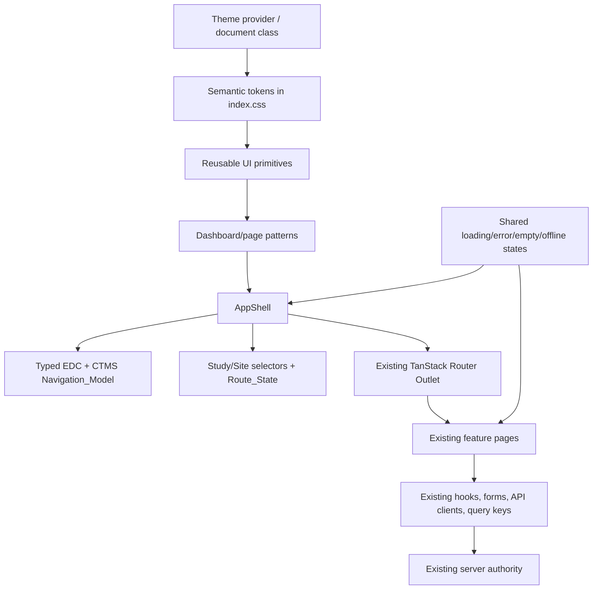
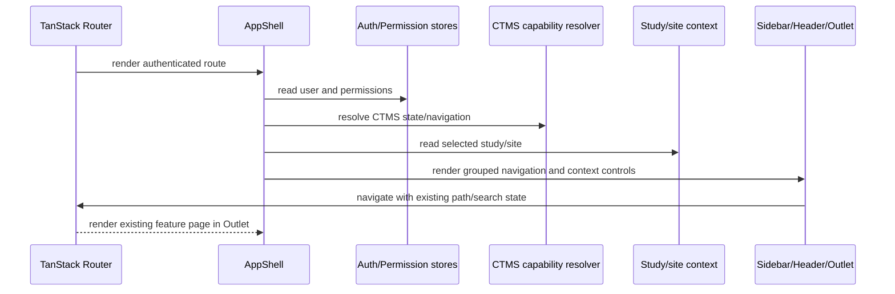

# Design Document

## Overview

This design modernizes the existing frontend into a shadcn-admin-style dashboard without creating a new application or changing application authority. The implementation remains inside `/Users/jason/Aurinara/edc/frontend/src`, uses the existing React 19 + TypeScript + Vite + Tailwind CSS v4 stack, and keeps TanStack Router, TanStack Query, Zustand, React Hook Form, Zod, `cn()`, and the existing API clients as the behavioral foundation.

The redesign has four outcomes:

1. A semantic token layer and reusable accessible primitives in `frontend/src/components/ui/`.
2. A responsive `AppShell` with compact grouped navigation, mobile drawer, breadcrumbs, study/site context, search affordance, notifications, theme control, and user menu.
3. Shared dashboard composition for page headers, cards, metrics, toolbars, filters, tables, tabs, forms, dialogs, empty/loading/error states, and ownership/status/freshness presentation.
4. An incremental feature migration with route, query, permission, auth, EDC clinical, CTMS operational, offline, and degraded-state regression protection.

The redesign changes presentation and interaction composition only. Existing route components, data hooks, mutation functions, validation schemas, API payloads, server authorization, and clinical ownership remain the source of truth unless a task explicitly extracts a presentation boundary without changing behavior.

### Goals

- Make the whole authenticated frontend visually coherent with compact shadcn-admin-style density, hierarchy, cards, tables, badges, tabs, dialogs, dropdowns, forms, and responsive navigation.
- Establish design tokens and primitives before mass page migration.
- Preserve all existing paths, deep links, route search state, query keys, filter behavior, pagination, permissions, capability gates, and direct access-denied behavior.
- Make light/dark/system theme behavior reliable and accessible.
- Keep EDC and CTMS content semantically distinct, including status, ownership, freshness, offline, worker-unavailable, and degraded states.
- Keep API/business logic changes separate from the visual redesign.
- Make every migration slice independently reviewable and revertible.

### Non-goals

- A second app, second auth shell, route migration, or backend redesign.
- A replacement for server authorization or frontend permission checks as convenience affordances.
- New EDC or CTMS business capabilities, clinical data models, API endpoints, or mutation ownership.
- A requirement for exact pixel parity with any third-party template.
- Blind copying of proprietary template code.
- A new search backend, notification backend, offline mutation queue, or design-system package unless separately approved.

## Repository Findings and Design Inputs

The design is based on inspection of the existing repository rather than external template code:

- `frontend/package.json` already provides React, TypeScript, Vite, Tailwind v4, `class-variance-authority`, `clsx`, `tailwind-merge`, `lucide-react`, TanStack Router/Query/Table, React Hook Form, Zod, Vitest, Testing Library, and Playwright. No new dependency is assumed.
- `frontend/src/index.css` already defines shadcn-like semantic CSS variables and imports Tailwind CSS v4. The redesign extends this foundation instead of introducing a competing styling system.
- `frontend/src/components/layout/AppShell.tsx` owns the authenticated sidebar, EDC navigation, dynamic CTMS navigation, study/site selectors, sign-out, and `Outlet`. It remains the shell integration point.
- `frontend/src/lib/router.ts` defines the existing public routes, authenticated layout, EDC routes, and CTMS routes. Route paths and direct access behavior remain unchanged.
- `frontend/src/lib/auth.ts`, `frontend/src/lib/permissions.ts`, and `frontend/src/lib/study-context.ts` define current auth, permission, and study/site context contracts. The visual layer consumes these contracts and does not reinterpret server authority.
- `frontend/src/features/ctms/navigation.ts` and `frontend/src/features/ctms/capabilities.ts` define CTMS section grouping, capability state, permission filtering, route targets, and the explicit `clinicalMutation: false` boundary. The redesigned shell must consume these functions rather than duplicate them.
- Existing `ctms-frontend` specifications establish that CTMS remains operational-only, projections are read-only, EDC is authoritative for clinical workflows, and CTMS degraded states must not disable EDC.

## Architecture

### Layered topology



The design uses four boundaries:

1. **Token boundary**: `index.css` owns semantic variables and theme values. Component classes consume semantic tokens rather than hard-coded page-specific colors.
2. **Primitive boundary**: `components/ui/` owns reusable accessible building blocks. Primitives do not call APIs, inspect permissions, or encode clinical rules.
3. **Pattern boundary**: layout and page-pattern components compose primitives into page headers, toolbars, dashboards, tables, forms, and state surfaces. Patterns accept data and callbacks; they do not own feature business logic.
4. **Feature boundary**: existing feature pages retain API hooks, query keys, validation, permissions, capability state, and mutation logic. Migration replaces markup and classes with primitives/patterns while preserving behavior.

### Proposed source layout

```text
frontend/src/
  components/
    ui/
      alert.tsx
      avatar.tsx
      badge.tsx
      breadcrumb.tsx
      button.tsx
      card.tsx
      checkbox.tsx
      dialog.tsx
      dropdown-menu.tsx
      empty-state.tsx
      input.tsx
      label.tsx
      separator.tsx
      sheet.tsx
      skeleton.tsx
      table.tsx
      tabs.tsx
      textarea.tsx
      tooltip.tsx
      select.tsx
      switch.tsx
      scroll-area.tsx
    layout/
      AppShell.tsx
      AppSidebar.tsx
      AppHeader.tsx
      Breadcrumbs.tsx
      UserMenu.tsx
      ThemeToggle.tsx
      GlobalSearch.tsx
      StudySelector.tsx
      SiteSelector.tsx
    patterns/
      PageHeader.tsx
      PageContainer.tsx
      PageToolbar.tsx
      MetricCard.tsx
      DataTableShell.tsx
      DetailCard.tsx
      StatusBadge.tsx
      OwnershipBadge.tsx
      LoadingState.tsx
      ErrorState.tsx
      EmptyState.tsx
  lib/
    navigation-model.ts
    route-context.ts
    theme.ts
  features/
    ... existing feature modules remain in place ...
```

The exact file split may be adjusted if existing files already provide a compatible boundary. The important contract is that primitives and shell responsibilities are separated from feature data behavior. New files must not duplicate existing auth, permission, CTMS capability, study/site, or API modules.

### Shell architecture

`AppShell` remains the authenticated composition root. The implementation may extract presentational children, but `AppShell` continues to own the existing data and behavior wiring:

- `useAuthStore` supplies the current user and logout function.
- `usePermission(PERMISSIONS.CTMS_OPERATIONAL_DATA_READ)` controls the existing CTMS convenience gate.
- `useCTMSCapabilityState()` and `resolveCTMSNavigation()` remain the source for CTMS readiness and grouped navigation.
- `useStudyContext()` remains the source for selected study/site IDs.
- `useNavigate()` and `Outlet` remain the route integration points.

The extracted shell receives typed props or uses the same existing hooks. The shell must not create a parallel navigation registry that can drift from `NAV_ITEMS`, CTMS capability descriptors, or route definitions.



### Navigation model

Add a typed navigation adapter only if the current inline `NAV_ITEMS` shape cannot support grouped labels, icons, tooltips, and breadcrumbs. The adapter must preserve:

- every current EDC `to` value;
- current active-route matching, including CTMS `exact: false` behavior;
- CTMS section IDs, labels, route scope, capability checks, permission checks, and `search={(previous) => previous}`;
- hidden-navigation convenience semantics while direct routes remain server-authorized;
- icon labels and collapsed-sidebar tooltips.

Lucide icons from the existing dependency replace emoji glyphs as presentation only. Icon names must be stable and every icon-only button must have an accessible name.

### Route and search-state model

No route migration is planned. Breadcrumbs derive labels from the current router location and a typed route-label map, not from route string parsing that can lose parameters. Navigation links use TanStack Router `Link` and preserve existing search state where current links do so. Shell-only state changes—sidebar collapse, mobile drawer, theme, open menus, and selected visual density—are local or persisted UI state and do not enter API query keys.

Study/site selection uses the existing Zustand actions. Selecting a study continues to clear the dependent site through `setStudy`; no visual control may write directly to the store or alter route search state unless current behavior already does so.

## Components and Interfaces

### Primitive contracts

Primitives should expose small typed interfaces and semantic HTML. Representative contracts:

```ts
interface ButtonProps extends React.ButtonHTMLAttributes<HTMLButtonElement> {
  variant?: 'default' | 'secondary' | 'outline' | 'ghost' | 'destructive' | 'link'
  size?: 'default' | 'sm' | 'lg' | 'icon'
  asChild?: boolean
}

interface BadgeProps extends React.HTMLAttributes<HTMLSpanElement> {
  variant?: 'default' | 'secondary' | 'outline' | 'destructive' | 'success' | 'warning' | 'info'
}

interface AppSidebarProps {
  collapsed: boolean
  mobileOpen: boolean
  onCollapsedChange: (collapsed: boolean) => void
  onMobileOpenChange: (open: boolean) => void
  edcItems: readonly NavigationItem[]
  ctmsSections: readonly CTMSNavigationSection[]
}

interface PageHeaderProps {
  title: string
  description?: string
  breadcrumbs?: readonly BreadcrumbItem[]
  actions?: React.ReactNode
}
```

Primitives use `forwardRef` where focus or imperative access matters, semantic native elements where possible, `cn()` for class composition, and `class-variance-authority` for variants. Radix primitives are not assumed because the current package does not list Radix dependencies; a package may be added only after exact-version approval and compatibility review. Native controls or repository-owned accessible compositions are preferred when they satisfy the interaction contract.

### Token and theme contracts

`frontend/src/index.css` remains the CSS entrypoint. Add semantic values for:

- surface hierarchy: background, card, popover, sidebar, muted, elevated;
- content hierarchy: foreground, muted foreground, primary, secondary, accent, destructive;
- interaction: border, input, ring, focus, selected, disabled;
- status: success, warning, info, destructive and their foreground values;
- layout: radius scale, shadow scale, sidebar width, header height, content max width, spacing density;
- typography: display, heading, body, label, caption sizes and weights;
- motion: duration and easing variables with reduced-motion overrides.

Theme switching should use a root `class` or equivalent document attribute and a small `theme.ts` adapter. Theme preference must be isolated from auth and Study_Context stores. Persistence location is a product decision; local storage is the default implementation assumption only if approved.

### Shared page patterns

Patterns are intentionally presentation-only:

- `PageContainer`: responsive max width, horizontal padding, vertical rhythm, and overflow policy.
- `PageHeader`: title, description, breadcrumbs, status/ownership context, and action slot.
- `PageToolbar`: search/filter/action grouping with mobile stacking.
- `MetricCard`: label, value, trend/context, loading skeleton, and optional status.
- `DataTableShell`: semantic table wrapper, responsive overflow/stacking, pagination, row actions, and empty/loading/error slots.
- `DetailCard`: label-value layout that can show owner, status, freshness, or timestamps.
- `StatusBadge` and `OwnershipBadge`: reuse existing status semantics and distinguish EDC/CTMS authority.
- `LoadingState`, `ErrorState`, and `EmptyState`: shared copy, retry action, accessible status role, and contextual slots.

Patterns accept server-returned totals, statuses, ownership, and freshness values; patterns never derive clinical authority or permission from visual state.

### Shell interfaces

- `AppSidebar` receives resolved navigation and manages desktop collapse/mobile open state.
- `AppHeader` renders menu trigger, `Breadcrumbs`, `StudySelector`, `SiteSelector`, `GlobalSearch`, notifications link, `ThemeToggle`, and `UserMenu`.
- `Breadcrumbs` receives route-derived labels and safe parent links; it preserves route search state according to the route contract.
- `ThemeToggle` calls the theme adapter only; it does not cause route navigation or query invalidation.
- `GlobalSearch` initially exposes only an existing supported search target. If no backend contract exists, the control remains a non-submitting affordance with explicit copy rather than an invented API call.
- `UserMenu` retains the existing display name and logout behavior and provides the same `/login` navigation after logout.

### Feature migration interface

Feature pages continue to own feature logic. Each migration replaces outer layout and local styling in the following form:

```tsx
<PageContainer>
  <PageHeader breadcrumbs={...} title={...} description={...} actions={...} />
  <PageToolbar>{existing filters and actions}</PageToolbar>
  <DataTableShell
    loading={query.isLoading}
    error={query.error}
    empty={query.data?.items.length === 0}
    onRetry={...}
  >
    {existing rows and mutation callbacks}
  </DataTableShell>
</PageContainer>
```

The feature page retains existing query keys, query functions, `enabled` conditions, form schemas, mutation callbacks, invalidation keys, permission checks, CTMS capability checks, and API error mapping.

## Data Models

### Design token model

```ts
type ThemeMode = 'light' | 'dark' | 'system'
type Density = 'comfortable' | 'compact'

interface ThemePreferences {
  mode: ThemeMode
  density: Density
}
```

Density is optional and must not be enabled by default without product approval. Theme preference is presentation state and must not be included in route search or server query keys.

### Navigation model

```ts
interface NavigationItem {
  id: string
  label: string
  to: string
  icon: React.ComponentType<{ className?: string }>
  section?: string
  description?: string
  activeOptions?: { exact?: boolean }
}

interface NavigationModel {
  edcSections: readonly { id: string; label: string; items: readonly NavigationItem[] }[]
  ctmsSections: readonly CTMSNavigationSection[]
}
```

The model is a view model. EDC and CTMS route strings, capability descriptors, and permission codes remain sourced from current modules. `NavigationModel` must not contain independent authorization policy.

### Route context model

```ts
interface RouteContextViewModel {
  pathname: string
  breadcrumbs: readonly BreadcrumbItem[]
  search: Record<string, unknown>
  selectedStudyId: string | null
  selectedSiteId: string | null
}
```

The view model may be recreated on route changes, but shell presentation changes must not mutate `search` or selected IDs. Dynamic route identifiers remain encoded and are never inferred from display labels.

### UI state model

```ts
type SurfaceState = 'closed' | 'open'
type QueryPresentationState =
  | 'loading'
  | 'refreshing'
  | 'success'
  | 'empty'
  | 'error'
  | 'unauthorized'
  | 'offline'
  | 'disabled'
  | 'unavailable'
  | 'worker-unavailable'
```

State components map existing query and feature state into copy and semantics. They do not replace TanStack Query status or CTMS capability state.

### Clinical and operational model constraints

Visual models may display:

- EDC clinical statuses and ownership labels;
- CTMS operational statuses and ownership labels;
- CTMS projection freshness/read-only metadata;
- offline and degraded-state metadata;
- server request/correlation identifiers when current features already expose them.

Visual models must not add writable fields, mutation actions, or authority for EDC-owned clinical objects. CTMS projections remain read-only and CTMS operational content remains visibly distinct.

## Responsive, Accessibility, and Theme Behavior

### Responsive layout

Use CSS media queries and Tailwind responsive utilities rather than JavaScript viewport branching for layout. The default targets are:

- **Mobile, 320–767px**: mobile Sheet navigation, single-column page headers, stacked toolbar controls, cards before tables where needed, horizontal scroll only for data that cannot be meaningfully stacked.
- **Tablet, 768–1023px**: compact persistent or toggleable sidebar, two-column cards where content permits, responsive table layout.
- **Desktop, 1024px and above**: collapsible sidebar, multi-column dashboard grids, fixed-width toolbar groups, full breadcrumb/context header.

The exact breakpoint values are implementation defaults and require product confirmation. No breakpoint may hide an essential status, ownership label, field, action, or error.

### Accessibility

- Use semantic `nav`, `header`, `main`, `aside`, `section`, table captions/headers, labels, and buttons.
- Provide accessible names for icon-only controls and tooltips as supplemental context, not the only label.
- Use `aria-expanded`, `aria-controls`, `aria-current`, `aria-invalid`, `aria-describedby`, and `role="status"`/`role="alert"` where applicable.
- Dialogs and sheets manage initial focus, focus containment, Escape dismissal, and focus return.
- Async state changes use an appropriately scoped live region and preserve the current page context.
- Status/ownership/freshness labels include text and do not rely on color alone.
- Keyboard navigation covers shell, menus, tabs, selectors, filters, forms, dialogs, tables, retry actions, and sign-out.
- Reduced motion disables non-essential transitions while retaining state changes and focus behavior.

### Theme behavior

Theme styles use semantic variables, not direct light-only Tailwind colors. Theme changes update the document theme class/attribute and leave route, query, form, auth, and Study_Context state untouched. Initial theme resolution must happen before the first meaningful shell paint when practical; if a bootstrap script is needed, implementation must keep the script minimal and avoid introducing a second app entrypoint.

## Migration Strategy

### Phase 0: inventory and compatibility seam

- Confirm the current contents of `frontend/src/components/ui/` and identify existing compatible primitives.
- Inventory page-level color, spacing, card, table, form, dialog, and status styles without changing behavior.
- Add a migration note or typed mapping only where old classes need a temporary compatibility bridge.

### Phase 1: tokens and primitives

- Extend `index.css` with light/dark semantic variables and focus/status tokens.
- Add primitive components one at a time, each with focused component tests.
- Add shared page/state patterns after primitives are stable.
- Do not migrate feature pages until button/input/card/dialog/table/state primitives are available.

### Phase 2: authenticated shell

- Extract `AppSidebar`, `AppHeader`, breadcrumbs, theme control, user menu, and global-search affordance from `AppShell`.
- Preserve current navigation data sources and selector/auth hooks.
- Add desktop collapse and mobile Sheet behavior.
- Add shell route/search-state and CTMS-disabled/unavailable regression tests.

### Phase 3: shared page composition and representative pages

Migrate representative dashboard/list/detail/form pages first, using existing feature components and hooks:

1. dashboard and list/table pages;
2. detail and casebook pages;
3. forms, dialogs, validation, and regulated actions;
4. notifications, audit, exports, and status-heavy pages;
5. CTMS workspace, projection, report, export, coordination, and health pages;
6. public auth pages last, unless the product chooses to prioritize login visual continuity.

Each slice keeps the route component and feature logic connected. A slice is complete only when its component/route tests and visual smoke checks pass.

### Phase 4: cleanup and consistency pass

- Replace remaining direct colors and duplicated layout classes with semantic tokens/patterns.
- Remove compatibility styles only after search confirms no remaining consumer and tests cover the replacement.
- Verify no application logic, API payload, query key, permission behavior, or clinical boundary changed during cleanup.

### Rollback and coexistence

Each migration slice should be isolated by file ownership: primitives, shell, patterns, and one feature group. Existing feature pages may temporarily use legacy classes while neighboring pages use new patterns. Rollback is a source-level revert of the presentation slice; API, route, and state modules remain unchanged.

## Error and Degraded-State Handling

The redesign uses existing feature state and adds shared presentation only:

| State | Presentation | Behavioral rule |
|---|---|---|
| Loading | Skeleton or labeled loading state | Do not imply empty data; preserve page context |
| Refreshing | Existing content with non-blocking progress indicator | Preserve current data and query behavior |
| Empty | Empty state with scope/context and permitted next action | Do not treat as error |
| Error | Sanitized error and retry when existing behavior permits | Preserve server error semantics and safe values |
| Unauthorized/access denied | Access-denied presentation | Do not infer authority from hidden navigation |
| CTMS disabled | Stable disabled explanation for direct CTMS state | Preserve all EDC navigation and workflows |
| CTMS unavailable | Unavailable/retry state | Do not treat failure as authorization or remove EDC |
| Offline | Offline indicator and cached-data label | Preserve current offline mutation policy |
| Worker unavailable | CTMS worker/coordination status | Do not block EDC clinical workflows |
| Stale projection/data | Existing freshness or stale label | Never make stale data appear current |

The redesign must not introduce optimistic behavior where current features do not have it. Mutation success, failure, invalidation, and error mapping remain owned by existing feature hooks.

## Testing Strategy

No tests or builds are run as part of specification creation. The future implementation should validate in layers:

### Unit tests

Use Vitest for:

- token/theme mode conversion and persistence adapter behavior;
- navigation model grouping and icon-label metadata;
- breadcrumb label mapping and search-state-preserving link construction;
- primitive variant class contracts;
- state-component classification and accessible copy;
- CTMS disabled/unavailable navigation behavior;
- preservation of existing permission/capability resolver outputs.

Pure helpers with finite domains use table-driven unit tests. A small set of cross-cutting preservation relations has enough input variation to justify optional property-style tests using the repository's existing dependency-free deterministic generator convention, with at least 100 generated cases per property. No new property-testing dependency or generator framework is required.

### Correctness Properties

*A property is a characteristic or behavior that should hold true across all valid executions of a system—essentially, a formal statement about what the system should do. Properties bridge human-readable requirements and executable correctness checks.*

The acceptance-criteria prework classified layout, focus, contrast, viewport behavior, dialogs, browser events, and route integration as example, edge-case, integration, or smoke tests. Property testing is reserved for pure or mostly pure preservation functions where many combinations of permissions, capabilities, route search values, theme state, server metadata, and mutation inputs can expose regressions. The property reflection consolidated overlapping navigation/capability checks, route/search checks, mutation-contract checks, and clinical-boundary checks so each property below has distinct validation value.

### Property 1: Navigation never exceeds current authority metadata

*For any* EDC navigation definition, CTMS capability manifest, permission set, study/site scope, and route descriptor, the Navigation_Model SHALL preserve every existing allowed EDC target, expose a CTMS target only when the existing resolver allows the target, and expose no EDC clinical mutation or capability-ineligible CTMS target.

**Validates: Requirements 2.6–2.8, 3.1–3.2, 8.2–8.5**

### Property 2: Presentation theme changes preserve application state

*For any* Route_State, Study_Context, authenticated user state, query-key snapshot, form draft, and supported theme transition, changing the theme SHALL leave route path, route search, selected study/site IDs, auth state, form values, and query keys equivalent.

**Validates: Requirements 4.2–4.4, 7.2–7.5**

### Property 3: Shell presentation actions preserve supported search state

*For any* supported Route_State search model and any shell-only action from the sidebar, mobile drawer, breadcrumb parent link, selector presentation, theme control, notification link, or user-menu open/close state, the action adapter SHALL preserve every unrelated supported search key and SHALL not introduce unrelated query invalidation.

**Validates: Requirements 3.3–3.5, 7.2–7.3**

### Property 4: Migrated mutation contracts remain unchanged

*For any* valid migrated form value, permission state, capability state, mutation type, and existing cache policy, the presentation adapter SHALL produce the same endpoint, payload fields, permission/capability checks, confirmation requirements, and post-success cache behavior as the pre-migration contract.

**Validates: Requirements 6.1–6.6, 7.5, 8.2, 8.6**

### Property 5: Server table metadata remains authoritative

*For any* ordered server collection, pagination metadata, active filter state, status/ownership/freshness labels, and responsive table presentation mode, the DataTableShell SHALL preserve server row order and metadata, SHALL not reconstruct totals or authorization from client rows, and SHALL expose every required row action in desktop and responsive modes.

**Validates: Requirements 5.2–5.4, 9.1–9.2**

### Property 6: Clinical and CTMS operational boundaries remain non-escalating

*For any* CTMS capability state, permission set, operational record, EDC reference, projection, and requested action, the redesigned presentation model SHALL expose only permitted CTMS operational actions, SHALL preserve EDC ownership/read-only semantics, and SHALL produce no mutation action for Study_Version, clinical subjects, Visit_Instances, Form_Instances, Field_Values, Queries, SDV/review/freeze/lock/signatures, Clinical_Attachments, or clinical exports.

**Validates: Requirements 6.5–6.6, 8.2–8.6**

Each property is one optional property-style test task. Component and browser tests remain mandatory for visual rendering, focus, responsive behavior, accessibility, and real route integration.

### Component tests

Use Vitest + Testing Library for:

- primitive variants, disabled/pending state, accessible names, focus rings, and keyboard operation;
- mobile Sheet open/close and focus return;
- sidebar collapse and tooltip semantics;
- breadcrumbs and selectors preserving route/search context;
- theme control preserving route, query, form, auth, and Study_Context state;
- page patterns for loading, empty, error, populated, status, ownership, and freshness states;
- representative EDC and CTMS page migration slices;
- direct access-denied behavior and CTMS disabled/unavailable fallbacks.

### Browser and visual tests

Use Playwright for representative desktop/mobile viewports and light/dark modes:

- login to authenticated shell transition;
- sidebar collapse, mobile drawer, breadcrumbs, selectors, notifications, theme, and user menu;
- dashboard/list/detail/form/dialog/table flows;
- keyboard traversal and focus return;
- offline/degraded-state presentation;
- CTMS capability disabled/unavailable and EDC preservation;
- deep links and representative query/search state;
- screenshot or stable DOM assertions for the shell and representative page patterns.

Visual regression baselines should cover stable shell/pattern surfaces, not every data-dependent page. Dynamic values should be masked or asserted semantically.

### Regression and contract validation

Existing CTMS and EDC tests remain in place. Add regression tests that assert:

- all route paths and direct links still render the same feature components;
- route search parameters and query keys survive shell presentation changes;
- `resolveCTMSNavigation` remains the CTMS navigation source;
- server permission and capability failures still render safe states;
- EDC clinical data boundaries and CTMS operational-only boundaries remain unchanged;
- existing API contract tests, status/ownership/freshness tests, offline tests, and degraded-state tests remain active.

### Future validation commands

The implementation task plan should use the repository's one-shot commands, not watch modes:

```text
npm run lint
npm run build
npm run test
npm run e2e
```

Commands should be run from `/Users/jason/Aurinara/edc/frontend` during implementation. The current specification phase intentionally does not execute them.

## Traceability Summary

| Requirement | Design coverage | Primary future validation |
|---|---|---|
| 1. Foundation | Tokens, primitive inventory, class composition, focus tokens | Unit/component tests |
| 2. Authenticated shell | AppShell extraction, sidebar/header/mobile drawer | Component/browser regression |
| 3. Navigation/context | Navigation adapter, breadcrumbs, selector behavior | Router/component tests |
| 4. Theme | Theme adapter, semantic variables, reduced motion | Unit/component/browser theme tests |
| 5. Page composition | Page patterns and shared state surfaces | Component/visual tests |
| 6. Interactions | Form/dialog/menu/table primitive migration | Component and existing feature tests |
| 7. Routing/query | No route migration, search-state preservation | Route/deep-link/query regression |
| 8. Boundaries | Existing auth/permission/capability/clinical contracts retained | EDC/CTMS regression and API contract tests |
| 9. Responsive/accessibility | Breakpoint behavior, semantic controls, focus/live regions | Testing Library/Playwright |
| 10. Incremental migration | Phase gates, coexistence, rollback seams | Slice checkpoints and route tests |
| 11. Delivery evidence | Layered test plan and visual baselines | Full one-shot validation commands |
